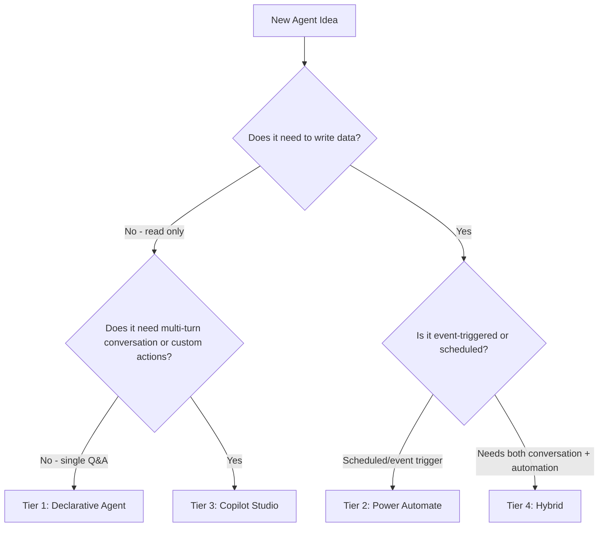

# Agent Patterns: When to Use Each Tier

This document provides the decision framework for selecting the appropriate architecture tier for a new Copilot agent. Each tier has distinct capabilities, governance requirements, licensing implications, and risk profiles.

---

## The Four Tiers

---

## Tier 1: Declarative Agents

**Best for:** Read-only information retrieval, knowledge-grounded Q&A, conversational reporting on live data.

**How it works:** A declarative agent manifest (JSON file) defines the agent's identity, instructions, and knowledge sources. Knowledge sources can be SharePoint sites, public web URLs, or custom Graph API plugins (OpenAPI specs). The agent is deployed via Teams Admin Center or the Microsoft 365 Admin Center.

**Pros:**
- Fastest to deploy (hours, not weeks)
- No Copilot Studio license required — M365 Copilot license is sufficient
- Grounding in SharePoint is native and requires no custom code
- Graph API plugins extend to live data without custom backend services
- Minimal governance surface area — read-only, deployed as a Teams app

**Cons:**
- No write capabilities
- Limited to single-turn or light multi-turn conversations
- No custom approval flows
- No scheduled/automated execution (agent must be invoked by a user)

**Examples from this playbook:**
- Break-Glass Account Validator
- MFA Registration Gap Finder
- App Packaging Advisor
- Knowledge Base RAG Agent

**Governance requirements:**
- App registration with read-only permissions
- Teams Admin Center deployment policy
- Knowledge source scoping (limit SharePoint access to specific sites)

---

## Tier 2: Power Automate Agents

**Best for:** Scheduled automation, event-triggered notifications, proactive monitoring, adaptive card reporting without requiring user invocation.

**How it works:** A Power Automate cloud flow with a scheduled or event-based trigger. Outputs are typically Adaptive Cards posted to Teams channels, emails, or records written to SharePoint lists. Can include basic approval actions using the built-in Power Automate approval connector.

**Pros:**
- Runs automatically without user invocation
- Native approval connector for simple one-level approvals
- Adaptive Cards provide rich, actionable notifications
- No custom code required for most patterns
- Power Platform governance (DLP policies, connector restrictions) applies

**Cons:**
- Not conversational — users can't ask follow-up questions
- Limited to the connectors available in Power Platform
- Power Automate licensing required (Power Automate per-user or per-flow)
- Complex approval logic is difficult to implement

**Examples from this playbook:**
- Secrets & Certificates Expiry Monitor
- Tenant Health Dashboard
- License Optimization Advisor
- External Sharing Exception Workflow

**Governance requirements:**
- Power Platform environment governance (DLP policies for connectors)
- Service principal for API connections
- Flow run history and error alerting

---

## Tier 3: Copilot Studio Agents

**Best for:** Multi-turn conversations, custom approval workflows, complex action orchestration, scenarios requiring integration with external systems or databases.

**How it works:** A bot built in Microsoft Copilot Studio (formerly Power Virtual Agents). Topics define conversation flows; Actions call external APIs or Power Automate flows; Knowledge sources provide grounded responses. Published to Teams as a Teams app.

**Pros:**
- Full multi-turn conversational capability
- Rich action library including Power Automate flows and direct API calls
- Approval workflows native via the Teams Approval app integration
- Analytics and conversation history built in
- Can combine knowledge sources (SharePoint) with live API data

**Cons:**
- Requires Copilot Studio licensing (per-session or per-user, depending on the scenario)
- Higher complexity: topics, entities, variables, flow actions
- Longer development cycle than declarative agents
- Testing and publishing requires Copilot Studio expertise

**Examples from this playbook:**
- Conditional Access Change Companion
- App Registration Governance
- SOC Triage Summarizer
- DLP Policy Tuning Advisor

**Governance requirements:**
- Copilot Studio environment governance
- Bot authentication configuration
- Action/plugin governance (which connectors are permitted)
- Publishing approval workflow

---

## Tier 4: Hybrid Agents

**Best for:** End-to-end process automation spanning multiple systems, write operations with complex approval chains, lifecycle management scenarios (onboarding, offboarding, rollouts).

**How it works:** Combines a Copilot Studio bot (conversational frontend and orchestration) with Power Automate flows (automation backend), Azure Logic Apps (complex integrations), and SharePoint lists (state management and audit logging).

**Pros:**
- Full capability stack: conversation + automation + write operations
- Can span multiple M365 workloads and external systems
- Human-in-the-loop gates at every stage
- Complete audit trail across all systems

**Cons:**
- Highest complexity and development cost
- Multiple systems to govern and maintain
- Licensing across Copilot Studio + Power Automate
- Requires careful security review given write capabilities

**Examples from this playbook:**
- Offboarding Orchestrator
- Passwordless Rollout Coach
- Copilot Readiness & Governance

**Governance requirements:**
- Full security review before production deployment
- Write operation permissions scoped to minimum required
- All write operations gated by human approval
- Immutable audit log (SharePoint versioned list + Power Automate run history)
- Monitoring alerts on all write operations from the service principal

---

## Decision Summary

| Question | Yes → | No → |
|---|---|---|
| Does the agent need to run automatically without user invocation? | Tier 2 or 4 | Tier 1 or 3 |
| Does the agent need to write to any M365 system? | Tier 3 or 4 | Tier 1 or 2 |
| Does the agent need multi-turn conversation? | Tier 3 or 4 | Tier 1 or 2 |
| Is the output a scheduled notification or report? | Tier 2 | — |
| Does the scenario require complex approval chains? | Tier 3 or 4 | — |
| Is this a full lifecycle process (onboarding, offboarding, rollout)? | Tier 4 | — |

Start at the lowest tier that meets the requirements. Every additional tier adds capability but also adds complexity, governance burden, and licensing cost.
