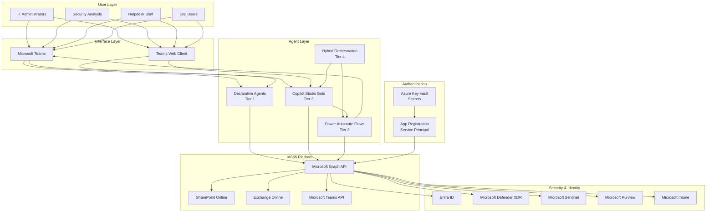
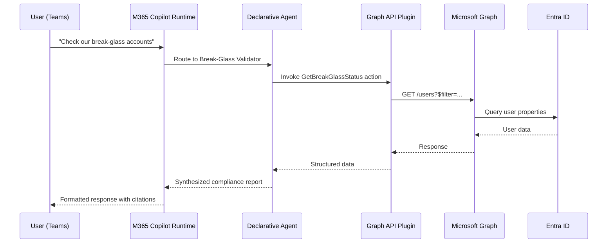
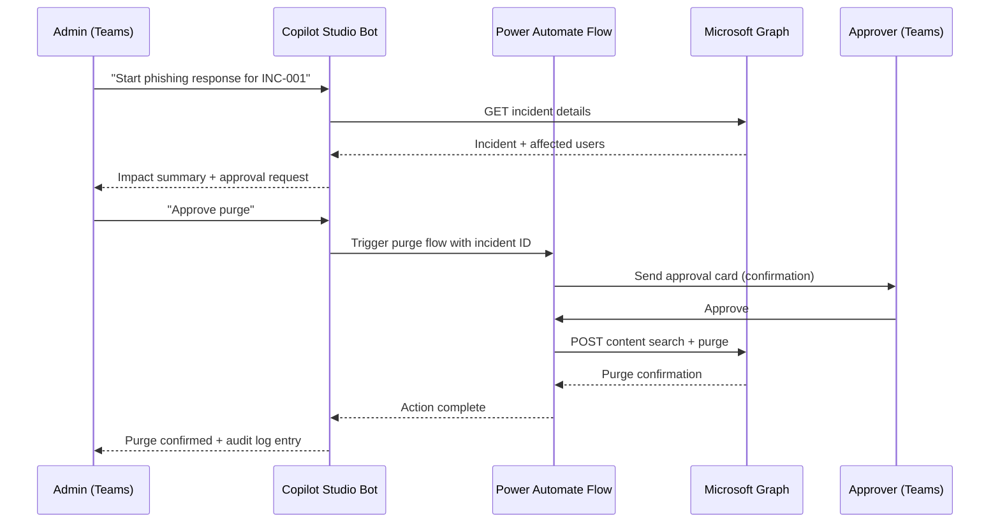

# Reference Architecture

This document describes the end-to-end reference architecture for Microsoft 365 Copilot agents in an enterprise environment.

---

## High-Level Architecture

---

## Component Descriptions

### User Layer
Users interact with agents exclusively through Microsoft Teams (desktop, web, or mobile). Agents are surfaced as Teams apps — either in the Teams app store (for broadly deployed agents) or via targeted deployment to specific security groups.

### Interface Layer
Microsoft Teams is the single pane of glass for all agent interactions. Teams provides:
- Chat interface for conversational agents
- Adaptive Cards for structured notifications and approvals
- Channel posts for scheduled reports (from Power Automate flows)
- Approval cards via the Teams Approval app

### Agent Layer

**Declarative Agents** are the simplest deployment: a JSON manifest + instructions file + optional OpenAPI plugin spec. They are processed by the M365 Copilot infrastructure and grounded in configured knowledge sources. No custom hosting required.

**Copilot Studio Bots** are hosted by Microsoft in the Power Platform environment. They communicate with external APIs via Power Automate cloud flows used as actions. Published to Teams as a bot app.

**Power Automate Flows** run in the Power Platform cloud. They use the Microsoft 365 connectors and HTTP connectors to call Graph API. Their outputs are Teams notifications (Adaptive Cards), SharePoint records, or email notifications.

**Hybrid Orchestration** combines the above: a Copilot Studio bot as the user-facing interface, Power Automate flows as the automation backend, and SharePoint lists as the state store and audit log.

### Platform Layer
Microsoft Graph is the unified API surface for all M365 data. All agents interact with M365 services through Graph — there is no direct API access to Exchange, Teams, or SharePoint that bypasses Graph (except for some legacy Exchange Online PowerShell operations).

### Security & Identity Layer
The five primary data sources for security and governance agents:
- **Entra ID** — Identity, authentication, Conditional Access, PIM
- **Microsoft Defender XDR** — Endpoint, email, identity, and cloud app security
- **Microsoft Sentinel** — SIEM, SOAR, threat intelligence
- **Microsoft Purview** — DLP, sensitivity labels, compliance, data governance
- **Microsoft Intune** — Endpoint management, device compliance, app management

### Authentication Layer
All agents authenticate to Graph using a service principal (app registration). Client secrets or certificates are stored in Azure Key Vault. The service principal is granted only the minimum permissions required for the agent's specific function.

---

## Data Flow: Declarative Agent

---

## Data Flow: Copilot Studio Agent with Approval

---

## Security Boundaries

1. **Tenant isolation** — All agents operate within a single M365 tenant. Cross-tenant operations are not supported and not in scope.

2. **Permission boundary** — Each agent's service principal can only access data covered by its explicitly granted permissions. Graph enforces permission boundaries server-side.

3. **User context vs. app context** — Declarative agents operate in the user's context for knowledge sources (SharePoint) — the user sees only what they have permission to see. Graph API plugin calls use the service principal's application context — the agent can read data the user may not individually have access to. This distinction must be understood and documented for each agent.

4. **Network boundary** — All traffic between agents and Microsoft services uses HTTPS with TLS 1.2+. No data leaves the Microsoft network boundary.

5. **Approval boundary** — For Tier 2 agents, the approval is a hard gate in the Power Automate flow. Bypassing the approval requires modifying the flow — which requires Power Platform admin access and generates an audit log entry.
