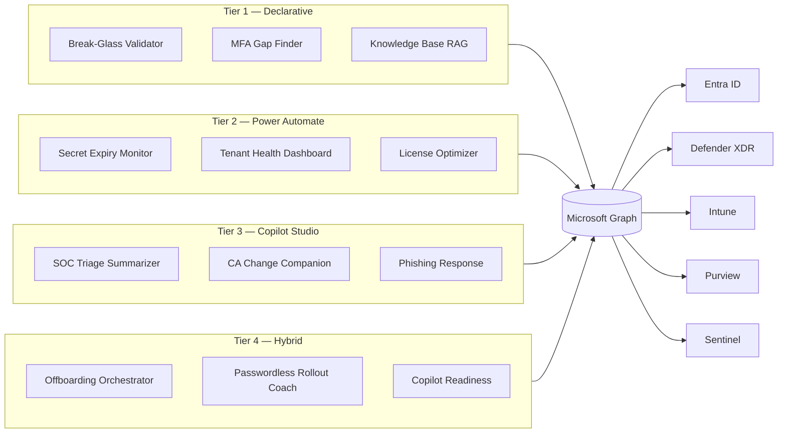

# Copilot Agent Playbook

> **35 Production-Ready Microsoft 365 Copilot Agent Ideas for Enterprise Environments**

Welcome to the Copilot Agent Playbook — a curated, enterprise-grade reference library for IT architects, security engineers, and governance teams building on the Microsoft 365 Copilot extensibility platform.

---

## Quick Stats

| | |
|---|---|
| **Total Agents** | 35 |
| **Domains** | 5 (Identity, Endpoint, SecOps, Compliance, Collaboration) |
| **Architecture Tiers** | 4 (Declarative, Power Automate, Copilot Studio, Hybrid) |
| **Implementation Examples** | 3 complete packs |

---

## Architecture Overview

---

## Getting Started

**For IT Architects:** Start with [Agent Patterns](architecture/agent-patterns.md) to understand which tier fits your use case, then browse the [Agent Catalog](catalog/index.md) for ideas in your domain.

**For Security Teams:** Jump directly to [SecOps agents](ideas/secops/phishing-response.md) or the [SecOps Starter Pack](examples/secops-starter-pack/README.md).

**For Governance Leads:** Review the [Governance Framework](architecture/governance-framework.md) first, then explore [Compliance agents](ideas/compliance/copilot-readiness-assessor.md).

**For Developers:** See the [Deployment Guide](architecture/deployment-guide.md) and the [Break-Glass Validator implementation](agents/declarative/break-glass-validator/README.md) as a working example.

---

## Browse by Domain

| Domain | Agents | Start Here |
|---|---|---|
| Identity | 10 | [Break-Glass Validator](ideas/identity/break-glass-validator.md) |
| Endpoint | 5 | [Device Compliance Drift](ideas/endpoint/device-compliance-drift.md) |
| SecOps | 8 | [SOC Triage Summarizer](ideas/secops/soc-triage-summarizer.md) |
| Compliance | 5 | [Copilot Readiness](ideas/compliance/copilot-readiness-assessor.md) |
| Collaboration | 6 | [Knowledge Base RAG](ideas/collaboration/knowledge-base-rag.md) |

---

## How to Contribute

See [CONTRIBUTING.md](../CONTRIBUTING.md). The fastest way to contribute is to copy `ideas/_template.md`, fill in all sections with substantive content, and open a PR.
