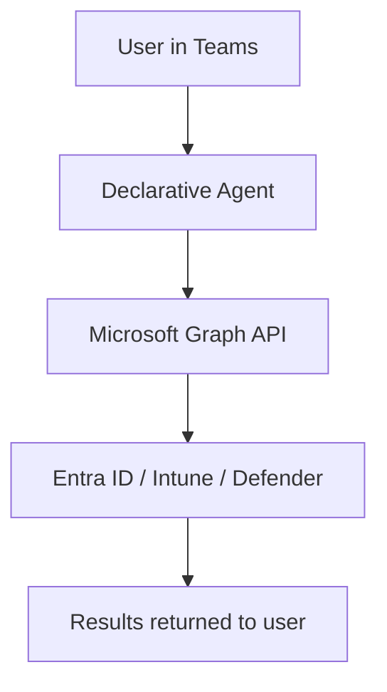

# {emoji} {title}

> **One-line summary of what this agent does and the primary problem it solves.**

| Attribute | Value |
|---|---|
| **Domain** | {domain} |
| **Architecture** | {architecture} |
| **Impact** | {impact} |
| **Effort** | {effort} |
| **Risk** | {risk} |
| **Approval Required** | {approval_required} |
| **Maturity** | {maturity} |

---

## Problem Statement

*Describe the enterprise pain point this agent addresses. What breaks, what costs time, what creates risk? Be specific — reference realistic scenarios rather than abstract descriptions. 2-4 paragraphs.*

---

## Agent Concept

*Describe what the agent does in plain English. How does an IT admin, security analyst, or end user interact with it? What questions can they ask? What does it return? 2-3 paragraphs.*

---

## Architecture

*Explain why this architecture tier was chosen. Reference the [Agent Patterns](../../docs/architecture/agent-patterns.md) doc. Include a Mermaid diagram if the flow is non-trivial.*

---

## Implementation Steps

1. **Create app registration** — Register an application in Entra ID with the required permissions listed below.
2. **Configure Graph API queries** — Build the queries that power the agent's knowledge.
3. **Create agent manifest** — Author the declarative agent manifest or Copilot Studio bot.
4. **Configure knowledge sources** — Connect SharePoint, Graph, or custom APIs as knowledge sources.
5. **Test in Teams** — Deploy to a test tenant and validate all prompts.
6. **Roll out to production** — Deploy via Teams Admin Center or Copilot Studio publish flow.

---

## Required Permissions

| Permission | Type | Justification |
|---|---|---|
| `User.Read.All` | Application | Read user profile data |
| `AuditLog.Read.All` | Application | Read sign-in and audit logs |

> **Principle of least privilege:** Request only the permissions above. Do not use Global Administrator or privileged roles for this agent.

---

## Security & Compliance Controls

- **Read-only by default** — This agent performs no write operations without explicit approval.
- **Audit logging** — All agent queries are logged to the Entra audit log.
- **Data residency** — All data remains within the M365 tenant boundary.
- **PII handling** — Responses are scoped to the requesting user's authorization level.
- **Retention** — Conversation history follows your tenant's Copilot conversation retention policy.

---

## Business Value & Success Metrics

**Primary value:** Describe the core business outcome in one sentence.

| Metric | Before Agent | After Agent | Target |
|---|---|---|---|
| Time to complete task | X hours | Y minutes | Z% reduction |
| Error rate | X% | Y% | Z% reduction |
| Analyst capacity freed | — | X hours/week | — |

---

## Example Use Cases

**Example 1:**
> "Show me all [relevant items] that are non-compliant."

**Example 2:**
> "Which [entities] haven't been reviewed in the last 90 days?"

**Example 3:**
> "Generate a summary report of [domain area] for my weekly review."

---

## Alternative Approaches

Without this agent, teams typically rely on:

- **Manual portal navigation** — Time-consuming, error-prone, no natural language interface.
- **PowerShell scripts** — Requires scripting knowledge, no conversational UX.
- **Existing Azure Monitor alerts** — Reactive rather than proactive, no context or guidance.

---

## Related Agents

- [Related Agent 1](link-to-agent.md) — How this agent connects to others
- [Related Agent 2](link-to-another.md) — Alternative approach
