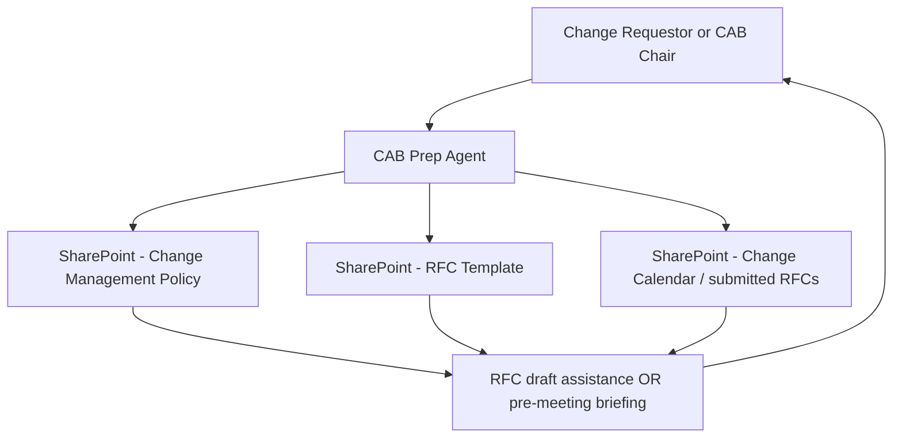

# 📅 Change Advisory Board Prep Agent

> **A declarative agent grounded in the change management knowledge base that helps change requestors prepare complete, high-quality CAB submissions and helps CAB chairs run structured review meetings.**

| Attribute | Value |
|---|---|
| **Domain** | Collaboration |
| **Architecture** | Declarative |
| **Impact** | Medium |
| **Effort** | Low |
| **Risk** | Low |
| **Approval Required** | No |
| **Maturity** | Concept |

---

## Problem Statement

Change Advisory Board processes are essential for managing the risk of IT changes in production environments, but they are frequently undermined by poor-quality submissions. Change requestors who don't have deep ITIL knowledge struggle to complete RFC (Request for Change) templates properly — risk assessments are superficial, rollback plans are vague, and implementation steps lack the detail needed for meaningful review.

CAB chairs spend a significant portion of each meeting asking clarifying questions that should have been answered in the submission, requesting revisions, or rubber-stamping changes because the review process can't keep up with submission volume. The process creates the appearance of governance without the substance.

---

## Agent Concept

For change requestors, the agent is a pre-submission coach: "I'm planning to migrate our Exchange transport rules to a new configuration. Help me write the CAB submission." The agent asks structured questions about the change (what, when, why, who, impact, risk, rollback), references the organization's change management policy from SharePoint, and produces a complete RFC draft in the required format.

For CAB chairs, the agent is a review assistant: before each CAB meeting, the agent reviews the submitted RFCs against completeness criteria and produces a pre-meeting briefing: "CAB meeting Thursday 3pm. 5 changes submitted. 2 are high-risk changes requiring extended review. Change #3 has an incomplete rollback plan — recommend returning for revision."

---

## Architecture

A **Tier 1 Declarative Agent** grounded in the organization's change management documentation (SharePoint). No API calls needed — this is pure knowledge-grounded generation.

---

## Implementation Steps

1. **Prepare SharePoint knowledge base** — Upload: change management policy, RFC template, risk assessment guide, standard rollback plan examples, CAB meeting agenda template, change calendar.

2. **Create declarative agent manifest** — Reference SharePoint as knowledge source. Write instructions for two personas: (a) RFC drafting assistant for requestors, (b) pre-meeting review summarizer for CAB chairs.

3. **Define RFC quality criteria** in instructions — Complete submissions must have: business justification, technical description with step-by-step implementation plan, risk score (likelihood × impact), specific rollback procedure (not "revert changes"), test plan, communication plan, and a defined change window.

4. **Deploy to Teams** — Target IT operations, platform engineering, and change management teams.

---

## Required Permissions

No Graph API permissions beyond SharePoint read access for the deploying user's context.

---

## Business Value & Success Metrics

**Primary value:** Improves RFC quality and CAB efficiency, reducing meeting time spent on clarification and revision requests.

| Metric | Before Agent | After Agent | Target |
|---|---|---|---|
| RFC completeness rate (first submission) | 50-60% | 85-90% | 60% improvement |
| CAB meeting time per change | 8-12 min avg | 4-6 min avg | 50% reduction |
| Changes returned for revision | 30-40% | 10-15% | 65% reduction |
| Change-related incidents (failed changes) | 5-10% of changes | 2-4% | 50% reduction |

---

## Example Use Cases

**Example 1:**
> "I need to submit a CAB request for upgrading the Intune connector for ServiceNow this weekend. Help me complete the RFC."

**Example 2:**
> "What information do I need to include in the risk assessment section of my CAB submission?"

**Example 3 (CAB chair):**
> "Summarize the 6 change requests submitted for this Thursday's CAB meeting. Which ones need additional information?"

---

## Related Agents

- [Teams Meeting Notes](teams-meeting-notes.md) — CAB meeting notes and decisions documented automatically
- [Tenant Health Dashboard](tenant-health-dashboard.md) — Service health should be checked before scheduling maintenance changes
- [Incident Postmortem Generator](../secops/incident-postmortem-generator.md) — Failed changes generate incidents requiring postmortem
