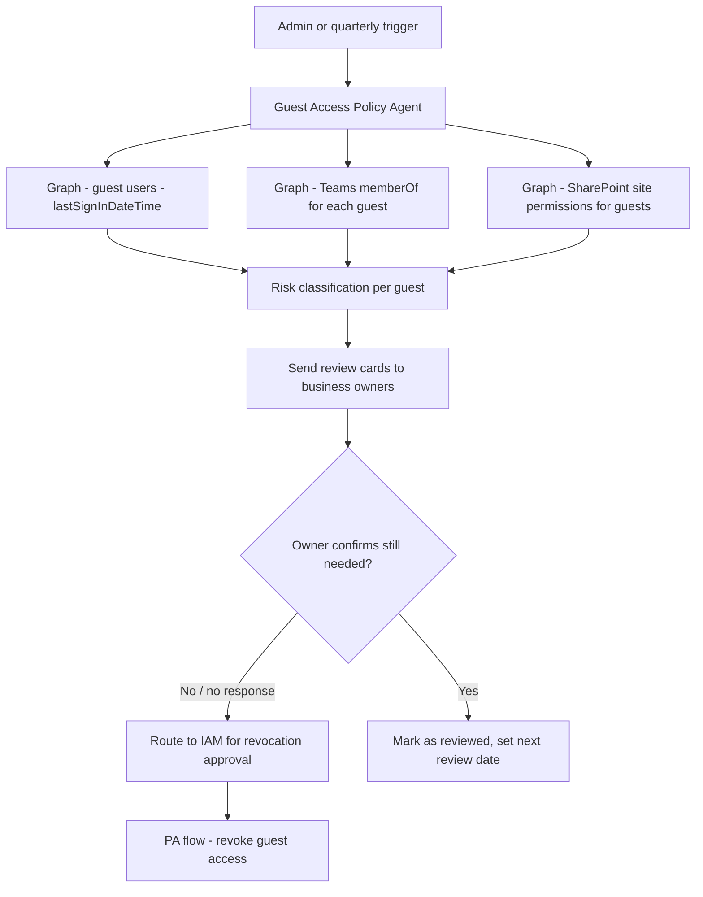

# 👥 Guest Access Policy Enforcer

> **A Copilot Studio agent that audits guest user access across Teams and SharePoint, identifies stale guests and policy violations, and routes cleanup approvals through the relevant business owners.**

| Attribute | Value |
|---|---|
| **Domain** | Collaboration |
| **Architecture** | Copilot Studio |
| **Impact** | High |
| **Effort** | Medium |
| **Risk** | Medium |
| **Approval Required** | Yes |
| **Maturity** | Concept |

---

## Problem Statement

Guest access in Microsoft 365 is essential for external collaboration — working with partners, clients, contractors, and vendors. It is also one of the most significant governance challenges in enterprise M365 deployments. Guest accounts accumulate: contractors whose engagement ended 18 months ago still have Teams channel access, former client contacts still have SharePoint site access, guests from an acquisition integration that was wound down are still in the directory.

Stale guest accounts represent both a security risk (an external party retaining access to corporate data after their legitimate access need has ended) and a compliance risk (many data protection frameworks require that access be revoked when the purpose for which it was granted no longer applies). In organizations with thousands of guest accounts and no systematic review process, the extent of stale access is often unknown.

---

## Agent Concept

The agent provides both audit and lifecycle management. For audit, an administrator asks "show me all guests who haven't signed in for more than 60 days" or "which guests have access to Teams channels containing confidential information?" The agent retrieves guest account data from Entra ID and cross-references with Teams membership and SharePoint permissions.

For lifecycle management, the agent runs a quarterly guest access review: for each guest, it identifies the primary business owner (the internal user who invited them or the team owner), sends a review card asking whether the guest's access should be maintained or revoked, and escalates non-responses. Approved revocations are processed by a Power Automate flow after IAM confirmation.

---

## Architecture

A **Tier 3 Copilot Studio agent** with Graph API access and Power Automate flows for review orchestration and revocation.

---

## Implementation Steps

1. **Create app registration** — `copilot-guest-policy` with `User.Read.All`, `Group.Read.All`, `TeamMember.Read.All`, `Sites.Read.All`.

2. **Build guest inventory query** — `GET /users?$filter=userType eq 'Guest'&$select=displayName,mail,signInActivity,createdDateTime`.

3. **Build access mapping** — For each guest, enumerate Teams memberships (`GET /users/{id}/memberOf`) and SharePoint site permissions.

4. **Build risk classification** — Score guests: high risk = access to confidential-labeled sites + last sign-in >90 days. Medium = stale access (>60 days). Low = active, recently accessed.

5. **Build quarterly review flow** — For each guest, identify the inviter/team owner. Send review Adaptive Card: "Guest X has access to [Team Y, Site Z]. They last signed in 95 days ago. Do they still need access? Yes / No."

6. **Build revocation flow** — Approved revocations: remove from Teams channels, remove SharePoint permissions, optionally disable account.

---

## Required Permissions

| Permission | Type | Justification |
|---|---|---|
| `User.Read.All` | Application | Read guest user properties and sign-in activity |
| `Group.Read.All` | Application | Read Teams/group memberships for guests |
| `Sites.Read.All` | Application | Read SharePoint site permissions for guests |
| `User.ReadWrite.All` | Application | Disable guest accounts after revocation approval |

---

## Security & Compliance Controls

- **Business owner review** — Each guest's access is reviewed by the internal user who is responsible for that relationship.
- **Non-response policy** — Guests with no response to a review request after 7 days are flagged for revocation.
- **IAM final confirmation** — All revocations require IAM team confirmation before execution.
- **Soft delete first** — Guests are first blocked from sign-in (soft delete) before account deletion, allowing a 30-day recovery window.

---

## Business Value & Success Metrics

**Primary value:** Eliminates stale guest access accumulation, reducing external access risk and improving compliance posture.

| Metric | Before Agent | After Agent | Target |
|---|---|---|---|
| Stale guest accounts (>90 days inactive) | 20-40% of guest estate | <5% | Near-zero |
| Guest access review frequency | Annual (if at all) | Quarterly | 4x more frequent |
| Review completion rate | 40-50% | 90%+ | Significant improvement |
| Time to complete guest access review | 3-4 weeks | 1-2 weeks | 60% reduction |

---

## Example Use Cases

**Example 1:**
> "Show me all guest users who haven't signed in for more than 90 days and still have active Teams access."

**Example 2:**
> "Start the quarterly guest access review for guests in the Finance and Legal Teams channels."

**Example 3:**
> "Which guests have access to SharePoint sites with Confidential sensitivity labels?"

---

## Related Agents

- [External Sharing Exception Workflow](../compliance/external-sharing-exception-workflow.md) — Governs the initial granting of external access
- [Privileged Access Review](../identity/privileged-access-review.md) — Guest users in privileged groups need elevated review priority
- [Offboarding Orchestrator](../secops/offboarding-orchestrator.md) — Guest contractors should be offboarded via the same process as employees
