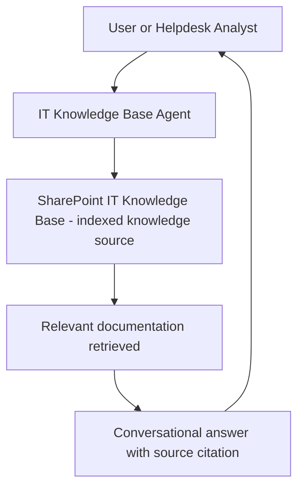

# 📚 Knowledge Base RAG Agent

> **A declarative agent grounded in the organization's IT knowledge base (SharePoint), enabling employees and helpdesk staff to get accurate, sourced answers to IT questions without navigating documentation or opening tickets.**

| Attribute | Value |
|---|---|
| **Domain** | Collaboration |
| **Architecture** | Declarative |
| **Impact** | High |
| **Effort** | Low |
| **Risk** | Low |
| **Approval Required** | No |
| **Maturity** | Concept |

---

## Problem Statement

Most organizations have an IT knowledge base — a SharePoint site, Confluence space, or wiki — containing how-to guides, policy documents, troubleshooting procedures, and FAQs. The problem is discoverability and accessibility. Users who need to know how to set up VPN on a Mac, reset their MFA method, or request software access must know that the knowledge base exists, navigate to it, formulate a search query, evaluate multiple results, and read through potentially outdated documentation.

The majority of tier-1 helpdesk tickets can be self-served from existing documentation. But the effort required to find and apply that documentation is high enough that most users default to opening a ticket. A helpdesk analyst then spends 10-15 minutes finding and reading the same documentation to answer the user's question.

The M365 Copilot declarative agent model is purpose-built for this use case: ground the agent in the SharePoint knowledge base, and users can ask questions in natural language and receive accurate, sourced answers with direct links to the relevant documentation.

---

## Agent Concept

A user asks "How do I connect to VPN from home?" in Teams. The agent queries the IT knowledge base SharePoint site, finds the relevant how-to guide, and returns a conversational answer with numbered steps extracted from the documentation, plus a direct link to the source document for reference. The answer is grounded — the agent cites its source and does not hallucinate procedures.

For helpdesk analysts, the agent is a first-responder: "What's the process for requesting software installation?" gives the analyst the exact procedure to follow or share with the user, pulled from the current approved documentation.

---

## Architecture

A **Tier 1 Declarative Agent** with SharePoint as the sole knowledge source. This is the simplest possible Copilot agent deployment — no custom plugins, no API calls, just grounded generation from curated documentation.

---

## Implementation Steps

1. **Prepare SharePoint knowledge base** — Ensure the SharePoint site has well-organized, up-to-date content. Outdated or conflicting documents should be archived before the agent is deployed (garbage in, garbage out).

2. **Create declarative agent manifest** — Reference the SharePoint site as a knowledge source. Write instructions that: always cite the source document, indicate when documentation may be outdated (check last modified date), and escalate to the helpdesk when the answer is not found in the knowledge base.

3. **Configure knowledge source scope** — Limit the knowledge source to the IT knowledge base site specifically; do not grant access to all SharePoint content.

4. **Deploy to Teams** — Available to all employees. No admin permissions required.

5. **Establish maintenance cadence** — Monthly review of most-queried topics to ensure documentation is current. The agent's query logs (via Copilot analytics) show which topics users ask about most, driving documentation prioritization.

---

## Required Permissions

No Graph API application permissions required. The agent uses delegated permissions via the user's existing SharePoint access. Users can only receive answers about content they already have permission to read.

---

## Security & Compliance Controls

- **Permissions-respecting** — The agent only surfaces content from SharePoint sites the requesting user has permission to read. No permission elevation.
- **Source citation** — Every answer includes a link to the source document, enabling users to verify accuracy.
- **Scope limited** — The knowledge source is scoped to the IT knowledge base site only, not all SharePoint content.

---

## Business Value & Success Metrics

**Primary value:** Deflects tier-1 helpdesk tickets that can be self-served from existing documentation, reducing helpdesk volume and improving user satisfaction.

| Metric | Before Agent | After Agent | Target |
|---|---|---|---|
| Tier-1 ticket deflection rate | 10-15% (self-service portal) | 30-40% | 3x improvement |
| Mean time to answer common IT questions | 15-30 min (ticket) | 2-3 min (agent) | 90% reduction |
| Knowledge base utilization | Low (navigation friction) | High (conversational access) | Significant increase |
| Helpdesk tickets for documented procedures | 200-300/month typical | 80-120/month | 50% reduction |

---

## Example Use Cases

**Example 1:**
> "How do I set up MFA on my new phone?"

**Example 2:**
> "What's the process for requesting access to the Finance SharePoint site?"

**Example 3:**
> "My VPN is disconnecting every 20 minutes. How do I fix this?"

**Example 4 (helpdesk):**
> "What's our standard process for onboarding a Mac laptop?"

---

## Alternative Approaches

- **SharePoint search** — Available but requires navigation to the site and formulating effective search queries.
- **Self-service portal (FAQs)** — Helpful but requires users to browse categories rather than ask natural language questions.
- **ChatGPT / general AI** — Not grounded in organizational documentation; may hallucinate incorrect procedures.

---

## Related Agents

- [Tenant Health Dashboard](tenant-health-dashboard.md) — Service health updates should be reflected in the knowledge base
- [Intune Troubleshooting](../endpoint/intune-troubleshooting.md) — More specialized troubleshooting for device-specific issues
- [Onboarding Access Assistant](../identity/onboarding-access-assistant.md) — Handles access requests that the knowledge base agent identifies as needed
