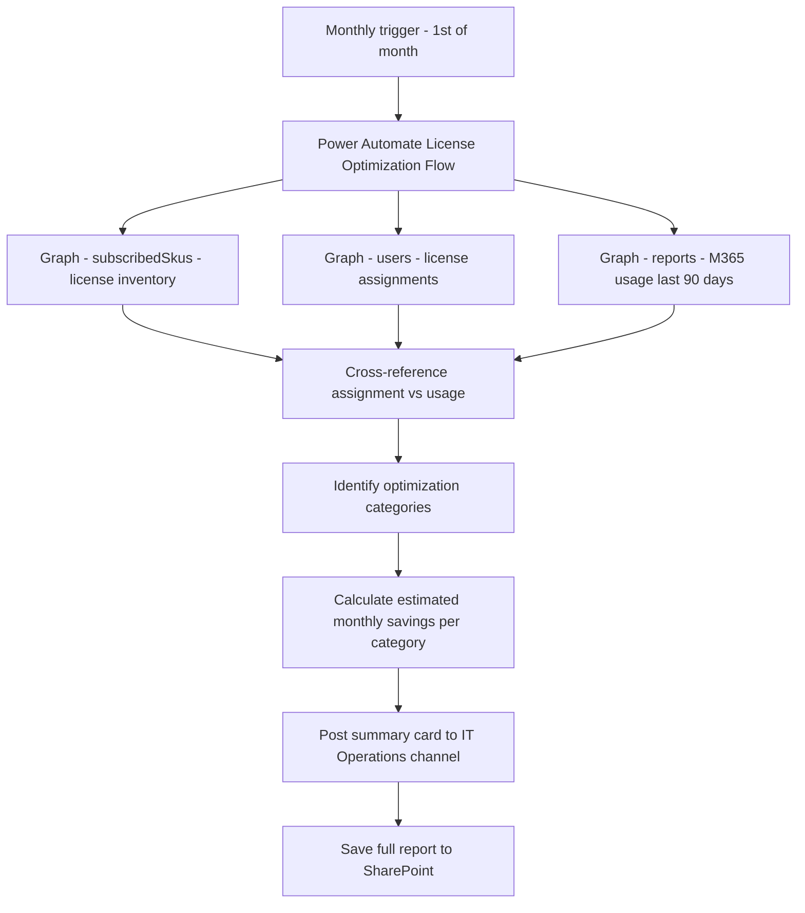

# 💰 License Optimization Advisor

> **A Power Automate flow that analyses M365 license assignments against actual usage data to identify unassigned, underused, and over-provisioned licenses — producing a monthly optimization report with estimated savings.**

| Attribute | Value |
|---|---|
| **Domain** | Collaboration |
| **Architecture** | Power Automate |
| **Impact** | Medium |
| **Effort** | Medium |
| **Risk** | Low |
| **Approval Required** | No |
| **Maturity** | Concept |

---

## Problem Statement

Microsoft 365 licensing costs are a significant and frequently inefficient IT expense. In a typical enterprise, 10-20% of assigned licenses are effectively wasted: assigned to inactive accounts, to users who left months ago before the license was reclaimed, to users who have a premium license when a lower tier would meet their needs, or as duplicates where a user was assigned two overlapping licenses.

License optimization is understood to be valuable — the CFO is always interested in finding cost savings — but it is rarely done systematically because getting accurate usage data requires navigating multiple M365 usage reports, correlating with license assignment data, and understanding which license SKUs overlap with which features. This is a 4-8 hour analysis exercise that most IT teams do annually at best.

---

## Agent Concept

A monthly Power Automate flow queries license assignment data (all users and their assigned SKUs) alongside M365 usage reports (last-activity dates for Exchange, Teams, SharePoint, OneDrive per user). It identifies four optimization categories:

1. **Unassigned licenses** — Purchased but not assigned to any user
2. **Inactive user licenses** — Assigned to users with no activity in 90+ days (potential leaver or inactive account)
3. **Feature underutilization** — Users with E5 licenses who never use E5-specific features (Defender for Office P2, Purview compliance features, Phone System)
4. **License stacking** — Users assigned multiple licenses with overlapping feature coverage

The monthly report is posted to the IT Operations Teams channel as an Adaptive Card with estimated monthly savings and a link to the full analysis in SharePoint.

---

## Architecture

A **Power Automate scheduled flow** for monthly analysis. A companion declarative agent for on-demand queries ("how many unused licenses do we have right now?").

---

## Implementation Steps

1. **Create app registration** — `copilot-license-opt` with `Directory.Read.All`, `Reports.Read.All`, `Organization.Read.All`.

2. **Build license inventory query** — `GET /subscribedSkus` to get all purchased license quantities and assigned counts. `GET /users?$select=assignedLicenses,signInActivity,accountEnabled`.

3. **Build usage data query** — `GET /reports/getM365AppUserDetail(period='D90')` for per-user activity across workloads.

4. **Build correlation logic** — For each user: compare assigned SKU features against used features. Flag inactive users (no sign-in in 90 days). Identify E5 users with zero Defender/Purview usage.

5. **Build cost calculation** — Map license SKU IDs to display names and list prices. Calculate monthly savings per optimization category.

6. **Build monthly report card** — Adaptive Card with: total potential monthly savings, breakdown by category, top 10 specific recommendations, link to full SharePoint report.

---

## Required Permissions

| Permission | Type | Justification |
|---|---|---|
| `Directory.Read.All` | Application | Read user license assignments |
| `Reports.Read.All` | Application | Read M365 usage reports per user |
| `Organization.Read.All` | Application | Read subscribed license SKUs |

---

## Business Value & Success Metrics

**Primary value:** Identifies 10-20% of the M365 licensing spend as reclaimable, providing direct cost savings with minimal effort.

| Metric | Before Agent | After Agent | Target |
|---|---|---|---|
| License waste identified | Unknown / annual manual | Monthly, quantified | Regular visibility |
| Licenses reclaimed per year | Ad hoc | Systematic | 10-20% of estate |
| Annual savings identified | Rarely quantified | £100K-1M+ depending on scale | ROI-positive from month 1 |
| Time for license analysis | 4-8 hours/quarter | Automated monthly | 95% reduction |

---

## Example Use Cases

**Example 1 (monthly report card):** "License Optimization Report - March 2026: Estimated monthly savings identified: £48,200. Unassigned licenses: 34. Inactive user licenses: 127. E5 underutilization candidates: 89."

**Example 2 (on-demand):**
> "How many Microsoft 365 E5 licenses are assigned to users with no Defender for Office P2 usage?"

**Example 3 (on-demand):**
> "Which users have been inactive for more than 90 days but still have active M365 licenses?"

---

## Related Agents

- [Offboarding Orchestrator](../secops/offboarding-orchestrator.md) — Timely offboarding prevents inactive licenses from accumulating
- [Stale Device Cleanup Planner](../endpoint/stale-device-cleanup.md) — Stale devices often correlate with inactive users who have unneeded licenses
- [Tenant Health Dashboard](tenant-health-dashboard.md) — License alerts may appear in service health communications
