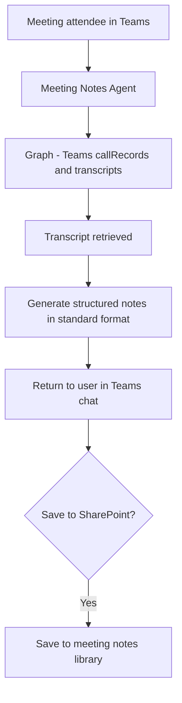

# 📋 Teams Meeting Notes Agent

> **A declarative agent that generates structured meeting notes, action item lists, and decision logs from Teams meeting transcripts — available immediately after meeting end without manual summarization.**

| Attribute | Value |
|---|---|
| **Domain** | Collaboration |
| **Architecture** | Declarative |
| **Impact** | Medium |
| **Effort** | Low |
| **Risk** | Low |
| **Approval Required** | No |
| **Maturity** | Concept |

---

## Problem Statement

Meeting notes are essential for organizational memory, accountability, and follow-through on commitments — yet they are consistently produced late, incompletely, or not at all. The person designated to take notes during a meeting is simultaneously expected to participate actively in the discussion. They either take poor notes while distracted or disengage from the conversation to write comprehensively. The notes that emerge are often a stream-of-consciousness transcript rather than a structured document with clear action items.

For organizations using Microsoft 365 Copilot, the platform's built-in meeting recap functionality already addresses much of this need. This agent pattern represents a complementary approach for organizations that want to customize the output format, integrate meeting outputs into specific SharePoint libraries or planner tasks, or provide access to teams not yet licensed for full M365 Copilot.

---

## Agent Concept

After a recorded Teams meeting ends, an attendee asks the agent "Summarize the meeting I just had" or "What were the action items from the 2pm strategy meeting?" The agent accesses the Teams meeting transcript (via the Graph Calls API), generates a structured summary in the organization's standard format, and provides the output in the channel or saves it to a designated SharePoint location.

The standard output format includes: meeting metadata (attendees, date, duration), executive summary (3-5 bullet points), key decisions made, action items with owner and due date, and open questions for follow-up.

---

## Architecture

A **Tier 1 Declarative Agent** using the Teams Graph API for transcript access. The agent generates structured output; saving to SharePoint is an optional follow-on step.

---

## Implementation Steps

1. **Create app registration** — `copilot-meeting-notes` with `CallRecords.Read.All`, `OnlineMeetingTranscript.Read.All`.

2. **Build declarative agent manifest** — Reference Graph API plugin for transcript retrieval. Author instructions defining the standard meeting notes format.

3. **Define standard output format** in instructions — Meeting Metadata | Executive Summary | Decisions Made | Action Items (owner, due date) | Open Questions.

4. **Optional: SharePoint integration** — Add a SharePoint write action to save completed notes to a designated meeting notes library with appropriate metadata.

5. **Deploy to all Teams users.**

---

## Required Permissions

| Permission | Type | Justification |
|---|---|---|
| `CallRecords.Read.All` | Application | Read Teams call records and transcripts |
| `OnlineMeetingTranscript.Read.All` | Delegated | Read transcripts for meetings the user attended |

---

## Security & Compliance Controls

- **Attendee scope** — Users can only access transcripts for meetings they attended. No cross-user transcript access.
- **Recording policy compliance** — The agent only processes transcripts from meetings where recording/transcription was enabled per organizational policy.
- **Retention compliance** — Meeting notes saved to SharePoint are subject to the same retention policies as other SharePoint content.

---

## Business Value & Success Metrics

**Primary value:** Eliminates the meeting notes bottleneck, ensuring every recorded meeting produces a structured, searchable record immediately.

| Metric | Before Agent | After Agent | Target |
|---|---|---|---|
| Meetings with structured notes produced | 20-30% | 90%+ | 3x improvement |
| Time to produce meeting notes | 30-60 min post-meeting | 2-3 min | 95% reduction |
| Action item tracking rate | Low (informal) | High (structured list) | Significant improvement |

---

## Example Use Cases

**Example 1:**
> "Summarize my 2pm meeting today and list the action items."

**Example 2:**
> "What decisions were made in the product roadmap meeting on March 10th?"

**Example 3:**
> "Save the notes from today's standup to our project SharePoint site."

---

## Related Agents

- [Knowledge Base RAG](knowledge-base-rag.md) — Meeting notes can be indexed in the knowledge base for future reference
- [Change Advisory Board Prep](change-advisory-board-prep.md) — CAB meetings specifically benefit from structured notes and decision logging
