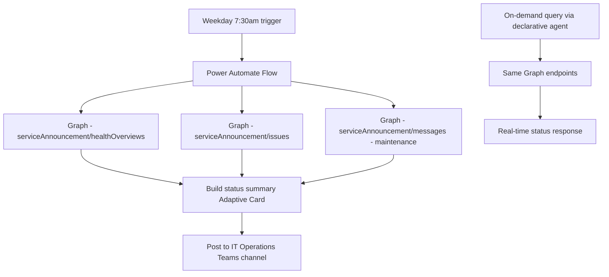

# 📈 Tenant Health Dashboard

> **A Power Automate flow that aggregates M365 service health advisories, active incidents, and upcoming maintenance windows into a daily morning briefing card posted to a dedicated Teams channel.**

| Attribute | Value |
|---|---|
| **Domain** | Collaboration |
| **Architecture** | Power Automate |
| **Impact** | High |
| **Effort** | Medium |
| **Risk** | Low |
| **Approval Required** | No |
| **Maturity** | Concept |

---

## Problem Statement

M365 service health information is available in the Microsoft 365 Admin Center, but in practice it is rarely checked proactively. Most IT teams learn about service degradations from end users calling the helpdesk — often 30-60 minutes after an incident begins. This reactive discovery means IT staff are fielding "is Teams down?" calls without context, and helpdesk analysts are troubleshooting user issues without knowing whether there is an active platform incident that explains them.

The Microsoft 365 Service Health API provides real-time access to the same information visible in the Admin Center — active incidents, advisories, and maintenance windows — but surfacing it proactively requires building a notification mechanism.

---

## Agent Concept

Every weekday morning at 7:30am, a Power Automate flow queries the M365 Service Health API and posts a structured Adaptive Card to a dedicated "IT Operations" Teams channel. The card shows: current service health status by workload (Exchange, Teams, SharePoint, Entra, Intune, etc.), any active incidents with severity and estimated resolution, any advisories that may impact end users, and maintenance windows scheduled for the next 7 days.

A companion declarative agent allows on-demand queries: "Is there an active Teams incident right now?" or "What maintenance is scheduled this weekend?"

---

## Architecture

A **Power Automate scheduled flow** for proactive briefing. A **declarative agent** for on-demand queries. Both backed by the M365 Service Health Graph API.

---

## Implementation Steps

1. **Create app registration** — `copilot-tenant-health` with `ServiceHealth.Read.All`.

2. **Build morning briefing flow** — Recurrence trigger (weekdays, 7:30am). Query `GET /admin/serviceAnnouncement/healthOverviews` and `GET /admin/serviceAnnouncement/issues?$filter=isResolved eq false`. Build Adaptive Card with color-coded status (green/yellow/red per workload). Post to Teams channel.

3. **Build maintenance window notification** — Weekly on Fridays: query upcoming maintenance messages for the next 7 days. Post weekend maintenance summary.

4. **Build incident alert flow** — Triggered by new active incident (poll every 15 minutes during business hours). Post alert card when new incident detected.

5. **Build declarative agent** — For on-demand queries. Same Graph plugin, conversational interface.

---

## Required Permissions

| Permission | Type | Justification |
|---|---|---|
| `ServiceHealth.Read.All` | Application | Read M365 service health status and incidents |

---

## Business Value & Success Metrics

**Primary value:** Shifts IT operations from reactive (learning about outages from end users) to proactive (knowing about incidents before users call).

| Metric | Before Agent | After Agent | Target |
|---|---|---|---|
| Detection lag for M365 incidents | 30-60 min (user reports) | <15 min | 75% reduction |
| "Is X down?" helpdesk calls during incidents | High volume | Reduced (proactive comms) | 40% reduction |
| Maintenance windows missed by IT | Occasional | None | Zero misses |

---

## Example Use Cases

**Example 1 (morning card):** "Good morning. Current M365 status: Exchange Online — Healthy. Microsoft Teams — Advisory: Some users may experience delays in message delivery. SharePoint — Healthy. See full details in the Admin Center."

**Example 2 (on-demand):**
> "Is there an active Microsoft Teams incident right now?"

**Example 3 (on-demand):**
> "What M365 maintenance is scheduled for this weekend?"

---

## Related Agents

- [Intune Troubleshooting](../endpoint/intune-troubleshooting.md) — Cross-reference Intune service health when troubleshooting device issues
- [Exchange Mail Flow Diagnostic](../secops/exchange-mail-flow-diagnostic.md) — Exchange incidents often explain mail flow issues
- [Knowledge Base RAG](knowledge-base-rag.md) — Post service health updates to the knowledge base for user self-service
