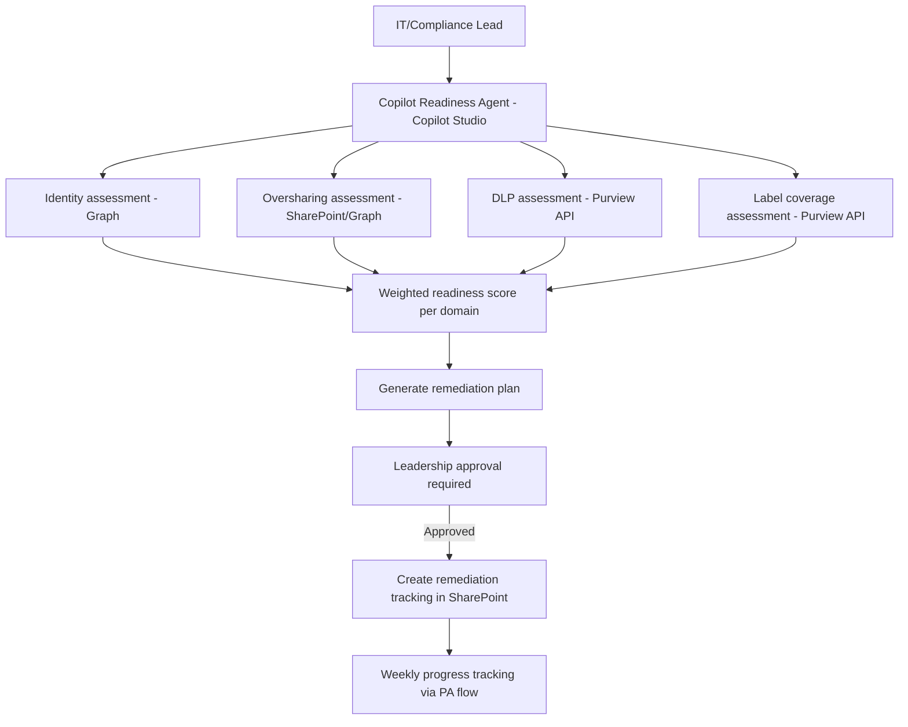

# 🤖 Copilot Readiness & Governance

> **A hybrid agent that assesses Microsoft 365 Copilot deployment readiness across five domains — data governance, identity, DLP, sensitivity labeling, and oversharing — and generates a phased remediation plan with approval gates before Copilot licenses are activated.**

| Attribute | Value |
|---|---|
| **Domain** | Compliance |
| **Architecture** | Hybrid |
| **Impact** | High |
| **Effort** | High |
| **Risk** | Medium |
| **Approval Required** | Yes |
| **Maturity** | Concept |

---

## Problem Statement

Microsoft 365 Copilot is one of the most powerful productivity tools ever deployed in enterprise environments — and one of the most data-aware. Copilot can read, summarize, and act on any content the user has permission to access, including content the user never knowingly accessed directly. This makes Copilot's information access boundaries identical to the user's SharePoint permissions — which in most organizations means Copilot can potentially surface content from years of oversharing, mis-classified sensitive documents, and incorrectly permissioned sites.

Organizations that deploy Copilot without a governance readiness assessment risk creating a situation where Copilot becomes an inadvertent insider threat tool: a user asks Copilot to summarize "all HR documents" and receives summaries of documents from a broadly shared HR SharePoint site that were never intended for their role. Or an executive asks Copilot to help prepare a presentation and it pulls in confidential M&A information from an improperly secured site.

The readiness assessment is not optional — it is a prerequisite for responsible deployment. But it is complex: it spans identity, data governance, DLP, sensitivity labeling, oversharing, and change management. Most organizations don't know where to start.

---

## Agent Concept

The agent conducts a structured readiness assessment across five domains and produces a weighted readiness score. The assessment covers:

1. **Identity** — MFA registration rate, Conditional Access coverage, privileged access governance
2. **Oversharing** — Broadly accessible SharePoint content, anonymous links, Everyone sharing
3. **Sensitivity labeling** — Label coverage across OneDrive and SharePoint content
4. **DLP** — DLP policy coverage for Copilot-relevant scenarios (prompt injection, data exfiltration)
5. **Copilot governance** — Copilot usage policies, interaction logging configuration, plugin governance

The agent returns a readiness score per domain (0-100) and an overall score, with specific remediation items ranked by impact. It then generates a phased deployment plan: which remediation must be complete before any Copilot licenses are activated, which can be addressed in parallel with a limited pilot, and which are ongoing governance activities.

---

## Architecture

A **Tier 4 Hybrid agent** combining Copilot Studio (assessment conversation and reporting), Power Automate (assessment data collection flows), and SharePoint (remediation tracking list and governance documentation).

---

## Implementation Steps

1. **Create app registration** — `copilot-readiness` with `Sites.Read.All`, `InformationProtectionPolicy.Read`, `Policy.Read.All`, `User.Read.All`, `DeviceManagementConfiguration.Read.All`.

2. **Build assessment modules** — One Power Automate flow per domain. Each flow returns a structured JSON result with: score, findings, and remediation items.

3. **Build scoring engine** in agent instructions — Weight each domain: Identity 25%, Oversharing 30%, Sensitivity Labels 20%, DLP 15%, Governance 10%.

4. **Generate remediation plan** — Classify each finding as: Pre-deployment blocker, Pilot prerequisite, Ongoing governance. Produce a project plan with estimated effort per item.

5. **Build tracking list** — SharePoint list with one row per remediation item: finding, owner, due date, status, evidence of completion.

6. **Leadership approval gate** — Before Copilot license assignment, the readiness report requires sign-off from CISO and IT Director via approval card.

---

## Required Permissions

| Permission | Type | Justification |
|---|---|---|
| `Sites.Read.All` | Application | Assess SharePoint sharing configurations |
| `InformationProtectionPolicy.Read` | Application | Assess sensitivity label coverage |
| `Policy.Read.All` | Application | Assess DLP and CA policy coverage |
| `User.Read.All` | Application | Assess identity readiness (MFA, CA) |

---

## Security & Compliance Controls

- **Leadership approval gate** — Copilot license activation blocked until readiness threshold is met and approved.
- **Remediation tracking** — All pre-deployment blockers tracked to completion with evidence.
- **Ongoing monitoring** — Post-deployment, monthly readiness re-assessment runs automatically.

---

## Business Value & Success Metrics

**Primary value:** Prevents data exposure incidents during Copilot deployment by ensuring governance foundations are in place before activation.

| Metric | Before Agent | After Agent | Target |
|---|---|---|---|
| Copilot deployment readiness assessment time | 4-8 weeks manual | 1-2 weeks | 75% reduction |
| Oversharing remediated before deployment | Partial | >80% of critical findings | High coverage |
| Copilot data exposure incidents (post-deploy) | Unknown/high risk | Managed low risk | Significant reduction |
| Readiness score at deployment | Unquantified | >75/100 | Defined threshold |

---

## Example Use Cases

**Example 1:**
> "Assess our tenant's readiness for Microsoft 365 Copilot deployment."

**Example 2:**
> "What are the pre-deployment blockers we must address before activating Copilot licenses?"

**Example 3:**
> "Show the current remediation progress. Are we on track for our planned deployment date?"

---

## Related Agents

- [SharePoint Oversharing Finder](../secops/sharepoint-oversharing-finder.md) — Addresses the oversharing domain of the readiness assessment
- [Data Classification Assistant](data-classification-assistant.md) — Addresses sensitivity labeling coverage
- [DLP Policy Tuning](dlp-policy-tuning.md) — Addresses DLP readiness domain
