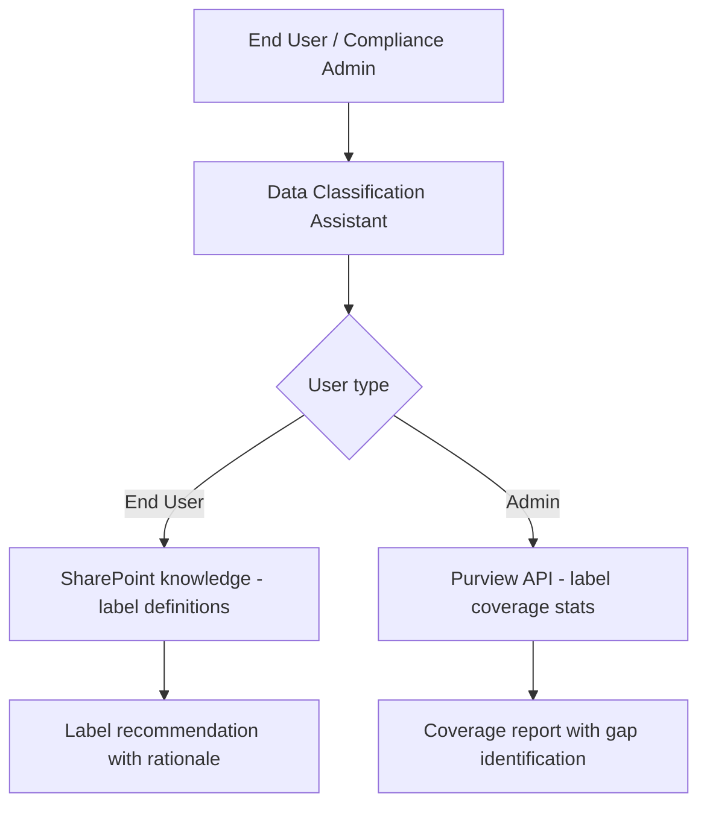

# 🏷️ Data Classification Assistant

> **A declarative agent that helps users understand and apply Microsoft Purview sensitivity labels correctly, and helps compliance administrators assess label coverage and identify unlabeled sensitive content.**

| Attribute | Value |
|---|---|
| **Domain** | Compliance |
| **Architecture** | Declarative |
| **Impact** | Medium |
| **Effort** | Medium |
| **Risk** | Medium |
| **Approval Required** | No |
| **Maturity** | Concept |

---

## Problem Statement

Sensitivity labels are foundational to data governance in Microsoft 365, but their effectiveness depends entirely on correct and consistent application. In most organizations, label coverage is low: employees don't understand what labels mean, don't know which label to apply to a given document, and default to either the lowest label (to avoid encryption complications) or no label at all.

The consequences: sensitive documents that should be encrypted and access-controlled are shared freely, DLP policies that depend on label matching fail to trigger, and Copilot governance that relies on sensitivity labels to restrict access cannot function. A data classification framework that exists on paper but is inconsistently applied in practice provides negligible security value.

---

## Agent Concept

Dual persona agent: for end users, it's a labeling coach — "which label should I use for this document that contains salary data?" The agent asks clarifying questions (what type of data, intended audience, sharing scope) and recommends the correct label with an explanation of what protections it applies. For compliance administrators, it's a coverage dashboard — surfacing which SharePoint sites have low label coverage, which content types contain sensitive data patterns but lack labels, and labeling trend data.

---

## Architecture

A **Tier 1 Declarative Agent** with Purview and SharePoint API access. The user-facing persona requires no admin permissions; the admin persona uses application permissions for tenant-wide coverage analysis.

---

## Implementation Steps

1. **Build user-facing knowledge source** — SharePoint document with all sensitivity label names, descriptions, protection settings, and decision guide ("if your document contains X, use Y label").

2. **Create app registration** — `copilot-data-classification` with `InformationProtectionPolicy.Read`, `Sites.Read.All`.

3. **Build admin analysis capability** — Graph API queries for label coverage stats per SharePoint site, unlabeled document count, and sensitive content (PII detected by auto-classification) without labels.

4. **Deploy two scopes** — End user persona deployed broadly via Teams. Admin analysis scoped to compliance team only.

---

## Required Permissions

| Permission | Type | Justification |
|---|---|---|
| `InformationProtectionPolicy.Read` | Application | Read label definitions and coverage statistics |
| `Sites.Read.All` | Application | Assess label coverage across SharePoint |

---

## Business Value & Success Metrics

**Primary value:** Increases sensitivity label adoption by making labeling decisions easy for end users, improving data governance effectiveness.

| Metric | Before Agent | After Agent | Target |
|---|---|---|---|
| Sensitivity label coverage | 20-40% typical | 70%+ | 3x improvement |
| End user labeling errors | High | Low | Significant reduction |
| Time for compliance admin coverage review | 4-8 hours | 30 minutes | 90% reduction |

---

## Example Use Cases

**Example 1:**
> "I'm writing a document with our Q3 financial results for the board. Which sensitivity label should I apply?"

**Example 2:**
> "What does the 'Highly Confidential' label actually do? Does it encrypt the file?"

**Example 3 (admin):**
> "Show me the top 10 SharePoint sites with the lowest sensitivity label coverage."

---

## Related Agents

- [Copilot Readiness & Governance](copilot-readiness-assessor.md) — Label coverage is a key readiness domain
- [DLP Policy Tuning](dlp-policy-tuning.md) — DLP policies often reference sensitivity labels; better labeling improves DLP effectiveness
- [SharePoint Oversharing Finder](../secops/sharepoint-oversharing-finder.md) — Labels help identify which broadly-shared content is most sensitive
