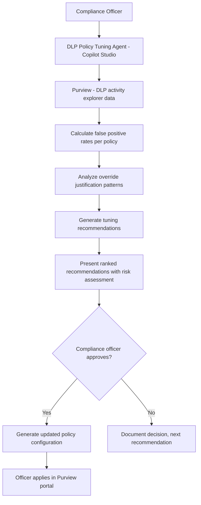

# 🚧 DLP Policy Tuning Advisor

> **A Copilot Studio agent that analyzes DLP policy match events, identifies high-volume false positive rules, and recommends targeted tuning adjustments — with approval required before any policy changes are generated.**

| Attribute | Value |
|---|---|
| **Domain** | Compliance |
| **Architecture** | Copilot Studio |
| **Impact** | High |
| **Effort** | Medium |
| **Risk** | Medium |
| **Approval Required** | Yes |
| **Maturity** | Concept |

---

## Problem Statement

Data Loss Prevention policies in Microsoft Purview are essential for protecting sensitive information, but poorly tuned policies create two serious problems. First, high false positive rates — policies that block legitimate business activities (a finance analyst can't email a spreadsheet to an auditor, a salesperson can't share a pricing document with a prospect) create business friction that generates a constant stream of helpdesk tickets and management escalations. Frustrated users route around DLP by using personal email or unapproved tools, which creates exactly the risk DLP was designed to prevent.

Second, alert fatigue: when DLP generates hundreds of policy match notifications per day, compliance officers become desensitized and miss the genuine violations. The signal-to-noise ratio degrades to the point where the compliance team is effectively blind to real data exfiltration events.

Tuning DLP policies requires balancing protection effectiveness against business friction — a judgment call that requires understanding both the policy's intent and the actual business context of the matched events. This is a domain where AI assistance adds significant value.

---

## Agent Concept

The agent queries DLP activity explorer data to identify the highest-volume policy matches over the last 30 days. For each policy, it calculates the false positive rate (matches that were overridden with a user justification), the business justification pattern (what reasons are users providing for overrides?), and the content types that are generating the most matches.

The agent recommends tuning adjustments: threshold changes (reduce sensitivity to reduce false positives while maintaining detection of genuine high-volume exfiltration), exception conditions (add an approved domain list for external sharing), or scope narrowing (apply the policy only to external communications, not internal). Each recommendation includes an estimate of the impact on false positive rate and a statement of residual risk.

Policy changes require compliance officer approval before the agent generates the updated policy configuration.

---

## Architecture

A **Tier 3 Copilot Studio agent** with Purview API access. No automated policy changes — all tuning is generated as configuration guidance that the compliance officer applies.

---

## Implementation Steps

1. **Create app registration** — `copilot-dlp-tuning` with `InformationProtectionPolicy.Read`, `DelegatedPermissionGrant.ReadWrite.All`, `ComplianceManager.Read.All`.

2. **Build activity explorer query** — Purview activity explorer API: aggregate DLP events by policy and rule, calculate override rates, extract justification text patterns.

3. **Build tuning analysis** in agent instructions — Define tuning strategies for each false positive pattern: high-volume internal sharing false positives → add internal domain exception, legitimate business content false positives → raise threshold or add content exception, role-specific false positives → add user group exclusion.

4. **Build recommendation presentation** — For each recommendation: current false positive rate, projected false positive rate after tuning, residual risk statement, and the exact policy configuration change.

5. **Build approval and configuration output** — On approval, produce the Purview policy JSON configuration or PowerShell command for the compliance officer to apply.

---

## Required Permissions

| Permission | Type | Justification |
|---|---|---|
| `InformationProtectionPolicy.Read` | Application | Read DLP policy configurations |
| `ActivityFeed.Read` | Application | Read DLP activity explorer events |

---

## Security & Compliance Controls

- **Approval required for all changes** — No DLP policy is modified without compliance officer approval.
- **Residual risk statement** — Every tuning recommendation includes an explicit statement of what risks would remain after the change.
- **Dual approval for scope reduction** — Changes that reduce the scope of a DLP policy (fewer users or workloads covered) require CISO approval in addition to compliance officer approval.
- **Rollback configuration** — Current policy configuration is exported and stored before any approved tuning is applied.

---

## Business Value & Success Metrics

**Primary value:** Reduces DLP false positive rate by 40-60%, decreasing business friction while maintaining genuine data protection.

| Metric | Before Agent | After Agent | Target |
|---|---|---|---|
| DLP false positive rate | 60-80% typical | 20-30% | 60% reduction |
| DLP-related helpdesk tickets/week | 30-50 | 10-15 | 70% reduction |
| Time to analyze and tune DLP policies | 2-3 weeks/quarter | 1-2 days | 85% reduction |
| Policy tuning frequency | Annually (if at all) | Quarterly | 4x more frequent |

---

## Example Use Cases

**Example 1:**
> "Which DLP policies have the highest false positive rates this month?"

**Example 2:**
> "Analyze our 'Credit Card Number' DLP rule and recommend tuning to reduce false positives in the Finance department."

**Example 3:**
> "Our users keep overriding the external email DLP policy with the justification 'sending to auditor.' How should we tune the policy?"

---

## Alternative Approaches

- **Purview DLP activity explorer** — Available but requires manual analysis; no tuning recommendations.
- **Microsoft DLP policy testing** — Simulation mode available but not conversational or recommendation-driven.
- **Manual compliance review** — Quarterly review of DLP alerts; slow, inconsistent, and dependent on individual expertise.

---

## Related Agents

- [Policy-to-Enforcement Mapper](policy-to-enforcement-mapper.md) — Identifies which policy requirements DLP is intended to enforce
- [Data Classification Assistant](data-classification-assistant.md) — Better sensitivity labeling improves DLP policy effectiveness
- [Exchange Mail Flow Diagnostic](../secops/exchange-mail-flow-diagnostic.md) — DLP blocking email delivery is a common diagnostic scenario
