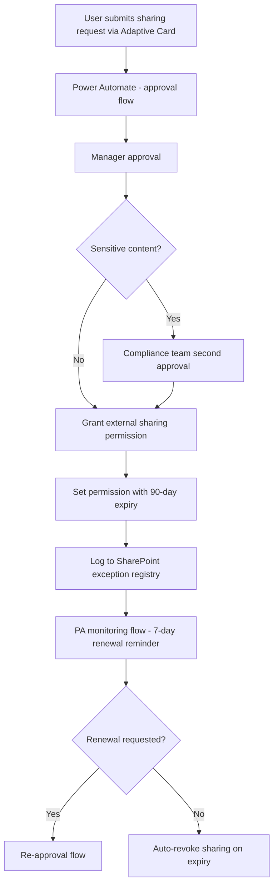

# 🔗 External Sharing Exception Workflow

> **A Power Automate-based agent that provides a structured, approved process for requesting external SharePoint sharing exceptions — replacing ad hoc sharing with a governed workflow that includes business justification, time limits, and automatic expiry.**

| Attribute | Value |
|---|---|
| **Domain** | Compliance |
| **Architecture** | Power Automate |
| **Impact** | Medium |
| **Effort** | Low |
| **Risk** | Medium |
| **Approval Required** | Yes |
| **Maturity** | Concept |

---

## Problem Statement

External sharing in SharePoint is a constant source of governance tension. Business users need to share documents with external partners, clients, and contractors — that is a legitimate business need. But unrestricted external sharing creates data exfiltration risks, compliance violations, and the kind of oversharing sprawl that was described in the SharePoint Oversharing Finder agent.

Most organizations respond with one of two failure modes: blanket restriction (external sharing disabled, frustrating users who find workarounds via personal email) or blanket enablement (external sharing unrestricted, creating governance chaos). Neither is acceptable. What's needed is a structured exception process: sharing with explicit business justification, manager approval, time limits, and automatic expiry.

The process should be as frictionless as possible for legitimate requests, while creating an auditable trail for compliance and making unapproved sharing immediately visible.

---

## Agent Concept

A user who needs to share a SharePoint site or document library with an external party submits a request through a simple Adaptive Card form (accessible via Teams or a SharePoint site). The form captures: the specific SharePoint site/library, the external email domain or specific addresses, the business justification, the duration needed (max 90 days), and the manager approval.

The request triggers an automated approval flow: manager approves, then a second-level compliance approval for requests involving sensitive-labeled content. On approval, the sharing permission is granted with a pre-set expiry. A Power Automate flow monitors all active external sharing exceptions and sends renewal reminders before expiry, automatically revoking access if no renewal is requested.

---

## Architecture

A **Power Automate** approval flow with an Adaptive Card request form. Granting the actual permission (after approval) uses the SharePoint Graph API with a time-bounded permission scope.

---

## Implementation Steps

1. **Build request form** — Power Apps or Adaptive Card form: SharePoint URL, external domain/addresses, justification, requested duration, intended use case.

2. **Create app registration** — `copilot-ext-sharing` with `Sites.ReadWrite.All` (for granting permissions after approval).

3. **Build approval flow** — Manager approval via Power Automate approval action. Conditional second approval for sites with sensitive labels.

4. **Build permission grant action** — After approval, use Graph API: `POST /sites/{siteId}/permissions` with invited users list and expiration date.

5. **Build exception registry** — SharePoint list: site, external domain, approver, grant date, expiry date, justification, status.

6. **Build monitoring flow** — Daily check of exception registry. Send renewal card 7 days before expiry. Auto-mark as expired on the expiry date.

---

## Required Permissions

| Permission | Type | Justification |
|---|---|---|
| `Sites.ReadWrite.All` | Application | Grant and revoke sharing permissions after approval |
| `InformationProtectionPolicy.Read` | Application | Check sensitivity labels for second-approval routing |

---

## Security & Compliance Controls

- **Dual approval for sensitive content** — Any external sharing of content with Confidential or higher labels requires compliance team approval in addition to manager approval.
- **Maximum 90-day duration** — No exception can be granted for more than 90 days. Renewals require re-approval.
- **Automatic expiry** — Permissions are granted with an expiry date at the API level; they cannot be accidentally left in place indefinitely.
- **Audit log** — Every exception request, approval decision, and expiry event is logged in the exception registry.

---

## Business Value & Success Metrics

**Primary value:** Enables legitimate external collaboration while maintaining governance, reducing both data exposure risk and business friction.

| Metric | Before Agent | After Agent | Target |
|---|---|---|---|
| External sharing exceptions documented | 10-20% | 100% | Full audit trail |
| External sharing links with no expiry | Many | 0 (new requests) | Eliminated for new |
| Time to process sharing request | 1-3 days (email) | Same day | 80% faster |
| Unauthorized external sharing incidents | Frequent | Rare | Significant reduction |

---

## Example Use Cases

**Scenario 1:** A project manager needs to share a project SharePoint site with an external consulting firm for 60 days. They submit the request via the Teams card, their manager approves, and access is automatically granted and expires on schedule.

**Scenario 2:** A user tries to share a document library containing Confidential-labeled content. The request is routed to compliance for second approval, which reviews the business justification and approves with conditions.

**Scenario 3:** An exception granted 83 days ago has not been renewed. The monitoring flow sends a renewal reminder, the business owner does not respond, and the permission is automatically revoked on day 90.

---

## Related Agents

- [SharePoint Oversharing Finder](../secops/sharepoint-oversharing-finder.md) — Identifies historical oversharing that predates this workflow
- [Data Classification Assistant](data-classification-assistant.md) — Labeling content helps route sharing requests to the correct approval tier
- [DLP Policy Tuning](dlp-policy-tuning.md) — DLP policies provide a technical backstop if sharing exceptions are mis-configured
