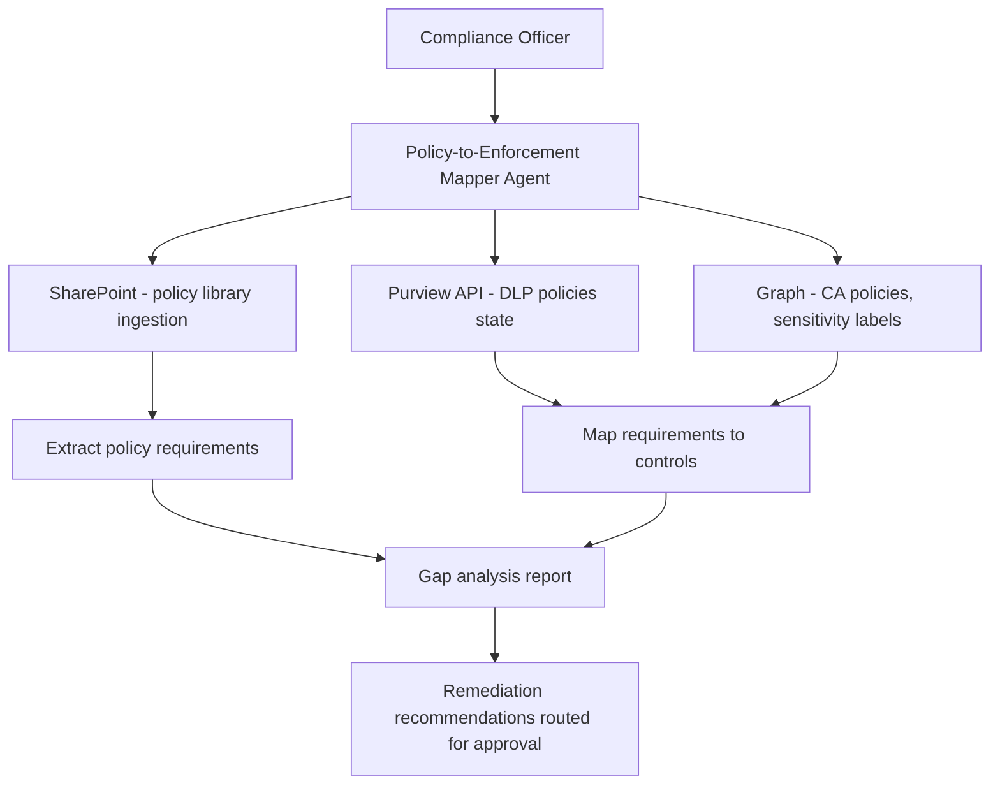

# 🗺️ Policy-to-Enforcement Mapper

> **A Copilot Studio agent that maps organizational security and compliance policies to their technical enforcement controls in M365, identifying gaps where policy exists on paper but has no corresponding technical enforcement.**

| Attribute | Value |
|---|---|
| **Domain** | Compliance |
| **Architecture** | Copilot Studio |
| **Impact** | Medium |
| **Effort** | Medium |
| **Risk** | Medium |
| **Approval Required** | Yes |
| **Maturity** | Concept |

---

## Problem Statement

Enterprise organizations maintain extensive libraries of information security policies — acceptable use, data classification, data handling, access control, incident response. These policies are typically reviewed annually by the compliance team and approved by leadership. What is rarely done systematically is verifying that each policy requirement has a corresponding technical control enforced in the M365 environment.

The result is a policy-control gap: the organization's data classification policy says "all documents containing PII must be labeled Confidential and encrypted," but only 15% of documents containing PII are actually labeled. The access control policy says "privileged access must be reviewed quarterly," but the review process is manual and incomplete. Auditors find these gaps; security incidents exploit them.

The Policy-to-Enforcement Mapper addresses the systematic question: for each requirement in our policy library, what technical control enforces it, and is that control configured correctly?

---

## Agent Concept

The agent ingests the organization's policy documents from SharePoint, extracts individual requirements (e.g., "all external email containing financial data must be DLP-protected"), and maps each requirement to its corresponding technical control in M365. For each mapping, it checks whether the control is configured and produces a gap report: requirements with no technical control, requirements with a partial control, and requirements with full enforcement.

When gaps are identified, the agent recommends the specific M365 control that should be configured (DLP policy, sensitivity label, CA policy, etc.) and routes a remediation recommendation to the appropriate team for approval.

---

## Architecture

A **Tier 3 Copilot Studio agent** with SharePoint and Purview API access. Policy documents are the knowledge source; Graph/Purview APIs provide the enforcement state.

---

## Implementation Steps

1. **Create app registration** — `copilot-policy-mapper` with `InformationProtectionPolicy.Read`, `Policy.Read.All`, `Sites.Read.All`.

2. **Build policy ingestion** — The agent reads policy documents from a designated SharePoint library. Documents are indexed as a knowledge source.

3. **Build control inventory** — The agent queries current DLP policies, sensitivity labels, CA policies, and other M365 controls via Graph/Purview APIs.

4. **Define requirement-to-control mapping schema** — A SharePoint list mapping policy requirement categories to M365 control types (e.g., "external sharing restriction" → CA policy + SharePoint sharing settings).

5. **Build gap analysis** — Compare extracted requirements against existing controls. Score completeness per requirement.

6. **Build approval flow** — Identified gaps are formatted as remediation recommendations. Each recommendation routed to the responsible team lead for prioritization approval.

---

## Required Permissions

| Permission | Type | Justification |
|---|---|---|
| `InformationProtectionPolicy.Read` | Application | Read sensitivity label and DLP policy configurations |
| `Policy.Read.All` | Application | Read CA and other M365 policy configurations |
| `Sites.Read.All` | Delegated | Read policy documents from SharePoint |

---

## Business Value & Success Metrics

**Primary value:** Provides systematic visibility into policy-control gaps, enabling compliance teams to prioritize technical remediation based on policy requirements rather than ad hoc assessment.

| Metric | Before Agent | After Agent | Target |
|---|---|---|---|
| Time to produce policy gap analysis | 3-6 weeks | 3-5 days | 80% reduction |
| Policy requirements with no technical control | Unknown | Quantified | Full visibility |
| Audit findings related to policy gaps | 5-10/year | 1-2/year | 70% reduction |

---

## Example Use Cases

**Example 1:**
> "Map our data classification policy requirements to their technical enforcement controls."

**Example 2:**
> "Which policy requirements have no corresponding technical control configured in M365?"

**Example 3:**
> "Our external auditors are asking about our DLP coverage. Show me which data handling policy requirements are enforced by DLP policies."

---

## Related Agents

- [DLP Policy Tuning](dlp-policy-tuning.md) — Tunes the DLP policies identified by the mapper
- [Data Classification Assistant](data-classification-assistant.md) — Improves sensitivity label coverage identified as a gap
- [Copilot Readiness & Governance](copilot-readiness-governance.md) — Policy-control mapping is part of the Copilot readiness assessment
