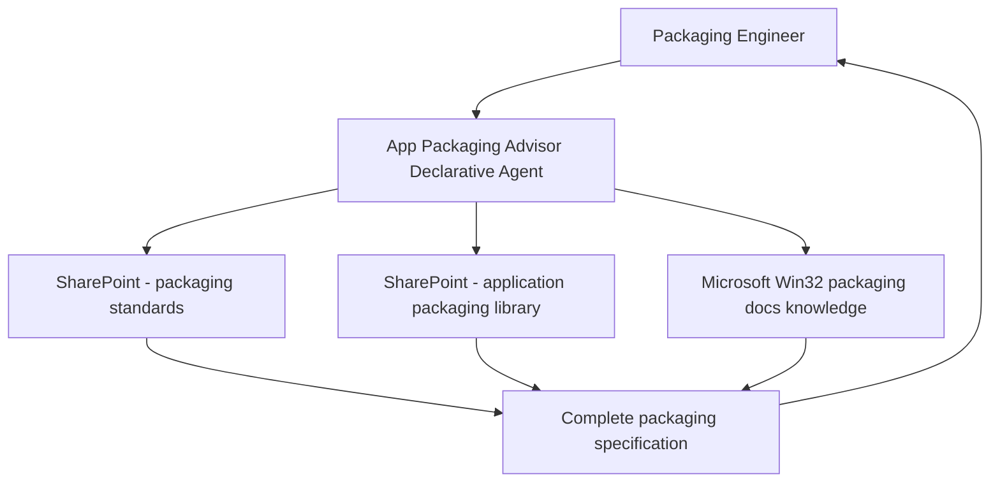

# 📦 App Packaging Advisor

> **A declarative agent grounded in Microsoft's Win32 app packaging guidance and organizational packaging standards, helping engineers create correctly-configured Intune app packages without trial-and-error deployments.**

| Attribute | Value |
|---|---|
| **Domain** | Endpoint |
| **Architecture** | Declarative |
| **Impact** | Medium |
| **Effort** | Low |
| **Risk** | Low |
| **Approval Required** | No |
| **Maturity** | Concept |

---

## Problem Statement

Packaging applications for Intune deployment is deceptively complex. The Win32 app packaging format (IntuneWinAppUtil) has specific requirements for detection rules, requirement rules, install/uninstall commands, return codes, and dependency handling. MSIX packaging introduces its own set of compatibility constraints. Getting any of these wrong results in silent deployment failures, apps that show as installed but aren't functional, or apps that can't be uninstalled.

Engineers who package apps occasionally — rather than as their primary role — spend significant time in trial-and-error: deploy, wait for Intune to process, check the device, diagnose failure, adjust, redeploy. Each cycle can take 30-60 minutes. Common mistakes include: missing the correct MSI product code for detection rules, using the wrong install command syntax for silent mode, not handling the 3010 return code (success-reboot-required), and missing required prerequisites.

---

## Agent Concept

A packaging engineer describes the application they're trying to package — "I need to package Adobe Acrobat Reader 2024 for Intune Win32 deployment" — and the agent provides a complete packaging specification: recommended install command, uninstall command, detection rule (registry key or MSI product code), requirement rules, return code mappings, and any known packaging challenges for that specific application.

The agent is grounded in Microsoft's Win32 app packaging documentation, the organization's packaging standards document (in SharePoint), and a curated knowledge base of common application packaging patterns. It can also help with detection rule logic for custom-built applications.

---

## Architecture

A **Tier 1 Declarative Agent** grounded in SharePoint knowledge sources containing packaging documentation, standards, and a library of pre-validated packaging specs for commonly deployed applications.

---

## Implementation Steps

1. **Build SharePoint knowledge base** — Create a SharePoint site with:
   - Organizational packaging standards document
   - Library of packaging specs for the top 50 deployed applications (install commands, detection rules, return codes)
   - Common packaging patterns reference guide

2. **Create declarative agent manifest** — Reference the SharePoint site as a knowledge source. Author instructions that guide the agent to always provide: install command, uninstall command, detection rule, return code handling, and known issues.

3. **Add Intune Graph API plugin** — Optional: allow the agent to check whether an app is already in the Intune app catalog (`GET /deviceAppManagement/mobileApps`) to avoid duplicate packaging.

4. **Deploy to Teams** — Target endpoint engineering team and desktop support engineers.

---

## Required Permissions

| Permission | Type | Justification |
|---|---|---|
| `DeviceManagementApps.Read.All` | Application | Check existing Intune app catalog for duplicates |
| `Sites.Read.All` | Delegated | Read packaging library from SharePoint |

---

## Business Value & Success Metrics

**Primary value:** Reduces packaging iteration cycles from 3-5 attempts to 1-2 by providing complete, validated packaging specifications upfront.

| Metric | Before Agent | After Agent | Target |
|---|---|---|---|
| App packaging iteration cycles | 3-5 avg | 1-2 avg | 60% reduction |
| Time to package standard app | 2-4 hours | 30-60 minutes | 75% reduction |
| Packaging-related deployment failures | ~25% first deploy | <5% | 80% reduction |

---

## Example Use Cases

**Example 1:**
> "How do I package Adobe Acrobat Reader 2024 as a Win32 app in Intune?"

**Example 2:**
> "What detection rule should I use for an MSI application that installs to a non-standard path?"

**Example 3:**
> "What return codes should I configure for a .NET application installer?"

**Example 4:**
> "How do I set up app dependencies in Intune for an app that requires Visual C++ redistributable?"

---

## Alternative Approaches

- **Microsoft Learn documentation** — Comprehensive but requires synthesizing information from multiple pages.
- **Trial-and-error deployment** — Time-consuming and requires Intune test devices.
- **Internal wiki** — Helpful if maintained, but not conversational and often out of date.

---

## Related Agents

- [Intune Troubleshooting](intune-troubleshooting.md) — Diagnoses deployment failures for already-packaged apps
- [Autopilot Readiness](autopilot-readiness.md) — ESP app failures are often caused by packaging issues
- [Device Compliance Drift](device-compliance-drift.md) — App deployment failures can affect compliance state
