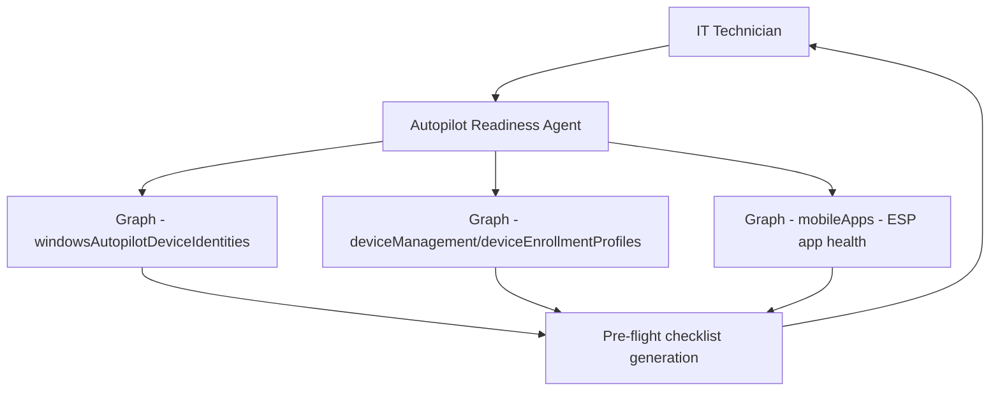

# ✈️ Autopilot Readiness

> **A declarative agent that validates whether devices, profiles, and tenant configuration meet Windows Autopilot prerequisites before deployment, surfacing blockers before they become on-site failures.**

| Attribute | Value |
|---|---|
| **Domain** | Endpoint |
| **Architecture** | Declarative |
| **Impact** | Medium |
| **Effort** | Medium |
| **Risk** | Low |
| **Approval Required** | No |
| **Maturity** | Concept |

---

## Problem Statement

Windows Autopilot deployments fail for a frustrating variety of reasons that are all preventable if identified in advance: hardware hash not registered, device not in the expected Autopilot group, deployment profile not assigned, ESP (Enrollment Status Page) blocking users for hours due to apps that can't be installed, or a device that was previously enrolled under a different tenant and not properly cleaned.

When these failures happen during an employee's first day — which is the most common deployment scenario — the impact is significant: the new employee can't work, IT is scrambling on-site, and the first impression of the company's IT organization is negative. Each failure typically takes 30-60 minutes to diagnose because the error messages in the Autopilot deployment log are cryptic and require cross-referencing multiple admin centers.

---

## Agent Concept

Before deploying a device, an IT administrator or deployment technician asks the agent to validate readiness for a specific device (by serial number or hardware hash). The agent checks: whether the hardware hash is registered in Autopilot, which deployment profile is assigned, whether required apps in the ESP are in a healthy state, whether the device's Entra join configuration is correct, and whether there are any open issues in the Intune service health dashboard that might affect deployment.

The agent returns a pre-flight checklist: green for ready, yellow for warnings (e.g., an optional app that may cause delays), and red for blockers that must be resolved before deployment.

---

## Architecture

A **Tier 1 Declarative Agent** using Intune Graph APIs for device validation and a SharePoint knowledge source containing the organization's Autopilot deployment runbook and known issue list.

---

## Implementation Steps

1. **Create app registration** — `copilot-autopilot-readiness` with `DeviceManagementServiceConfig.Read.All`, `DeviceManagementManagedDevices.Read.All`, `DeviceManagementApps.Read.All`.

2. **Build readiness checks** — Implement checks: hardware hash present, profile assigned, ESP apps healthy, tenant join type (Hybrid vs cloud-only), existing enrollment state, TPM attestation state.

3. **Author agent instructions** — Define what each check result means operationally and what the remediation step is for each failure type.

4. **Add SharePoint knowledge source** — Include Autopilot deployment runbook and known issue tracker for common failure patterns.

5. **Deploy to helpdesk and endpoint team.**

---

## Required Permissions

| Permission | Type | Justification |
|---|---|---|
| `DeviceManagementServiceConfig.Read.All` | Application | Read Autopilot profiles and configurations |
| `DeviceManagementManagedDevices.Read.All` | Application | Read device enrollment state |
| `DeviceManagementApps.Read.All` | Application | Check ESP app health status |

---

## Business Value & Success Metrics

**Primary value:** Reduces Autopilot deployment failures by catching blockers during pre-flight rather than during the employee's first-day deployment.

| Metric | Before Agent | After Agent | Target |
|---|---|---|---|
| First-time Autopilot success rate | 70-80% | 95%+ | 95% minimum |
| Time to diagnose Autopilot failure | 30-60 min | 5-10 min | 80% reduction |
| New hire first-day device issues | Common | Rare | 80% reduction |

---

## Example Use Cases

**Example 1:**
> "Check if device with serial number ABC123 is ready for Autopilot deployment."

**Example 2:**
> "Why would an Autopilot device get stuck on the Enrollment Status Page?"

**Example 3:**
> "Are all the apps in our ESP currently in a healthy deployment state?"

---

## Alternative Approaches

- **Manual Intune portal checks** — Requires checking multiple blades; no consolidated pre-flight view.
- **Autopilot deployment logs** — Available after failure, not before.
- **Endpoint Manager diagnostics** — Limited pre-flight capability.

---

## Related Agents

- [Device Compliance Drift](device-compliance-drift.md) — After enrollment, tracks ongoing compliance state
- [Intune Troubleshooting](intune-troubleshooting.md) — Handles post-enrollment issues
- [App Packaging Advisor](app-packaging-advisor.md) — Ensures apps in the ESP are correctly packaged
