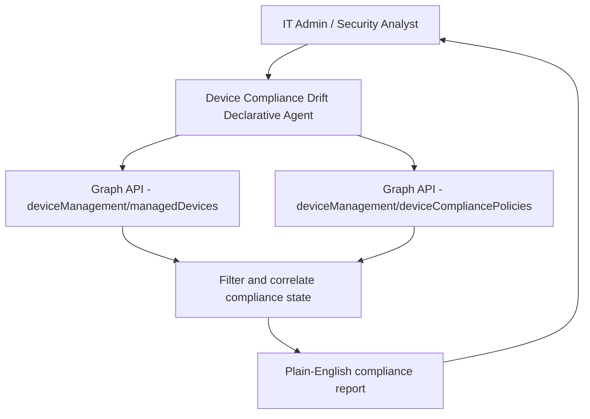

# 💻 Device Compliance Drift

> **A declarative agent that queries Intune device compliance state on demand, surfaces non-compliant devices by policy, department, or user, and explains what specific compliance checks are failing and why.**

| Attribute | Value |
|---|---|
| **Domain** | Endpoint |
| **Architecture** | Declarative |
| **Impact** | High |
| **Effort** | Medium |
| **Risk** | Low |
| **Approval Required** | No |
| **Maturity** | Concept |

---

## Problem Statement

Intune device compliance policies are the gate between corporate access and non-compliant endpoints. When a device falls out of compliance — BitLocker disabled, OS version behind, antivirus out of date — Conditional Access policies should block that device from accessing corporate resources. In practice, compliance drift is common and often undetected until a security incident or audit reveals a population of non-compliant devices that have been silently passing through Conditional Access due to misconfigured grace periods or overly permissive compliance policy settings.

Compliance operations teams know that non-compliant devices exist, but getting actionable data is harder than it should be. The Intune portal's compliance reports show aggregate numbers but require multiple clicks to drill into specific failure reasons. Questions like "how many devices in the London office are non-compliant because of BitLocker?" or "which users in Sales have devices in the 'not evaluated' state?" require custom report exports and manual analysis.

---

## Agent Concept

An IT admin or security analyst asks conversational questions about device compliance state. The agent queries the Intune Graph API, filters by the requested criteria (department, compliance policy, specific failure reason, OS platform), and returns structured results with failure reasons explained in plain English.

The agent understands Intune's compliance states — compliant, noncompliant, not evaluated, in grace period, error — and explains what each means operationally. For non-compliant devices, it surfaces the specific policy settings that are failing (not just "noncompliant") so the analyst can prioritize remediation.

---

## Architecture

A **Tier 1 Declarative Agent** with a Graph API plugin covering the Intune device compliance APIs.

---

## Implementation Steps

1. **Create app registration** — `copilot-compliance-drift` with `DeviceManagementManagedDevices.Read.All` and `DeviceManagementConfiguration.Read.All`.

2. **Build Graph API plugin** — Wrap `GET /deviceManagement/managedDevices`, `GET /deviceManagement/deviceCompliancePolicies`, and `GET /deviceManagement/managedDevices/{id}/deviceCompliancePolicyStates`.

3. **Author agent instructions** — Define compliance state explanations and remediation guidance for the most common failure reasons (BitLocker not enabled, OS update required, antivirus not reporting, device not checked in, firewall disabled).

4. **Add SharePoint knowledge source** — Upload the organization's device compliance policy documentation so the agent can explain the rationale behind each compliance requirement.

5. **Deploy to Teams** — Target endpoint management team and helpdesk tier 2.

---

## Required Permissions

| Permission | Type | Justification |
|---|---|---|
| `DeviceManagementManagedDevices.Read.All` | Application | Read device state and compliance status |
| `DeviceManagementConfiguration.Read.All` | Application | Read compliance policy definitions |

---

## Security & Compliance Controls

- **Read-only** — No remediation actions are taken by the agent.
- **No device data in shared channels** — Device names and user associations are only surfaced in private channels or direct messages to authorized team members.

---

## Business Value & Success Metrics

**Primary value:** Reduces time to identify and prioritize non-compliant device populations from hours of report analysis to minutes of conversational queries.

| Metric | Before Agent | After Agent | Target |
|---|---|---|---|
| Time to identify non-compliant population | 2-4 hours | 5 minutes | 95% reduction |
| Non-compliant device detection lag | Days to weeks | Same day | Near-zero |
| Compliance rate (endpoint estate) | 75-85% typical | 90%+ | Sustained improvement |

---

## Example Use Cases

**Example 1:**
> "How many devices are currently non-compliant and what are the top failure reasons?"

**Example 2:**
> "Show me all Windows devices in the Engineering department that are non-compliant."

**Example 3:**
> "Which users have devices in 'in grace period' status that will become non-compliant in the next 7 days?"

---

## Alternative Approaches

- **Intune portal compliance reports** — Aggregate data available but not conversational, no cross-filtering by arbitrary attributes.
- **PowerShell with Graph SDK** — Scriptable but requires expertise and custom output formatting.
- **Azure Monitor workbooks** — Good for dashboards but not conversational queries.

---

## Related Agents

- [Autopilot Readiness](autopilot-readiness.md) — Ensures devices are ready for compliant enrollment
- [Stale Device Cleanup Planner](stale-device-cleanup-planner.md) — Devices that are perpetually non-compliant may be stale and should be removed
- [Intune Troubleshooting](intune-troubleshooting.md) — Helps resolve the underlying issues causing compliance failures
