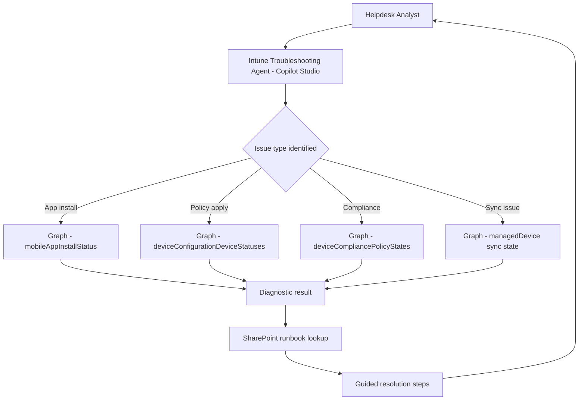

# 🔧 Intune Troubleshooting Assistant

> **A Copilot Studio agent grounded in Intune device management data and internal runbooks, enabling helpdesk analysts to resolve common device management issues through guided, conversational troubleshooting without escalating to tier-2.**

| Attribute | Value |
|---|---|
| **Domain** | Endpoint |
| **Architecture** | Copilot Studio |
| **Impact** | Medium |
| **Effort** | Medium |
| **Risk** | Low |
| **Approval Required** | No |
| **Maturity** | Concept |

---

## Problem Statement

Intune-related helpdesk tickets are among the highest-volume and most time-consuming category in enterprise IT support. Common issues — app installation failures, policy application delays, compliance check failures, sync issues, BitLocker recovery — have known resolution paths, but tier-1 helpdesk analysts rarely have the Intune expertise to follow them without escalating to endpoint management specialists.

The result is a disproportionate escalation rate for device management issues: tier-1 analysts spend 5 minutes trying to help before escalating, and tier-2 endpoint specialists spend 15-30 minutes resolving issues that tier-1 could handle with proper guidance. Endpoint teams in organizations with 5,000+ managed devices spend 30-40% of their time on tier-1 issues that could be resolved with better tooling.

---

## Agent Concept

A helpdesk analyst reports a device issue by describing it in natural language — "user says their company portal app won't install any apps on their iPhone" — and the agent asks structured diagnostic questions, queries the Intune Graph API for the specific device's state, and guides the analyst through a resolution path. The agent is grounded in both Intune documentation and the organization's internal device management runbooks stored in SharePoint.

The agent supports multi-turn diagnostic conversations: it asks for the device ID or user UPN, retrieves the device's management state, identifies the specific failure, and suggests the next diagnostic step. If the issue exceeds tier-1 scope, it generates a structured escalation ticket with the diagnostic context already populated.

---

## Architecture

A **Tier 3 Copilot Studio agent** with Graph API actions for live device data and SharePoint knowledge for runbooks.

---

## Implementation Steps

1. **Create app registration** — `copilot-intune-troubleshoot` with `DeviceManagementManagedDevices.Read.All`, `DeviceManagementApps.Read.All`, `DeviceManagementConfiguration.Read.All`.

2. **Build Copilot Studio topics** — One topic per issue category: app install failure, policy application issue, compliance failure, sync problem, BitLocker recovery, enrollment failure.

3. **Add Graph API actions** — For each topic, add a Power Automate flow action that queries the relevant Graph endpoint for the specific device.

4. **Add SharePoint knowledge source** — Upload internal runbooks for each issue category. The agent uses these to provide organization-specific resolution steps (e.g., internal proxy settings, custom MDM configurations).

5. **Build escalation flow** — When issue exceeds tier-1 scope, generate a pre-populated ServiceNow/Jira ticket with all diagnostic context included.

---

## Required Permissions

| Permission | Type | Justification |
|---|---|---|
| `DeviceManagementManagedDevices.Read.All` | Application | Read device state for diagnostics |
| `DeviceManagementApps.Read.All` | Application | Read app installation status |
| `DeviceManagementConfiguration.Read.All` | Application | Read policy application state |

---

## Business Value & Success Metrics

**Primary value:** Reduces escalation rate for device management tickets, freeing endpoint specialists for complex work.

| Metric | Before Agent | After Agent | Target |
|---|---|---|---|
| Intune ticket escalation rate | 60-70% | 25-30% | 55% reduction |
| Mean time to resolve device ticket | 45-60 min | 15-20 min | 65% reduction |
| Tier-2 time on tier-1 issues | 30-40% of capacity | 10-15% | 65% reduction |

---

## Example Use Cases

**Example 1:**
> "A user says their Company Portal shows 'Waiting for install status' for Microsoft Teams. How do I fix it?"

**Example 2:**
> "Device johndoe-laptop is showing as non-compliant but the user says they updated Windows. What do I check?"

**Example 3:**
> "How do I retrieve a BitLocker recovery key for a device that's locked?"

---

## Alternative Approaches

- **Microsoft Learn / Intune docs** — Available but not conversational, not grounded in org-specific context.
- **Internal wiki** — Helpful if kept up to date, but not integrated with live device data.
- **Direct Intune portal access for tier-1** — Security concern: over-broad access for troubleshooting purposes.

---

## Related Agents

- [Device Compliance Drift](device-compliance-drift.md) — Surfaces compliance issues proactively before they generate helpdesk tickets
- [App Packaging Advisor](app-packaging-advisor.md) — Prevents app install failures through correct packaging
- [Autopilot Readiness](autopilot-readiness.md) — Prevents enrollment failures that generate troubleshooting tickets
