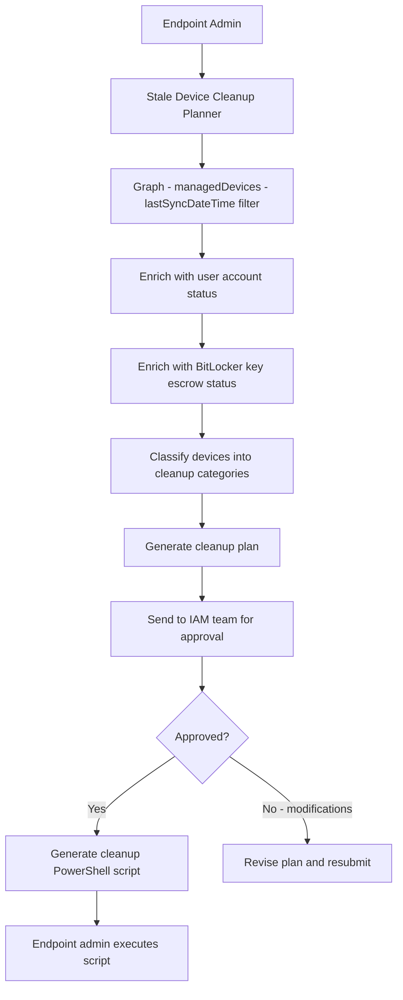

# 🗑️ Stale Device Cleanup Planner

> **A Copilot Studio agent that identifies devices not checked in for 90+ days, correlates with user account status, and generates a batched cleanup plan requiring IAM approval before any device records are deleted.**

| Attribute | Value |
|---|---|
| **Domain** | Endpoint |
| **Architecture** | Copilot Studio |
| **Impact** | Medium |
| **Effort** | Medium |
| **Risk** | Medium |
| **Approval Required** | Yes |
| **Maturity** | Concept |

---

## Problem Statement

Intune tenants accumulate stale device records at a constant rate. Personal devices used by former contractors, corporate devices that were decommissioned without proper offboarding, test devices from pilots that ended, and devices that were re-imaged and re-enrolled without removing the old record all contribute to a growing inventory of zombie devices. In tenants with 5,000+ devices, stale records commonly represent 10-20% of the inventory.

Stale devices are not just a data hygiene problem. They consume Intune license allocations (device-based licensing counts stale devices), skew compliance reporting (stale devices often show as non-compliant, inflating the non-compliance percentage), and can create security audit findings. More critically, a device that last checked in 180 days ago may represent an unmanaged endpoint that is accessing corporate resources through a cached token.

The challenge with cleanup is the risk of accidentally deleting an active device. An engineer on extended leave whose laptop hasn't connected to the corporate network in 90 days is not the same as a decommissioned device — but they look identical in a raw "last check-in date" report.

---

## Agent Concept

The agent queries Intune for devices meeting stale criteria (configurable threshold, default 90 days), then enriches each result with: the device owner's account status in Entra (active, disabled, deleted), the user's last sign-in date, whether the device has a BitLocker recovery key escrowed, and whether the device has any pending compliance actions. This enrichment allows the agent to classify stale devices into cleanup categories:

- **Safe to delete**: Device owner account disabled/deleted AND device not checked in for 90+ days
- **Review required**: Device owner account active but device stale (potential extended leave or home device)
- **Hold**: Device has escrowed BitLocker key that has not been confirmed as backed up elsewhere

The agent generates a batched cleanup plan grouped by category and routes it through IAM approval before producing the cleanup script.

---

## Architecture

A **Tier 3 Copilot Studio agent** with approval workflow. The agent generates the cleanup plan; human IAM approval is required; execution is via PowerShell by the endpoint team.

---

## Implementation Steps

1. **Create app registration** — `copilot-stale-device` with `DeviceManagementManagedDevices.Read.All`, `User.Read.All`, `AuditLog.Read.All`, `BitlockerKey.Read.All`.

2. **Build staleness query** — `GET /deviceManagement/managedDevices?$filter=lastSyncDateTime le {90daysago}&$select=deviceName,userPrincipalName,lastSyncDateTime,operatingSystem,enrolledDateTime`.

3. **Build enrichment logic** — For each stale device, query: user account enabled status, user last sign-in, BitLocker recovery key presence.

4. **Build classification rules** — Apply categorization logic in a Power Automate flow.

5. **Build approval workflow** — Generate a structured cleanup plan document, attach to an Adaptive Card approval sent to IAM and endpoint leads.

6. **Generate cleanup script** — On approval, produce a PowerShell script using `Remove-MgDeviceManagementManagedDevice` for each approved device.

---

## Required Permissions

| Permission | Type | Justification |
|---|---|---|
| `DeviceManagementManagedDevices.Read.All` | Application | Read device inventory and sync dates |
| `User.Read.All` | Application | Check device owner account status |
| `AuditLog.Read.All` | Application | Check user last sign-in date |
| `BitlockerKey.Read.All` | Application | Verify BitLocker key escrow before deletion |

---

## Security & Compliance Controls

- **Approval required for all deletions** — No device is deleted without IAM approval of the cleanup plan.
- **BitLocker key protection** — Devices with non-confirmed BitLocker key escrow are held from the cleanup plan.
- **Batched cleanup with review window** — Cleanup plans are executed in batches with a 48-hour review window after approval.
- **Audit log** — All deleted device records are logged with approver identity and timestamp.

---

## Business Value & Success Metrics

**Primary value:** Reduces Intune device count by 10-20%, improving license efficiency and compliance reporting accuracy.

| Metric | Before Agent | After Agent | Target |
|---|---|---|---|
| Stale device percentage | 15-25% | <5% | Sustained <5% |
| Time to produce cleanup plan | 1-2 days manual | 30 minutes | 95% reduction |
| Compliance report accuracy | Skewed by stale devices | Accurate | Significant improvement |
| License cost reduction | — | 10-20% device license savings | Quantifiable ROI |

---

## Example Use Cases

**Example 1:**
> "Show me all devices that haven't checked in for more than 90 days."

**Example 2:**
> "Generate a stale device cleanup plan for this quarter."

**Example 3:**
> "Which stale devices belong to users whose accounts are still active?"

---

## Alternative Approaches

- **Intune portal stale device filter** — Available but manual, no enrichment with user account status, no approval workflow.
- **PowerShell script** — Scriptable but requires safe-delete logic to be built manually and has no approval mechanism.
- **Autopilot deregistration** — Handles the Autopilot side but not the Intune managed device record.

---

## Related Agents

- [Device Compliance Drift](device-compliance-drift.md) — Stale devices inflate non-compliance numbers; cleanup improves compliance metrics
- [Offboarding Orchestrator](../secops/offboarding-orchestrator.md) — Proper offboarding prevents devices from becoming stale
- [Intune Troubleshooting](intune-troubleshooting.md) — Some stale devices are stale due to sync issues, not actual decommission
