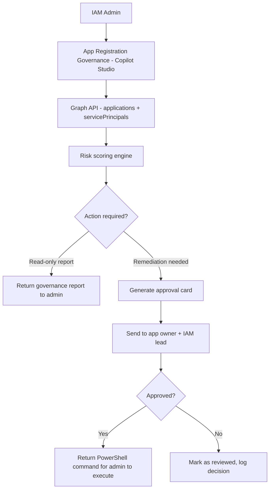

# 📋 App Registration Governance

> **A Copilot Studio agent that audits app registrations for over-permissioned scopes, missing owners, stale credentials, and unreviewed consent grants, then routes remediation actions through an approval workflow.**

| Attribute | Value |
|---|---|
| **Domain** | Identity |
| **Architecture** | Copilot Studio |
| **Impact** | High |
| **Effort** | Medium |
| **Risk** | Medium |
| **Approval Required** | Yes |
| **Maturity** | Concept |

---

## Problem Statement

Enterprise tenants accumulate app registrations at a rate of dozens per year. Developers create registrations for integrations, automations, and proofs of concept. Projects end, developers leave, and the registrations persist — often with broad permissions, active credentials, and no owner. Over time, the app registration estate becomes a security liability: over-privileged service principals with valid credentials and no accountability.

The attack surface is significant. Each app registration with a valid client secret and `Mail.Read.All` or `Files.ReadWrite.All` permissions is a potential lateral movement vector. In a tenant with 300 app registrations, it is common to find 20-40 with no owner, 15-20 with credentials expiring or expired, and 5-10 with permissions that exceed what any legitimate use case would require.

Governance reviews are typically annual, manual, and incomplete. The governance team exports a CSV from the Entra portal, circulates it to business owners who have long forgotten the context, and marks applications as "reviewed" after a cursory glance. This process creates compliance theater rather than actual risk reduction.

---

## Agent Concept

The agent provides both continuous monitoring (via scheduled Power Automate flows) and on-demand governance queries (via Copilot Studio). For governance reviews, an administrator can ask "show me all app registrations with no assigned owner" or "which service principals have Mail permissions and haven't been used in 90 days?" The agent retrieves live data and presents it in a structured format.

When the agent identifies applications requiring action — revocation of unused permissions, deletion of stale registrations, assignment of owners — it routes these through an approval workflow. A stale application flagged for deletion triggers an approval card sent to the last-known owner and the IAM team lead. Only after approval does the agent generate the PowerShell command (not execute it directly) for the admin to run.

---

## Architecture

A **Tier 3 Copilot Studio agent** with Power Automate approval flows. The agent reads data, the human approves remediation actions, and the human executes the approved action. No automated write operations.

---

## Implementation Steps

1. **Create app registration** — `copilot-appgov` with `Application.Read.All`, `AppRoleAssignment.ReadWrite.All` (for generating remediation guidance only — no direct execution), `AuditLog.Read.All`.

2. **Build risk scoring model** — Score each app registration on: days since last activity, credential expiry status, permission sensitivity (rank permissions from low to critical), owner assignment, and consent type (admin vs. user consent).

3. **Build Copilot Studio topics** — Topic: "Governance audit" (runs full scan). Topic: "Review specific app" (takes app name/ID as input). Topic: "Show over-permissioned apps" (filters by permission sensitivity score).

4. **Build approval Power Automate flow** — When agent identifies an app for deletion or permission reduction, trigger approval card to owner and IAM lead. Include: app name, last activity date, current permissions, recommendation, and pre-generated remediation command.

5. **Schedule monthly sweep** — A companion Power Automate flow runs monthly, scores all apps, and posts a governance summary card to the IAM Teams channel.

---

## Required Permissions

| Permission | Type | Justification |
|---|---|---|
| `Application.Read.All` | Application | Read all app registrations and service principals |
| `AuditLog.Read.All` | Application | Determine last activity date from sign-in logs |
| `Directory.Read.All` | Application | Resolve owners and group memberships |

---

## Security & Compliance Controls

- **Human-in-the-loop for all write operations** — The agent generates PowerShell commands; humans execute them after approval.
- **Approval audit trail** — All approval decisions are stored in Power Automate run history and exportable for compliance reporting.
- **Owner notification** — App owners are notified before any action is taken on their registrations.
- **Staged remediation** — Permission reductions are recommended in stages; full deletion is the last resort after owner confirmation.

---

## Business Value & Success Metrics

**Primary value:** Reduces the over-permissioned app registration attack surface while establishing a repeatable, auditable governance process.

| Metric | Before Agent | After Agent | Target |
|---|---|---|---|
| App registrations with no owner | 20-40% typical | <5% | >95% ownership |
| Time for annual app governance review | 40-80 hours | 8-12 hours | 80% reduction |
| Stale apps removed per year | 5-10 (ad hoc) | 30-50 (systematic) | 5x increase |
| Over-permissioned apps identified | Rarely | Monthly | Full coverage |

---

## Example Use Cases

**Example 1:**
> "Show me all app registrations that haven't had any sign-in activity in 180 days."

**Example 2:**
> "Which service principals have Mail.ReadWrite.All permission and no assigned owner?"

**Example 3:**
> "Run a governance audit and score all our app registrations by risk level."

---

## Alternative Approaches

- **Microsoft Entra Recommendations** — Surfaces some unused app recommendations but limited in depth and filtering.
- **Manual CSV export** — Export from portal, analyze in Excel, circulate for review. Time-intensive and error-prone.
- **Defender for Cloud Apps** — Surfaces OAuth app risk but not optimized for internal app governance.

---

## Related Agents

- [Secrets & Certificates Expiry Monitor](secrets-expiry-monitor.md) — Monitors credential expiry for the same app registrations
- [Least Privilege Builder (PIM)](least-privilege-builder.md) — Covers human privileged access alongside service principal governance
- [Privileged Access Review](privileged-access-review.md) — Reviews service principal role assignments
