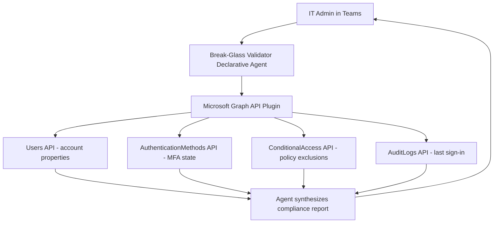

# 🚨 Break-Glass Account Validator

> **A declarative agent that validates break-glass (emergency access) account configuration against CIS and NIST benchmarks on demand, surfacing drift before an emergency becomes a crisis.**

| Attribute | Value |
|---|---|
| **Domain** | Identity |
| **Architecture** | Declarative |
| **Impact** | High |
| **Effort** | Low |
| **Risk** | Low |
| **Approval Required** | No |
| **Maturity** | Concept |

---

## Problem Statement

Break-glass accounts — also called emergency access accounts — are the tenant's last line of defense when all normal administrative paths are blocked. A locked-out federated identity provider, a misconfigured Conditional Access policy, or an MFA service outage can lock every administrator out of the tenant simultaneously. Without functioning break-glass accounts, recovery requires a multi-hour support engagement with Microsoft.

The problem is that these accounts are rarely used, and that infrequent use makes them easy to neglect. Over time, passwords expire and go unrotated. MFA methods drift from compliant configurations. Sign-in monitoring alerts get accidentally removed during policy cleanup. Conditional Access exclusion groups get renamed and the account falls under scope of a policy that blocks all access. By the time the emergency occurs, the emergency accounts are themselves broken.

Manual auditing of break-glass accounts typically takes 30-45 minutes per account, requires navigating multiple Entra ID blades, and produces results that are undocumented and unrepeatable. Most organizations audit quarterly at best — leaving months of drift undetected between reviews.

This agent makes break-glass validation a 2-minute conversational query rather than a multi-step manual process.

---

## Agent Concept

When an IT admin types "check our break-glass accounts" in Teams, the agent queries Microsoft Graph for all accounts matching break-glass naming conventions (e.g., accounts tagged with a designated group or UPN pattern), then evaluates each account against a checklist derived from Microsoft's own break-glass guidance, CIS Microsoft 365 Foundations Benchmark, and NIST SP 800-63B.

The agent returns a structured report per account covering: MFA registration status, last password change date, last sign-in date, whether the account is excluded from all Conditional Access policies, whether a high-severity alert is configured for any sign-in, whether the account holds Global Administrator role, and whether it is cloud-only (not synced from on-premises AD).

The agent provides a traffic-light status (compliant / warning / critical) per check and per account, with links directly to the relevant Entra portal blade for remediation.

---

## Architecture

This is a **Tier 1 Declarative Agent** — read-only, no approval required. It connects to Microsoft Graph via an app registration with application permissions. No user delegation is needed because the agent runs as a service account querying tenant-wide data.

The declarative agent manifest references a Graph API plugin (OpenAPI spec) that wraps the four query types. The agent instructions ground the model in break-glass best practices and define how to score each check.

---

## Implementation Steps

1. **Create app registration** — In Entra ID, create a new app registration named `copilot-break-glass-validator`. Grant application permissions: `User.Read.All`, `AuditLog.Read.All`, `Policy.Read.All`, `UserAuthenticationMethod.Read.All`. Have a Global Admin grant admin consent.

2. **Store the client secret** — Add the client secret to Azure Key Vault. Reference it in the agent's plugin configuration, never hardcoded.

3. **Build the OpenAPI plugin** — Author an OpenAPI 3.0 spec that wraps four Graph endpoints: `GET /users`, `GET /users/{id}/authentication/methods`, `GET /identity/conditionalAccessPolicies`, `GET /auditLogs/signIns`. Host this spec on an Azure Static Web App or App Service.

4. **Author the declarative agent manifest** — Create `manifest.json` referencing the plugin. Write `instructions.md` with the compliance scoring logic: what constitutes compliant MFA, acceptable password age, required CA exclusion, and alert configuration.

5. **Test with a non-production tenant** — Verify the agent correctly identifies a misconfigured test account and returns the right remediation links.

6. **Deploy to Teams** — Upload the agent package to Teams Admin Center. Scope initial rollout to the Identity & Access Management team.

---

## Required Permissions

| Permission | Type | Justification |
|---|---|---|
| `User.Read.All` | Application | Read break-glass account profile properties |
| `AuditLog.Read.All` | Application | Read last sign-in timestamps |
| `Policy.Read.All` | Application | Read Conditional Access policy exclusions |
| `UserAuthenticationMethod.Read.All` | Application | Read MFA registration state |

> **No write permissions are requested.** This agent is strictly read-only.

---

## Security & Compliance Controls

- **Read-only** — The app registration has zero write permissions. Even if the agent were compromised, it cannot modify any identity configuration.
- **Audit logging** — All Graph API calls made by the app registration are logged to Entra audit logs under the service principal's activity.
- **Secret rotation** — The client secret lives in Key Vault with a 90-day rotation policy enforced by an Azure Monitor alert.
- **Scoped deployment** — The Teams app is deployed only to members of the IAM admin team via targeted deployment in Teams Admin Center.
- **No PII in responses** — The agent does not surface password values, authentication method details beyond registration status, or full UPNs in shared channels.

---

## Business Value & Success Metrics

**Primary value:** Ensures break-glass accounts are functional before an emergency occurs, reducing mean time to recovery during tenant lockout scenarios from hours to minutes.

| Metric | Before Agent | After Agent | Target |
|---|---|---|---|
| Time to audit break-glass accounts | 30-45 min manual | 2 min agent query | 95% reduction |
| Audit frequency | Quarterly | Weekly or on-demand | 12x increase |
| Drift detection lag | Up to 90 days | Same day | Near-zero |
| Documentation of audit results | Ad hoc / none | Auto-generated report | 100% documented |

---

## Example Use Cases

**Example 1:**
> "Are our break-glass accounts compliant with Microsoft's recommendations?"

**Example 2:**
> "When did our emergency accounts last sign in?"

**Example 3:**
> "Do we have sign-in alerts configured for break-glass account usage?"

**Example 4:**
> "Which Conditional Access policies include our break-glass accounts in scope?"

---

## Alternative Approaches

Without this agent, teams typically rely on:

- **Manual Entra portal review** — Requires navigating 4-5 separate blades per account, produces no structured output, takes 30+ minutes.
- **Entra ID Access Reviews** — Scoped to group membership reviews, not configuration compliance. Quarterly cadence is too infrequent.
- **Azure Monitor alerts** — Reactive: notifies when a break-glass account signs in, but does not proactively validate configuration health.
- **Microsoft Secure Score** — Surfaces some break-glass recommendations but lacks the per-account detail needed for validation.

---

## Related Agents

- [MFA Registration Gap Finder](mfa-registration-gap-finder.md) — Identifies all users missing compliant MFA, not just break-glass accounts
- [Privileged Access Review](privileged-access-review.md) — Reviews all privileged role assignments, including those held by break-glass accounts
- [Conditional Access Change Companion](conditional-access-change-companion.md) — Validates CA policy changes don't accidentally capture break-glass accounts
