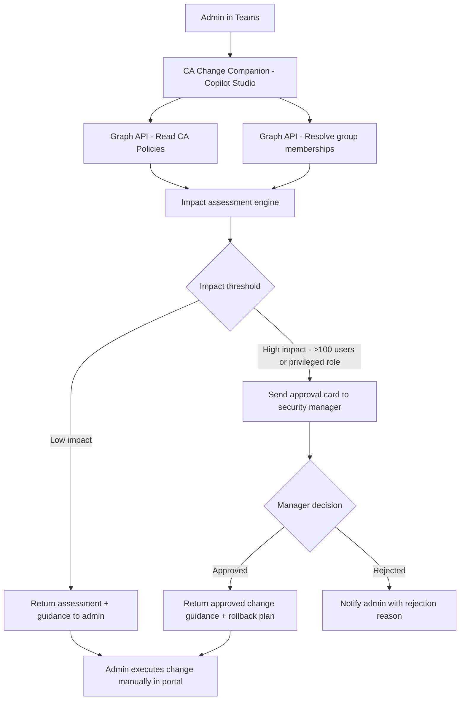

# 🔒 Conditional Access Change Companion

> **A Copilot Studio agent that guides administrators through Conditional Access policy changes, validates impact before apply, and requires approval for changes that affect more than 100 users or touch privileged roles.**

| Attribute | Value |
|---|---|
| **Domain** | Identity |
| **Architecture** | Copilot Studio |
| **Impact** | High |
| **Effort** | Medium |
| **Risk** | Medium |
| **Approval Required** | Yes |
| **Maturity** | Concept |

---

## Problem Statement

Conditional Access policies are among the most powerful — and most dangerous — controls in a Microsoft 365 tenant. A misconfigured policy can lock every user out of every application simultaneously, including the administrator making the change. Unlike most configuration changes, CA policy changes take effect immediately upon saving, with no staging or preview mode by default.

Enterprises with mature CA deployments commonly have 30-100 or more policies, each with complex include/exclude logic across users, groups, applications, conditions, and grant controls. Understanding the blast radius of a proposed change requires cross-referencing multiple policies, group memberships, and application assignments — a cognitive task that is easy to get wrong under pressure.

The most common CA-related incidents are: accidentally removing MFA requirements for a broad population, applying a compliant device requirement before devices are actually enrolled, blocking break-glass accounts from a policy exclusion group that was renamed, and enabling a new policy in "on" state rather than "report-only" state for initial validation.

A companion agent cannot prevent all mistakes, but it can enforce a structured change process: validate the proposed change against known risk patterns, calculate the estimated user impact, route large changes through an approval workflow, and auto-generate a rollback plan.

---

## Agent Concept

The agent operates as a pre-change checklist enforcer. When an admin says "I want to add MFA requirement for all guest users accessing SharePoint," the agent:

1. Reads the current CA policy set from Graph
2. Identifies which existing policies already cover guest/SharePoint combinations
3. Calculates potential user impact by resolving group memberships
4. Checks whether break-glass accounts would be affected
5. Presents a structured impact assessment: users affected, apps affected, potential conflicts, and recommended safeguards (e.g., "deploy in report-only mode first")
6. If the change touches >100 users or a privileged role group, triggers an approval card to the security team manager
7. After approval, generates the PowerShell command or direct portal link for the admin to execute the change themselves

---

## Architecture

This is a **Tier 3 Copilot Studio agent** with an approval flow. The agent itself never writes to Entra — it prepares and validates the change, then the human executes it after approval. This maintains human-in-the-loop for all policy modifications.

---

## Implementation Steps

1. **Create app registration** — `copilot-ca-companion` with `Policy.Read.All`, `Group.Read.All`, `User.Read.All` permissions. No write permissions.

2. **Build Copilot Studio bot** — Create a new bot in Copilot Studio. Add a topic for CA change assessment. Add a Power Automate flow action that calls Graph to read current policies and resolve group sizes.

3. **Implement impact scoring** — Build logic to: count users in target groups, identify whether break-glass exclusion groups are in scope, check for policy conflicts, and flag privileged role groups.

4. **Build approval flow** — When impact score exceeds threshold, trigger a Power Automate approval flow. Send an Adaptive Card to the designated approver with the full impact assessment attached.

5. **Generate rollback artifact** — After approval, the agent generates a JSON export of the current CA policy state and attaches it to the Teams conversation as a rollback reference.

6. **Publish to Teams** — Publish the Copilot Studio bot to Teams and restrict access to the IAM admin security group.

---

## Required Permissions

| Permission | Type | Justification |
|---|---|---|
| `Policy.Read.All` | Application | Read all Conditional Access policies |
| `Group.Read.All` | Application | Resolve group memberships for impact calculation |
| `User.Read.All` | Application | Count users affected by proposed changes |

> **No write permissions.** The agent assesses and guides; humans execute.

---

## Security & Compliance Controls

- **No write access** — The agent cannot modify policies. All changes are executed by the human admin.
- **Approval workflow** — Changes affecting >100 users or privileged roles require explicit manager approval before the agent provides change guidance.
- **Rollback artifact** — A JSON snapshot of the current policy state is generated before every approved change.
- **Audit trail** — All agent interactions are logged. Approval decisions are stored in the Power Automate run history.
- **Break-glass protection** — The agent explicitly warns if a proposed change would affect accounts identified as break-glass accounts.

---

## Business Value & Success Metrics

**Primary value:** Prevents CA-related tenant lockouts and production incidents by enforcing structured impact assessment before every policy change.

| Metric | Before Agent | After Agent | Target |
|---|---|---|---|
| CA-related incidents per year | 3-5 | 0-1 | 80% reduction |
| Time for change impact assessment | 45-90 min manual | 3-5 min | 95% reduction |
| Changes deployed without impact review | ~40% | 0% | 100% coverage |
| Rollback plans documented | Rarely | Every change | 100% |

---

## Example Use Cases

**Example 1:**
> "What would happen if I added compliant device requirement to our All Users policy?"

**Example 2:**
> "I want to block legacy authentication for all guest users. What's the blast radius?"

**Example 3:**
> "Review my planned CA change: adding SharePoint to the MFA required app list."

---

## Alternative Approaches

- **Report-only mode** — Entra CA supports report-only mode natively, but it requires the admin to know to use it and to manually analyze the resulting sign-in logs.
- **What If tool in Entra portal** — Allows per-user simulation but doesn't scale to bulk analysis or integrate with approval workflows.
- **Manual peer review** — Slow, inconsistent, undocumented.

---

## Related Agents

- [Break-Glass Account Validator](break-glass-validator.md) — Validates break-glass accounts are excluded from CA policies
- [Entra Sign-In Risk Explainer](entra-signin-risk-explainer.md) — Explains risk events that CA policies are designed to block
- [Privileged Access Review](privileged-access-review.md) — Reviews the privileged groups that CA policies protect
