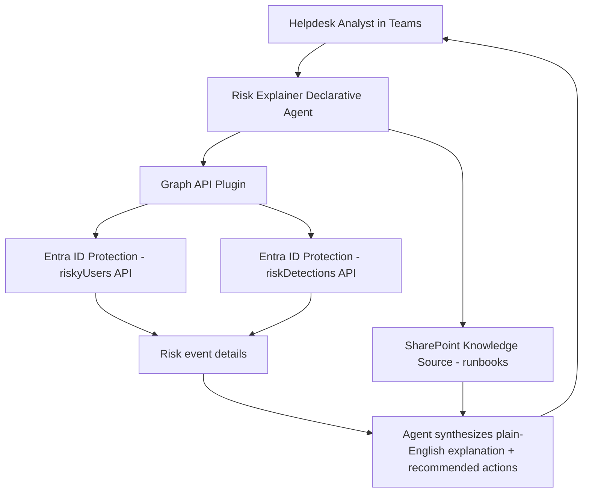

# 🔍 Entra Sign-In Risk Explainer

> **A declarative agent that translates Entra ID Protection risk events into plain-English explanations, helping helpdesk staff and junior analysts understand and triage risky sign-ins without deep identity expertise.**

| Attribute | Value |
|---|---|
| **Domain** | Identity |
| **Architecture** | Declarative |
| **Impact** | Medium |
| **Effort** | Low |
| **Risk** | Low |
| **Approval Required** | No |
| **Maturity** | Concept |

---

## Problem Statement

Entra ID Protection generates risk events — atypical travel, anonymous IP usage, malware-linked IP, leaked credentials, impossible travel, and a dozen other detection types — but the default portal experience presents these as terse labels with minimal context. A helpdesk analyst looking at "unfamiliar sign-in properties" for a user who called in confused about an MFA prompt has no quick way to understand what triggered the risk, whether it is a true positive, what the recommended response is, or how to document the investigation.

The result is one of two failure modes: either analysts dismiss risk events because they don't understand them (creating security gaps), or they escalate everything to the security team regardless of severity (creating noise that burns out senior analysts). Neither outcome serves the organization.

Additionally, end users who receive MFA challenges or access blocks due to risk policies often contact the helpdesk without any context. The helpdesk analyst needs to explain what happened in user-friendly terms, verify the sign-in was legitimate, and document the outcome — a process that currently requires the analyst to navigate multiple portal blades.

---

## Agent Concept

The agent accepts a user UPN or a specific sign-in event ID and returns a plain-English explanation of what triggered the risk detection, what the risk level means in practical terms, what the recommended investigation steps are, and what remediation options exist (self-remediation via MFA, admin dismissal, user password reset, etc.).

The agent is grounded in Microsoft's public documentation on risk detection types, supplemented by a SharePoint knowledge source containing the organization's own risk investigation runbooks. When an analyst asks "why was Jane Smith flagged as high risk?", the agent queries Graph for Jane's recent risk events, retrieves the detection details, and provides a structured triage summary in conversational language.

---

## Architecture

A **Tier 1 Declarative Agent** grounded in two knowledge sources: Microsoft Graph (for live risk event data) and a SharePoint site containing internal investigation runbooks. The combination of live data and curated guidance makes this significantly more useful than either source alone.

---

## Implementation Steps

1. **Create app registration** — `copilot-risk-explainer` with `IdentityRiskyUser.Read.All` and `IdentityRiskEvent.Read.All` permissions. Grant admin consent.

2. **Build Graph API plugin** — Author OpenAPI spec wrapping `GET /identityProtection/riskyUsers/{userId}`, `GET /identityProtection/riskDetections?$filter=userId eq '{userId}'`, and `GET /identityProtection/riskyUsers/{userId}/history`.

3. **Prepare SharePoint knowledge source** — Create a SharePoint site with the investigation runbook for each risk detection type. This allows the agent to surface organization-specific guidance alongside Microsoft's standard recommendations.

4. **Author declarative agent manifest** — Reference both the Graph plugin and the SharePoint knowledge source. Write instructions that guide the model to always explain: what triggered the risk, what the risk level means, whether it is likely a true positive or false positive, and what the analyst should do next.

5. **Deploy to Teams helpdesk channel** — Target deployment to the helpdesk team and tier-1 security analysts.

---

## Required Permissions

| Permission | Type | Justification |
|---|---|---|
| `IdentityRiskyUser.Read.All` | Application | Read user risk state and history |
| `IdentityRiskEvent.Read.All` | Application | Read individual risk detection events |

---

## Security & Compliance Controls

- **Read-only** — The agent cannot dismiss risks, reset passwords, or modify any user state.
- **Audit logging** — All Graph API calls are logged under the service principal.
- **PII awareness** — The agent instructions explicitly limit UPN and personal details to the conversation context only; they are not stored in any external system by the agent.
- **Scoped access** — Only helpdesk team members can access the agent.

---

## Business Value & Success Metrics

**Primary value:** Reduces escalation rate for risk events by empowering tier-1 helpdesk to triage and document risky sign-ins without senior analyst involvement.

| Metric | Before Agent | After Agent | Target |
|---|---|---|---|
| Risk event escalation rate | 70% | 30% | 55% reduction |
| Time to triage single risk event | 15-20 min | 3-5 min | 75% reduction |
| Analyst satisfaction with risk tooling | Low | High | Qualitative improvement |
| Investigation documentation rate | 40% | 95% | Consistent documentation |

---

## Example Use Cases

**Example 1:**
> "Why was john.smith@contoso.com flagged as high risk today?"

**Example 2:**
> "Explain what 'unfamiliar sign-in properties' means and whether I should be worried."

**Example 3:**
> "A user called saying they got an MFA prompt they didn't expect. Their risk level shows medium. What should I do?"

---

## Alternative Approaches

- **Entra portal risk blade** — Shows raw detection data but no plain-English explanation or guided next steps.
- **Microsoft Defender XDR alerts** — Surfaces some identity risk events but in a security operations context, not helpdesk-friendly.
- **Manual documentation** — Requires analysts to maintain their own notes, inconsistent quality.

---

## Related Agents

- [MFA Registration Gap Finder](mfa-gap-finder.md) — Identifies users who lack compliant MFA, making them more likely to generate risk events
- [Phishing Response](../secops/phishing-response.md) — Handles the downstream response when a risk event is confirmed as a compromise
- [Break-Glass Account Validator](break-glass-validator.md) — Ensures emergency accounts are never flagged as risky
