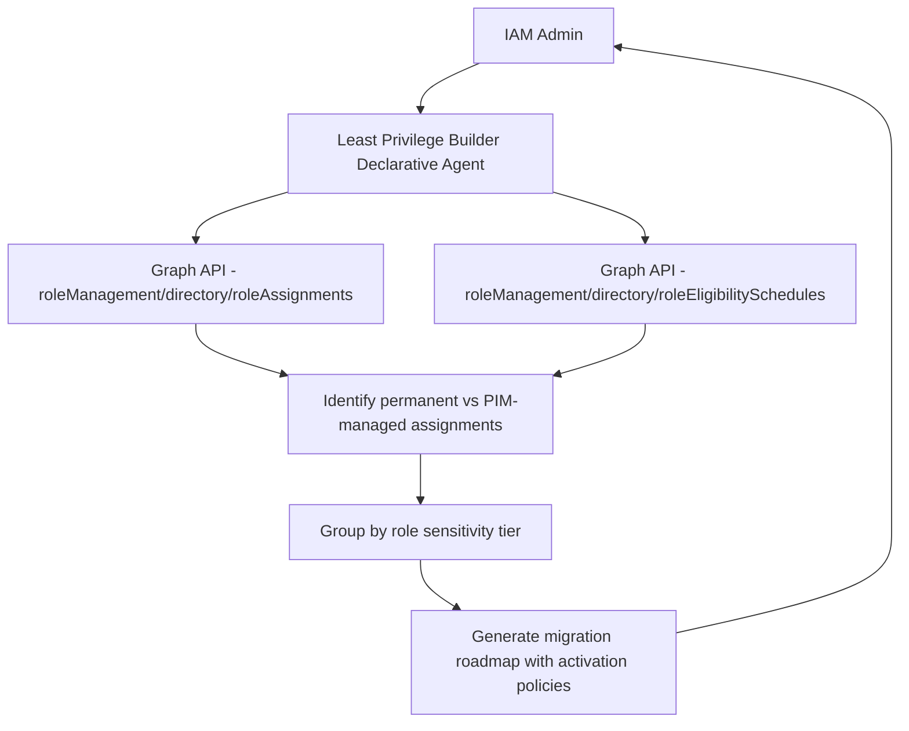

# 🔑 Least Privilege Builder (PIM)

> **A declarative agent that analyzes current role assignments, identifies permanent privileged access that should be converted to just-in-time via PIM, and generates a migration plan grounded in the principle of least privilege.**

| Attribute | Value |
|---|---|
| **Domain** | Identity |
| **Architecture** | Declarative |
| **Impact** | High |
| **Effort** | Low |
| **Risk** | Low |
| **Approval Required** | No |
| **Maturity** | Concept |

---

## Problem Statement

Privileged Identity Management (PIM) is one of Entra ID's most powerful security controls, converting permanent privileged role assignments into time-limited, approval-gated, just-in-time activations. Despite being available in every Entra ID P2 tenant, PIM adoption remains low because the effort to analyze the current state, plan the migration, and communicate the change to role holders feels overwhelming to time-constrained IAM teams.

The typical situation: 15-25 users with permanent Global Administrator assignment, 40+ permanent Application Administrator assignments, no activation policies configured, no approval requirements, no justification requirements. The Secure Score recommendation says "enable PIM" but provides no migration path.

Without a structured migration plan, organizations leave permanent privileged access in place indefinitely. Every account with a permanent privileged role is a standing target — if compromised, the attacker has unlimited time to move laterally. PIM activation windows of 1-8 hours dramatically reduce the exposure window.

---

## Agent Concept

An administrator asks "analyze our current privileged role assignments and recommend a PIM migration plan." The agent retrieves all Entra directory role assignments, identifies permanent (non-PIM-managed) assignments, groups them by role sensitivity, and generates a prioritized migration roadmap with recommended activation policies for each role.

For each role, the agent recommends: maximum activation duration, whether to require approval (and suggested approvers), whether to require justification, whether to require MFA at activation, and what notifications to configure. The output is a structured migration plan the IAM team can execute over 4-6 weeks rather than a raw list of users to process.

---

## Architecture

A **Tier 1 Declarative Agent** that reads PIM and role assignment data from Graph. The output is advisory — execution happens in the Entra PIM portal by a human administrator.

---

## Implementation Steps

1. **Create app registration** — `copilot-pim-advisor` with `RoleManagement.Read.All` and `PrivilegedAccess.Read.AzureAD` permissions.

2. **Build Graph API plugin** — Wrap `GET /roleManagement/directory/roleAssignments`, `GET /roleManagement/directory/roleEligibilitySchedules`, and `GET /roleManagement/directory/roleDefinitions`.

3. **Define role sensitivity tiers** in agent instructions:
   - Tier A (Critical): Global Admin, Privileged Role Admin, Security Admin
   - Tier B (High): Exchange Admin, SharePoint Admin, Intune Admin
   - Tier C (Standard): All other directory roles

4. **Define recommended PIM policies per tier** in instructions:
   - Tier A: 2-hour max activation, approval required, MFA at activation, justification required
   - Tier B: 4-hour max activation, no approval, MFA at activation, justification required
   - Tier C: 8-hour max activation, no approval, no MFA requirement, justification recommended

5. **Deploy to Teams** — IAM team only.

---

## Required Permissions

| Permission | Type | Justification |
|---|---|---|
| `RoleManagement.Read.All` | Application | Read directory role assignments |
| `PrivilegedAccess.Read.AzureAD` | Application | Read PIM eligibility schedules |
| `User.Read.All` | Application | Resolve user display names for role holders |

---

## Security & Compliance Controls

- **Read-only** — No PIM policies are created or modified by the agent.
- **Output is advisory** — The agent generates a plan; humans execute it after review.
- **Scoped access** — Only IAM administrators can access this agent.

---

## Business Value & Success Metrics

**Primary value:** Accelerates PIM adoption by converting a complex analysis task into a structured, ready-to-execute migration plan.

| Metric | Before Agent | After Agent | Target |
|---|---|---|---|
| Time to produce PIM migration plan | 2-3 days | 30 minutes | 95% reduction |
| Permanent GA assignments | 15-25 typical | 0-2 (break-glass only) | Near-zero |
| Privileged access covered by PIM | <20% | >90% | 90%+ |
| Time to achieve CIS benchmark compliance | Months | Weeks | 60% faster |

---

## Example Use Cases

**Example 1:**
> "Analyze our current role assignments and recommend a PIM migration plan."

**Example 2:**
> "Which users have permanent Global Administrator assigned and should be in PIM instead?"

**Example 3:**
> "What activation policy should we configure for our Exchange Administrators?"

**Example 4:**
> "How many of our privileged users are already managed via PIM eligible assignments?"

---

## Alternative Approaches

- **Microsoft Secure Score** — Recommends enabling PIM but doesn't provide a migration plan.
- **Entra PIM portal** — Shows current state but requires manual analysis to produce a migration plan.
- **Manual spreadsheet analysis** — Feasible for <20 role holders, does not scale.

---

## Related Agents

- [Privileged Access Review](privileged-access-review.md) — Periodic review of PIM assignments once migration is complete
- [Break-Glass Account Validator](break-glass-account-validator.md) — Validates that break-glass accounts are excluded from PIM requirements
- [App Registration Governance](azure-app-registration-governance.md) — Governs service principal role assignments alongside human privileged access
