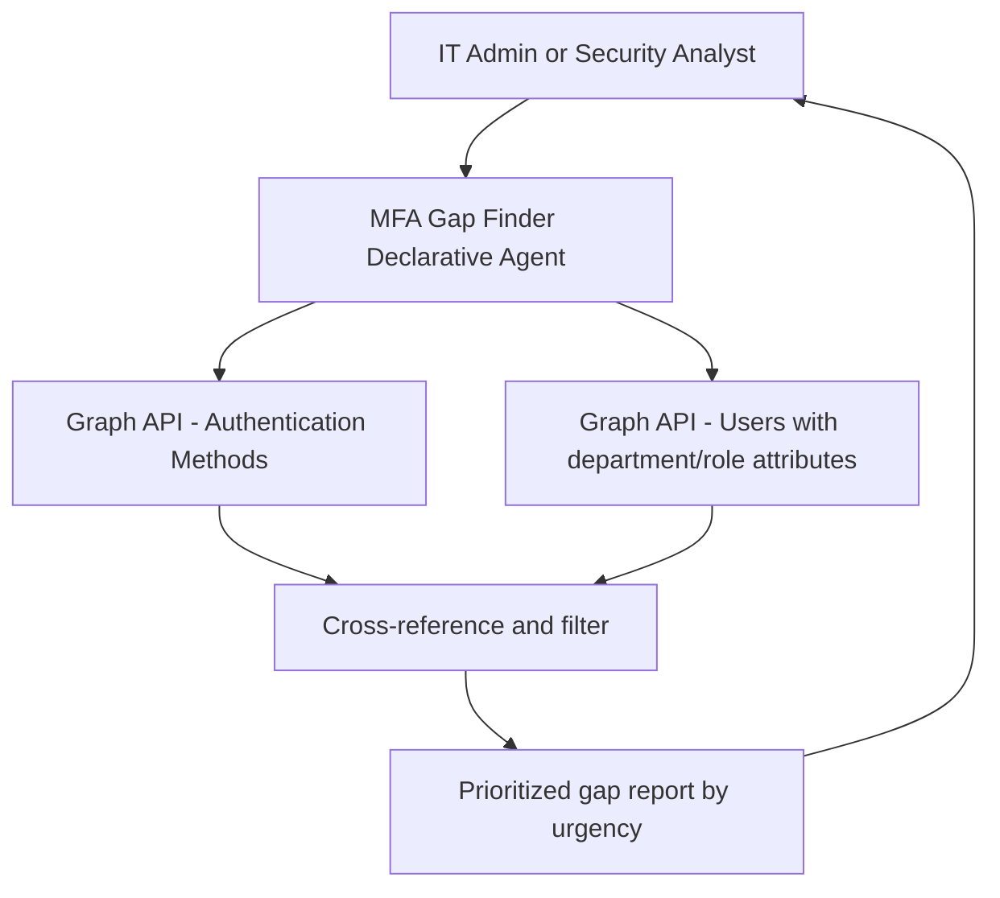

# 📵 MFA Registration Gap Finder

> **A declarative agent that identifies users lacking compliant MFA registration, filtered by department, role, or risk profile, enabling targeted remediation campaigns rather than bulk email blasts.**

| Attribute | Value |
|---|---|
| **Domain** | Identity |
| **Architecture** | Declarative |
| **Impact** | High |
| **Effort** | Low |
| **Risk** | Low |
| **Approval Required** | No |
| **Maturity** | Concept |

---

## Problem Statement

Multi-factor authentication is the single most effective control against account compromise — Microsoft's own data indicates that MFA blocks 99.9% of automated credential attacks. Yet in most enterprise tenants, 10-30% of users are not registered for any MFA method, or are registered only for SMS OTP (which is susceptible to SIM-swapping and real-time phishing attacks).

The challenge is not knowing that the gap exists — it is knowing precisely where the gap is so remediation resources can be directed effectively. Sending a bulk "please register for MFA" email to all 10,000 users generates a helpdesk surge, low compliance rates, and resentment. What organizations need is precise targeting: which users in Finance are not registered? Which managers have not set up the Authenticator app? Which contractors registered only with SMS and need to upgrade?

Microsoft provides an Authentication Methods Activity report in the Entra portal, but it is not conversational, does not support filtering by arbitrary attributes, and produces raw tables that require post-processing to be actionable.

---

## Agent Concept

An IT administrator or security analyst asks targeted questions like "Show me all users in the Finance department who have not registered the Microsoft Authenticator app" and receives a filterable, prioritized list. The agent queries the Authentication Methods API, cross-references user department and job title attributes, and returns results grouped by urgency (users with no MFA at all, users with only SMS OTP, users with Authenticator registered but not passwordless-capable).

The agent also provides campaign planning support: "How many users in the London office need to register? Who are the most senior ones?" This enables targeted executive communications rather than blanket notifications.

---

## Architecture

A **Tier 1 Declarative Agent** using the Authentication Methods and Users Graph APIs. The agent's instructions are grounded in Microsoft's authentication method recommendations and the organization's own MFA policy (loaded from a SharePoint knowledge source).

---

## Implementation Steps

1. **Create app registration** — `copilot-mfa-gap-finder` with `UserAuthenticationMethod.Read.All` and `User.Read.All`. Grant admin consent.

2. **Build Graph API plugin** — Wrap `GET /users/{id}/authentication/methods` and `GET /reports/authenticationMethods/userRegistrationDetails`. The latter provides a pre-aggregated view per user.

3. **Add SharePoint knowledge source** — Upload the organization's MFA policy document. This allows the agent to reference policy thresholds (e.g., "SMS OTP is not compliant per our policy") in its responses.

4. **Author agent instructions** — Define MFA compliance levels: Level 0 = no MFA, Level 1 = SMS only, Level 2 = Authenticator app (TOTP), Level 3 = Authenticator app (push), Level 4 = FIDO2 or Windows Hello. Instructions should guide the agent to always state which level a user is at and what upgrade path is recommended.

5. **Deploy to Teams** — Target IAM team and IT helpdesk managers.

---

## Required Permissions

| Permission | Type | Justification |
|---|---|---|
| `UserAuthenticationMethod.Read.All` | Application | Read authentication method registrations per user |
| `User.Read.All` | Application | Read user department, job title, and location attributes |
| `Reports.Read.All` | Application | Access authentication methods activity reports |

---

## Security & Compliance Controls

- **Read-only** — No ability to modify authentication methods or user accounts.
- **Aggregated output** — When reporting on large populations, the agent returns counts and segments rather than raw UPN lists to reduce PII exposure in shared channels.
- **Role-scoped access** — Only IAM admins and security managers can query individual user MFA status.

---

## Business Value & Success Metrics

**Primary value:** Enables targeted, efficient MFA registration campaigns that achieve higher compliance rates with fewer helpdesk tickets.

| Metric | Before Agent | After Agent | Target |
|---|---|---|---|
| MFA registration rate | 70-80% | 95%+ | 95% minimum |
| Time to identify non-compliant population | 2-4 hours | 5 minutes | 95% reduction |
| Helpdesk tickets per MFA campaign | High (bulk comms) | Low (targeted) | 50% reduction |
| SMS-only users identified and upgraded | Rarely tracked | Weekly report | Full visibility |

---

## Example Use Cases

**Example 1:**
> "Show me all users in the Finance department with no MFA registered."

**Example 2:**
> "How many users are registered only with SMS OTP? Which ones are in privileged roles?"

**Example 3:**
> "Who are the top 10 most senior employees who haven't registered the Authenticator app?"

**Example 4:**
> "What percentage of our contractor population is MFA-registered?"

---

## Alternative Approaches

- **Entra Authentication Methods Activity report** — Available in portal but not conversational, no cross-filtering with user attributes.
- **PowerShell** — `Get-MgUserAuthenticationMethod` works but requires scripting expertise and custom reporting logic.
- **Conditional Access report-only mode** — Shows who would be blocked, but doesn't surface the registration gap proactively.

---

## Related Agents

- [Break-Glass Account Validator](break-glass-validator.md) — Validates that break-glass accounts have compliant (non-MFA) authentication configured
- [Passwordless Rollout Coach](passwordless-rollout.md) — Plans and tracks the full passwordless transition journey
- [Entra Sign-In Risk Explainer](entra-signin-risk-explainer.md) — Explains why unregistered users generate higher risk scores
