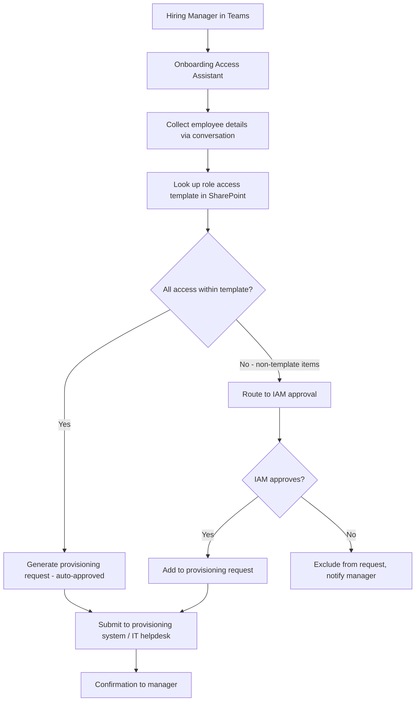

# 👋 Onboarding Access Assistant

> **A Copilot Studio agent that guides IT administrators and hiring managers through the access provisioning process for new employees, enforcing role-based access templates and requiring approval for out-of-template requests.**

| Attribute | Value |
|---|---|
| **Domain** | Identity |
| **Architecture** | Copilot Studio |
| **Impact** | Medium |
| **Effort** | Medium |
| **Risk** | Medium |
| **Approval Required** | Yes |
| **Maturity** | Concept |

---

## Problem Statement

New employee onboarding is consistently one of the top sources of IT helpdesk tickets. Hiring managers submit access requests via email, Jira tickets, or verbal requests, using inconsistent terminology and without reference to the organization's access templates. IT administrators interpret these requests as best they can, often over-provisioning access "to be safe" and creating access that is never reviewed or removed.

The consequences accumulate over time: users with access to systems they no longer use, access to departments they transferred away from, and permissions that were granted as a one-time exception and became permanent. Access creep is one of the leading contributing factors to data breach blast radius — when an account is compromised, the attacker inherits all of the over-provisioned access.

The onboarding process also creates equity problems: employees in departments with vocal managers get comprehensive access from day one, while employees in under-resourced departments wait weeks for basic tools. Standardization through role-based templates solves both problems.

---

## Agent Concept

A hiring manager or HR business partner interacts with the agent in Teams to request access for a new employee. The agent asks structured questions: the employee's job title, department, manager, start date, and any special access needs. It then looks up the organization's access template for that role (stored in SharePoint), presents what access will be provisioned automatically, and highlights any requests that fall outside the template as requiring IAM approval.

The agent generates a structured access request ticket, routes out-of-template requests for approval, and tracks the provisioning status. On the employee's first day, the agent can confirm what access has been granted and surface any pending items.

---

## Architecture

A **Tier 3 Copilot Studio agent** backed by SharePoint access templates and Power Automate provisioning flows. Template-matching access is approved by policy; non-template access requires IAM approval.

---

## Implementation Steps

1. **Build access template library** — Create a SharePoint list with one row per job title/department combination. Columns: job title, department, required groups, optional groups (manager-requestable), prohibited access (cannot be granted regardless of request).

2. **Create app registration** — `copilot-onboarding` with `User.Read.All`, `Group.Read.All` to validate template alignment against current group structure.

3. **Build Copilot Studio bot** — Create an onboarding topic with a structured conversation flow collecting: employee name, email, job title, department, manager, start date, and any special access needs.

4. **Implement template matching** — When the employee's role is identified, the bot retrieves the matching template from SharePoint and presents the standard access bundle.

5. **Build approval flow** — Non-template items trigger a Power Automate approval sent to the IAM team lead with full context: what is being requested, why it falls outside the template, and the requesting manager's details.

6. **Integrate with provisioning** — On approval, the flow creates a ticket in the IT service management system (ServiceNow, Jira Service Management, etc.) with the complete provisioning specification.

---

## Required Permissions

| Permission | Type | Justification |
|---|---|---|
| `User.Read.All` | Application | Validate employee account creation |
| `Group.Read.All` | Application | Read group names to match templates |
| `Sites.Read.All` | Delegated | Read access templates from SharePoint |

---

## Security & Compliance Controls

- **Template enforcement** — Access outside the defined template for a role requires explicit IAM approval. No ad hoc provisioning without a paper trail.
- **Prohibited access list** — Each template includes a prohibited list. Even with IAM approval, certain access combinations are blocked at the template level.
- **Access review trigger** — All non-template access granted via exception is automatically flagged for the 90-day access review cycle.
- **Audit trail** — Every onboarding request, template match result, and approval decision is logged.

---

## Business Value & Success Metrics

**Primary value:** Standardizes access provisioning, reduces over-provisioning, and creates an auditable trail from day-one of employment.

| Metric | Before Agent | After Agent | Target |
|---|---|---|---|
| Time to complete access request | 2-5 days | Same day | 80% reduction |
| Access provisioned outside template | ~40% | <10% | 75% reduction |
| Onboarding helpdesk tickets per hire | 3-5 | 0-1 | 80% reduction |
| Access review coverage (90-day) | Ad hoc | 100% of exceptions | Full coverage |

---

## Example Use Cases

**Example 1:**
> "I need to set up access for Sarah Chen who is joining as a Financial Analyst in the Finance department on April 1st."

**Example 2:**
> "What access does a Marketing Manager typically get provisioned?"

**Example 3:**
> "Sarah also needs access to the M&A project SharePoint site. Is that standard for her role?"

---

## Alternative Approaches

- **Email-based access requests** — No template enforcement, inconsistent documentation, slow approval cycles.
- **ITSM forms** — Better structure but no AI assistance, no template lookup, no approval routing.
- **Entra ID Lifecycle Workflows** — Automates provisioning for lifecycle events but requires pre-defined workflow triggers, not conversational requests.

---

## Related Agents

- [Privileged Access Review](privileged-access-review.md) — Reviews the access granted during onboarding after 90 days
- [Offboarding Orchestrator](../secops/offboarding-orchestrator.md) — The complementary offboarding process
- [MFA Registration Gap Finder](mfa-gap-finder.md) — Identifies new hires who haven't completed MFA registration
