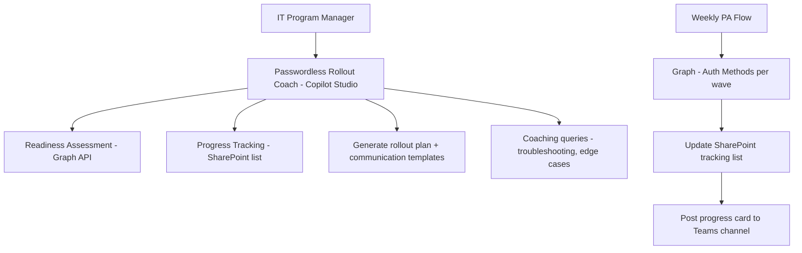

# 🔓 Passwordless Rollout Coach

> **A hybrid agent that plans, tracks, and coaches a phased passwordless authentication rollout across the enterprise — from initial readiness assessment through full production deployment.**

| Attribute | Value |
|---|---|
| **Domain** | Identity |
| **Architecture** | Hybrid |
| **Impact** | High |
| **Effort** | High |
| **Risk** | Medium |
| **Approval Required** | Yes |
| **Maturity** | Concept |

---

## Problem Statement

Passwordless authentication — Microsoft Authenticator passkeys, FIDO2 security keys, and Windows Hello for Business — dramatically improves both security and user experience. It eliminates the primary attack surface for credential-based attacks and removes password reset burden from the helpdesk. Microsoft has made passwordless the recommended authentication standard. Yet most enterprises are years behind in adoption.

The obstacle is not technical capability — the platform supports passwordless fully. The obstacle is change management at scale: identifying which users are ready, sequencing the rollout to avoid disrupting operations, communicating the change in a way that reduces helpdesk surge, handling edge cases (shared workstations, users without compatible devices, kiosk scenarios), and tracking progress without a purpose-built project management system.

IT architects who have led passwordless rollouts consistently report that the planning and tracking overhead consumed more time than the technical implementation.

---

## Agent Concept

The agent operates across the full rollout lifecycle. In the planning phase, it assesses the tenant's current passwordless readiness: device compatibility (Windows Hello requires TPM 2.0), authentication method registration rates, Conditional Access policy gaps, and application compatibility. It generates a phased rollout plan with recommended user segments (IT admins first, then power users, then general staff).

During execution, the agent tracks enrollment progress per wave, surfaces users who are stuck, provides helpdesk talking points for common issues (FIDO2 key not recognized, Windows Hello setup loop), and posts weekly progress reports to the program team. It also generates user communication templates for each rollout wave.

The agent integrates with a SharePoint tracking list that serves as the single source of truth for rollout status, updated by the Power Automate monitoring flows.

---

## Architecture

A **Tier 4 Hybrid agent** combining Copilot Studio (conversational planning and coaching), Power Automate (weekly progress monitoring flows), and a SharePoint list (rollout tracking). The Copilot Studio bot handles planning queries and coaching; the Power Automate flows handle scheduled data collection and reporting.

---

## Implementation Steps

1. **Readiness assessment module** — Query `GET /reports/authenticationMethods/userRegistrationDetails` to baseline current passwordless registration. Check device management data in Intune for TPM 2.0 compliance.

2. **Build rollout plan template** — SharePoint list structure: Wave (1-N), User segment description, Target users (group), Start date, Target enrollment rate, Current enrollment rate, Status.

3. **Build weekly monitoring flow** — Power Automate flow: for each rollout wave, query current passwordless registration rate among wave members. Compare to target. Post Adaptive Card summary to Teams program channel.

4. **Build Copilot Studio coaching bot** — Topics: "Assess readiness", "Generate rollout plan", "Show current progress", "Troubleshoot enrollment issue", "Generate communication email for wave N".

5. **Build communication templates** — SharePoint knowledge source with email/Teams message templates for each rollout phase, customizable by wave and audience.

6. **Approval workflow** — Each wave activation requires program manager sign-off via approval card before the wave is opened for enrollment.

---

## Required Permissions

| Permission | Type | Justification |
|---|---|---|
| `UserAuthenticationMethod.Read.All` | Application | Track passwordless registration per user |
| `Reports.Read.All` | Application | Access authentication methods activity reports |
| `DeviceManagementManagedDevices.Read.All` | Application | Check device TPM compatibility via Intune |
| `User.Read.All` | Application | Resolve user wave assignments |

---

## Security & Compliance Controls

- **Read-only monitoring** — Enrollment tracking reads only; no changes to authentication methods.
- **Wave approval gate** — Each rollout wave requires explicit program manager approval before activation.
- **Rollback plan** — Each wave plan includes a documented rollback procedure (re-enabling password authentication for the wave group if issues are detected).
- **Edge case registry** — Known edge cases (shared kiosks, service accounts, legacy applications) are documented and excluded from passwordless scope with IAM approval.

---

## Business Value & Success Metrics

**Primary value:** Accelerates passwordless adoption from years to months by removing planning overhead and providing continuous progress visibility.

| Metric | Before Agent | After Agent | Target |
|---|---|---|---|
| Time to complete passwordless rollout | 18-24 months | 6-9 months | 60% faster |
| Passwordless adoption rate (12 months) | 10-20% | 60-80% | 4x improvement |
| Helpdesk tickets during rollout | High surge | Managed (targeted comms) | 40% reduction |
| Rollout planning time | 3-4 weeks | 1 week | 75% reduction |

---

## Example Use Cases

**Example 1:**
> "Assess our tenant's readiness for a passwordless rollout."

**Example 2:**
> "What percentage of Wave 1 users have completed passwordless registration?"

**Example 3:**
> "Generate a communication email for the Finance department about their upcoming passwordless wave."

**Example 4:**
> "A user says Windows Hello setup keeps looping. What should the helpdesk tell them?"

---

## Alternative Approaches

- **Microsoft's passwordless deployment guide** — Comprehensive documentation but no tracking or automation.
- **Manual project plan in Excel** — Feasible but requires manual data collection and constant updates.
- **Entra Authentication Methods policy** — Controls which methods are enabled but provides no rollout planning or tracking.

---

## Related Agents

- [MFA Registration Gap Finder](mfa-gap-finder.md) — Identifies users not yet registered for any authentication method
- [Device Compliance Drift](../endpoint/device-compliance-drift.md) — Windows Hello for Business requires device compliance; this agent ensures devices are ready
- [Least Privilege Builder (PIM)](least-privilege-builder.md) — Privileged users are typically Wave 1 for passwordless rollout
