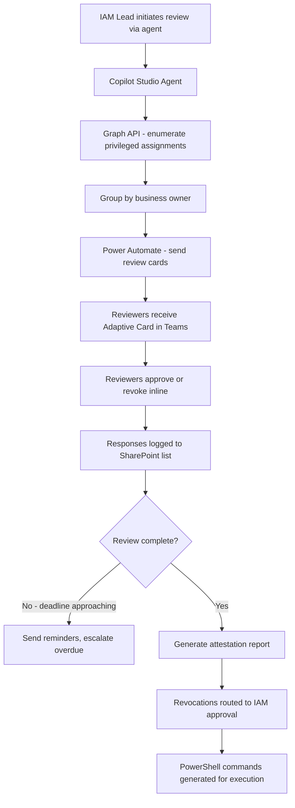

# 👁️ Privileged Access Review

> **A Copilot Studio agent that orchestrates quarterly privileged access reviews, generating per-reviewer packages, tracking completion, and escalating non-responses — turning a painful compliance exercise into a structured, tracked process.**

| Attribute | Value |
|---|---|
| **Domain** | Identity |
| **Architecture** | Copilot Studio |
| **Impact** | High |
| **Effort** | Medium |
| **Risk** | Medium |
| **Approval Required** | Yes |
| **Maturity** | Concept |

---

## Problem Statement

Quarterly privileged access reviews are a compliance requirement under SOC 2, ISO 27001, and most enterprise security frameworks. In practice, they are one of the most universally dreaded compliance tasks for IAM teams. The typical process: export a spreadsheet of all privileged role assignments from Entra, manually split it into segments by business owner, email each owner asking them to confirm or deny each assignment, chase non-responders for weeks, consolidate responses, remediate revocations, and produce an attestation report. This process takes 3-6 weeks and is hated by everyone involved.

The specific failure modes are: reviewers who approve everything without genuine review (rubber-stamping), reviewers who miss the email entirely, assignments that should be revoked but get approved because the reviewer doesn't recognize the user (who transferred 18 months ago), and audit artifacts that are Excel spreadsheets — difficult to query and easy to manipulate.

---

## Agent Concept

The agent automates the orchestration layer of the access review. It queries the current privileged role assignment state, groups assignments by business owner (derived from manager hierarchy in Entra), and sends each reviewer a structured Adaptive Card in Teams with their specific review set. The card allows inline approve/revoke decisions with a required justification field.

The agent tracks completion in real time: "8 of 12 reviewers have completed their review. 3 are overdue." It sends automated reminders to overdue reviewers and escalates to their managers after 5 business days. At review close, the agent generates a structured attestation report with a full decision log.

Revocations approved during the review trigger an IAM approval before the agent produces a PowerShell command for execution.

---

## Architecture

A **Tier 3 Copilot Studio agent** with Power Automate orchestration flows. The review lifecycle (send → remind → escalate → close → report) is managed by Power Automate; the agent provides the conversational interface for initiating reviews and checking status.

---

## Implementation Steps

1. **Create app registration** — `copilot-access-review` with `RoleManagement.Read.All`, `User.Read.All`, `Directory.Read.All`.

2. **Build review orchestration flow** — Power Automate flow triggered by the agent: enumerate all privileged assignments, resolve manager hierarchy to determine reviewer, create review packets, send Adaptive Cards with approve/revoke buttons and justification text field.

3. **Build response collection** — Store all responses in a SharePoint list: assignment ID, reviewer, decision (approve/revoke), justification, timestamp.

4. **Build reminder and escalation flows** — Scheduled daily check: identify incomplete reviews past deadline, send reminder cards, escalate to manager after 5 business days.

5. **Build attestation report generator** — At review close, generate a structured Markdown report with: total assignments reviewed, approval rate, revocations, non-responses treated as revocations, and full decision log.

6. **Build revocation approval flow** — Approved revocations go to IAM lead for final confirmation before generating execution commands.

---

## Required Permissions

| Permission | Type | Justification |
|---|---|---|
| `RoleManagement.Read.All` | Application | Read all privileged role assignments |
| `User.Read.All` | Application | Resolve user names and manager hierarchy |
| `Directory.Read.All` | Application | Read group memberships for PIM eligible assignments |

---

## Security & Compliance Controls

- **No write permissions** — The agent and flows read only. Revocations require IAM approval + manual execution.
- **Justification required** — Every revocation decision must include a written justification stored in the audit log.
- **Non-response policy** — Non-responses after escalation are treated as revocations by policy, documented in the attestation report.
- **Tamper-evident log** — Decision records in SharePoint are versioned and write-protected after review close.

---

## Business Value & Success Metrics

**Primary value:** Reduces access review cycle time from 3-6 weeks to 1-2 weeks while improving documentation quality and reviewer completion rates.

| Metric | Before Agent | After Agent | Target |
|---|---|---|---|
| Review cycle duration | 3-6 weeks | 1-2 weeks | 60% reduction |
| Reviewer completion rate | 60-70% | 95%+ | 35% improvement |
| Rubber-stamp approval rate | ~30% | <5% (justification required) | 83% reduction |
| Attestation report preparation | 8-16 hours manual | Auto-generated | Near-zero |

---

## Example Use Cases

**Example 1:**
> "Start the Q2 2026 privileged access review for all Entra directory roles."

**Example 2:**
> "What's the status of the current access review? Who hasn't responded yet?"

**Example 3:**
> "Show me all assignments that were marked for revocation in the current review."

---

## Alternative Approaches

- **Entra ID Access Reviews** — Native capability that covers group membership and app assignments. Recommend using native Access Reviews for those scenarios; this agent adds value for custom orchestration and reporting.
- **Manual spreadsheet process** — Current state for most organizations. Described in the problem statement above.
- **IGA platforms (SailPoint, Saviynt)** — Full-featured but expensive and complex to deploy. This agent provides 80% of the value for organizations not ready to invest in a full IGA platform.

---

## Related Agents

- [Least Privilege Builder (PIM)](least-privilege-builder.md) — Converts permanent assignments to PIM before the review, reducing the review scope
- [App Registration Governance](app-registration-governance.md) — Reviews service principal assignments alongside human privileged access
- [Offboarding Orchestrator](../secops/offboarding-orchestrator.md) — Removes privileged access immediately upon offboarding, reducing the access review backlog
