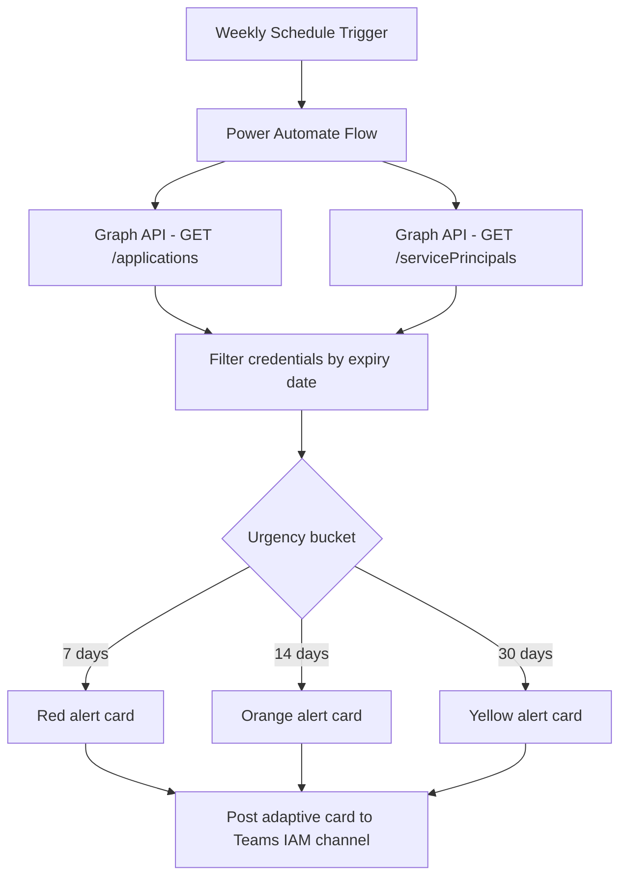

# 🔐 Secrets & Certificates Expiry Monitor

> **A Power Automate flow that queries all app registrations and service principals weekly, identifies credentials expiring in 30/14/7 days, and posts adaptive card alerts to Teams with direct remediation links.**

| Attribute | Value |
|---|---|
| **Domain** | Identity |
| **Architecture** | Power Automate |
| **Impact** | Medium |
| **Effort** | Low |
| **Risk** | Low |
| **Approval Required** | No |
| **Maturity** | Concept |

---

## Problem Statement

Every enterprise tenant accumulates hundreds of app registrations and service principals over time. Each one can have one or more client secrets or certificates attached, each with its own expiry date. When these credentials expire, the applications that rely on them stop working — silently, without warning, often at the worst possible moment.

Production outages caused by expired secrets are among the most embarrassing and preventable incidents in enterprise IT. The fix itself takes minutes; the detection is what fails. Developers who created an app registration years ago may have left the organization. The app may be undocumented. No one receives an expiry notification by default in Entra ID unless explicit alerting is configured — and in most organizations, it isn't.

The typical workaround is a spreadsheet maintained by an IAM team member who periodically logs into the Entra portal and manually checks credentials. This approach doesn't scale beyond 50-100 app registrations and creates a single point of failure in both process and personnel.

---

## Agent Concept

A scheduled Power Automate cloud flow runs weekly (or daily for critical environments). It queries the Microsoft Graph API for all app registrations and service principals in the tenant, extracts the `passwordCredentials` and `keyCredentials` arrays, and calculates days until expiry for each credential.

Credentials are grouped into three urgency buckets: expiring within 30 days (yellow), within 14 days (orange), and within 7 days (red). The flow posts a structured adaptive card to a designated Teams channel — typically the IAM or platform engineering channel — with each expiring credential listed by application name, credential type (secret vs. certificate), owner (if tagged), expiry date, and a direct link to the Entra portal page for that application.

A companion declarative agent allows on-demand queries: "What secrets expire this month?" or "Show me all expired certificates."

---

## Architecture

This is a **Power Automate scheduled flow** with an optional declarative agent for on-demand queries. The flow uses the HTTP connector to call Graph API with a managed identity or service principal.

---

## Implementation Steps

1. **Create app registration** — Register `copilot-secret-expiry-monitor` with `Application.Read.All` permission. Grant admin consent.

2. **Build the Power Automate flow** — Use a Recurrence trigger (weekly, Monday 8am). Add HTTP actions to call `GET /applications?$select=displayName,passwordCredentials,keyCredentials` and `GET /servicePrincipals?$select=displayName,passwordCredentials,keyCredentials`. Use `$top=999` with pagination to retrieve all records.

3. **Filter and group credentials** — Use `Filter array` actions to separate credentials by expiry threshold. Calculate `days until expiry` using `div(sub(ticks(item()?['endDateTime']), ticks(utcNow())), 864000000000)`.

4. **Build adaptive cards** — Create an Adaptive Card JSON template with color-coded urgency indicators. Include: App name, credential type, expiry date, days remaining, and a direct URL to `https://entra.microsoft.com/#view/Microsoft_AAD_RegisteredApps/ApplicationMenuBlade/~/Credentials/appId/{appId}`.

5. **Post to Teams** — Use the "Post card in a chat or channel" Teams connector action, targeting the IAM channel.

6. **Add declarative agent** — Optionally build a companion declarative agent with the same Graph plugin for on-demand queries.

---

## Required Permissions

| Permission | Type | Justification |
|---|---|---|
| `Application.Read.All` | Application | Read all app registrations and service principals |

---

## Security & Compliance Controls

- **Read-only** — The flow reads credential metadata only. It does not expose actual secret values (Graph never returns secret values after creation).
- **Scoped notification** — Adaptive cards are posted to a private channel accessible only to the IAM team.
- **Secret rotation** — The flow's own service principal secret is stored in Key Vault and rotated every 90 days.
- **No credential values in logs** — Flow run history never contains actual secret or certificate content.

---

## Business Value & Success Metrics

**Primary value:** Eliminates production outages caused by expired app registration credentials through proactive, automated notification.

| Metric | Before Agent | After Agent | Target |
|---|---|---|---|
| Production outages from expired secrets | 2-4/year | 0 | 100% reduction |
| Time to detect expiring credentials | Days to weeks | Same day (weekly scan) | Near-zero lag |
| Manual audit time per month | 4-8 hours | 0 | 100% automated |
| Coverage of app registrations monitored | Partial | 100% | Full coverage |

---

## Example Use Cases

**Example 1 (scheduled):** Every Monday morning, the IAM team receives an adaptive card in Teams listing all credentials expiring in the next 30 days, sorted by urgency.

**Example 2 (on-demand via declarative agent):**
> "What secrets expire this month?"

**Example 3 (on-demand):**
> "Show me all expired certificates in our tenant."

**Example 4 (on-demand):**
> "Which app registrations have no owner assigned?"

---

## Alternative Approaches

- **Entra ID portal** — Credentials blade shows expiry dates per app, but requires manual review of each application individually. No bulk view.
- **Azure Monitor alerts** — Can alert on resource health but not on Entra credential expiry natively.
- **Microsoft Secure Score** — Does not surface credential expiry at the application level.
- **PowerShell script** — `Get-MgApplication` can retrieve credential data, but requires scheduling, output parsing, and a notification mechanism — essentially building the same flow manually.

---

## Related Agents

- [Azure App Registration Governance](azure-app-registration-governance.md) — Broader governance of app registrations including owners, permissions, and lifecycle
- [Break-Glass Account Validator](break-glass-account-validator.md) — Validates emergency account configuration
- [Privileged Access Review](privileged-access-review.md) — Reviews service principal role assignments alongside credential expiry
