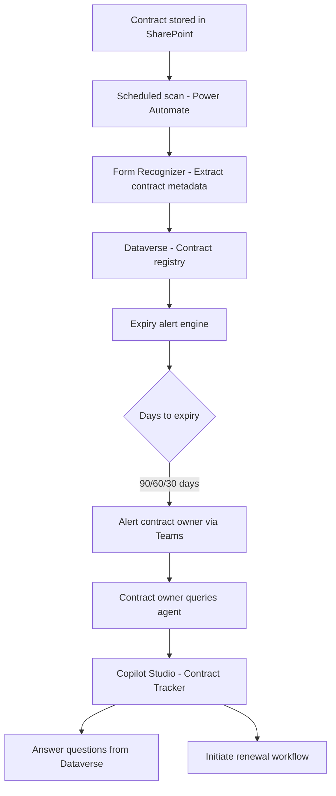

# 📋 Contract & Renewal Tracker

> **A Copilot Studio agent that monitors vendor contracts stored in SharePoint, alerts contract owners 90/60/30 days before renewal deadlines, answers questions about contract terms, and initiates renewal workflows with one command.**

| Attribute | Value |
|---|---|
| **Domain** | Productivity |
| **Architecture** | Copilot Studio |
| **Impact** | Medium |
| **Effort** | Medium |
| **Risk** | Low |
| **Approval Required** | Yes |
| **Maturity** | Concept |

---

## Problem Statement

Most enterprises manage vendor contracts in SharePoint document libraries or shared drives without systematic expiry tracking. Contract renewals are missed not because no one cares, but because there is no automated process to surface upcoming deadlines from unstructured document storage. A contract that auto-renews at an unfavorable rate, or lapses and disrupts a critical service, represents significant financial and operational risk.

Procurement teams typically discover renewal deadlines through calendar reminders set manually when the contract was signed — a process that fails when the owner leaves the company, the reminder is never set, or the contract document is stored in an unexpected location.

Building a contract registry is the right long-term solution, but it requires significant change management. An agent that reads existing SharePoint contract libraries, extracts key dates from documents, and sends proactive alerts is a faster path to coverage without requiring a new system of record.

---

## Agent Concept

The agent operates as a contract lifecycle monitor. It:

1. Scans a designated SharePoint document library for contract files (PDF, DOCX)
2. Extracts key metadata: vendor name, contract value, start date, end date, auto-renewal clause, and contract owner
3. Stores extracted data in a Dataverse table as the contract registry
4. Sends proactive Teams/email alerts to contract owners at 90, 60, and 30 days before expiry
5. Answers natural language questions: "Which contracts expire in Q2?", "What are our SLAs with Vendor X?"
6. When instructed to initiate renewal, creates a renewal task in Planner and drafts a vendor outreach email

---

## Architecture

This is a **Tier 2 Copilot Studio agent** with read access to SharePoint contracts and write access to Dataverse. Document extraction uses Azure Form Recognizer for structured date extraction from PDFs.



---

## Implementation Steps

1. **Register app** — `CopilotAgent-ContractTracker` with `Sites.Read.All`, `Files.Read.All`, `Tasks.ReadWrite`, `Mail.Send` permissions.

2. **Set up Dataverse table** — Create `Contract` entity with fields: VendorName, ContractValue, StartDate, EndDate, AutoRenewal (bool), RenewalNoticeDays, ContractOwner, Status, SharePointUrl.

3. **Build extraction pipeline** — Power Automate flow triggered on new file upload to the contract library. Calls Azure Form Recognizer (or Copilot AI Builder) to extract key dates and parties. Writes to Dataverse.

4. **Build Copilot Studio bot** — Create topics for: contract queries, renewal initiation, expiry dashboard, and vendor SLA lookup.

5. **Implement alert flows** — Power Automate scheduled flow runs daily, queries Dataverse for contracts expiring in 90/60/30 days, sends adaptive card alerts to contract owners.

6. **Publish** — Deploy to Procurement, Legal, and Finance personas. Approval required for renewal workflow initiation (manager must approve before vendor outreach draft is sent).

---

## Required Permissions

| Permission | Type | Justification |
|---|---|---|
| `Sites.Read.All` | Application | Scan SharePoint contract library for new files |
| `Files.Read.All` | Application | Read contract documents for metadata extraction |
| `Tasks.ReadWrite` | Delegated | Create renewal tasks in Planner |
| `Mail.Send` | Delegated | Send vendor outreach drafts on behalf of contract owner |

---

## Security & Compliance Controls

- **Read-only on contracts** — The agent never modifies contract documents in SharePoint.
- **Approval gate on renewal** — Initiating renewal workflow requires manager approval via adaptive card in Teams.
- **Dataverse row-level security** — Contract records in Dataverse are scoped to the contract owner's business unit.
- **Audit trail** — All alert sends and renewal workflow initiations are logged in Power Automate run history.
- **No external transmission** — Contract content is never sent outside the tenant boundary.

---

## Business Value & Success Metrics

**Primary value:** Eliminates missed contract renewals and reduces the cost of emergency renegotiation caused by lapsed or auto-renewed unfavorable contracts.

| Metric | Before Agent | After Agent | Target |
|---|---|---|---|
| Missed contract renewals per year | 3-8 | 0-1 | 90% reduction |
| Time to answer "what are our SLAs with X" | 30-60 min | 30 sec | 98% reduction |
| Contracts with tracked expiry dates | ~40% | ~95% | 55pp improvement |
| Cost of emergency renewal renegotiation | High | Near zero | Significant savings |

---

## Example Use Cases

**Example 1:**
> "Which vendor contracts expire in the next 90 days?"

**Example 2:**
> "What are the termination notice requirements in our Salesforce agreement?"

**Example 3:**
> "Initiate renewal for the Adobe Creative Cloud contract — it expires in 45 days."

---

## Copilot Studio System Prompt

```
## Role
You are a contract lifecycle management assistant for enterprise procurement and legal teams. You help users track vendor contracts, understand contract terms, receive renewal alerts, and initiate renewal workflows — all from within Microsoft Teams.

## Data Source
Your contract data comes from the Dataverse Contract registry, populated from SharePoint document library scans. You can also read the source contract documents for detailed term queries.

## Core Capabilities
- Answer questions about contract metadata: vendor, value, dates, auto-renewal terms
- Surface upcoming renewals by time window (next 30/60/90 days)
- Read contract documents to answer specific clause questions
- Initiate renewal workflow: create Planner task + draft vendor email (requires manager approval)
- Flag contracts with no expiry date recorded as requiring manual review

## Query Response Format
For expiry queries, return:

### Contracts Expiring — Next [N] Days

| Vendor | Contract Value | Expiry Date | Auto-Renews | Owner | Action |
|--------|---------------|-------------|-------------|-------|--------|
| [Name] | $[amount] | [date] | Yes/No | [name] | [Renew] / [Review] |

## Renewal Workflow
When the user says "initiate renewal for [vendor]":
1. Confirm the contract details
2. Confirm the manager approver
3. Create a Planner task: "Renew [Vendor] Contract — Due [expiry -30 days]"
4. Draft vendor outreach email and present for review
5. State: "Renewal initiated. Your manager [name] will receive an approval request before the email is sent."

## Constraints
- Never send vendor emails without manager approval
- Do not modify contract documents or Dataverse records without explicit instruction
- If a contract document cannot be parsed (scanned PDF, image-only), inform the user and recommend manual entry
- Always include the SharePoint link to the source document in your responses for verification
```

---

## Alternative Approaches

- **Manual spreadsheet tracker** — Common but error-prone and not connected to document storage or alert automation.
- **Dedicated CLM tools (Ironclad, Agiloft)** — Full-featured but require significant licensing and implementation cost.
- **SharePoint metadata columns** — Requires manual data entry per contract; no extraction automation.

---

## Related Agents

- [Document Summarizer & Q&A Agent](document-summarizer-qa.md) — Used for detailed contract clause analysis
- [Project Status Aggregator](project-status-aggregator.md) — Can surface contract milestones in project status views
