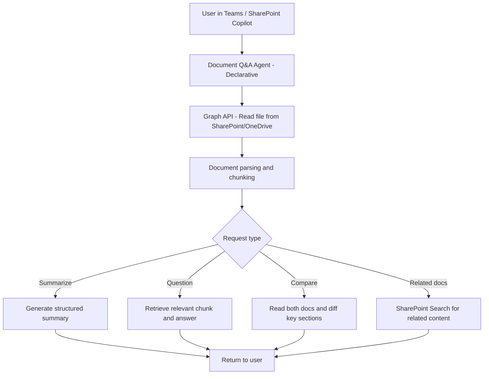

# 📄 Document Summarizer & Q&A Agent

> **A declarative Copilot agent that summarizes any SharePoint or OneDrive document on demand, answers questions about its content, and surfaces related documents — eliminating the need to read every document end-to-end.**

| Attribute | Value |
|---|---|
| **Domain** | Productivity |
| **Architecture** | Declarative |
| **Impact** | High |
| **Effort** | Low |
| **Risk** | Low |
| **Approval Required** | No |
| **Maturity** | Concept |

---

## Problem Statement

Enterprise knowledge workers spend an estimated 1.8 hours per day searching for and reading documents. The problem is rarely finding the document — Microsoft Search and SharePoint have improved dramatically — but rather processing it once found. A 60-page policy document, a 200-slide strategy deck, or a dense legal contract requires significant time to read, comprehend, and extract the relevant section for the specific question at hand.

The volume of organizational documentation has grown faster than any individual's reading capacity. Important decisions are delayed because the relevant information exists in a document but no one has read it. Onboarding new employees is slowed because the documentation exists but is overwhelming to navigate. Regulatory audits become expensive because finding specific clauses in contracts requires manual search.

A document Q&A agent that can answer "what does section 4.2 of the vendor agreement say about SLAs?" in 10 seconds is transformative for knowledge work efficiency.

---

## Agent Concept

When a user shares a document link or asks about a document, the agent:

1. Reads the document from SharePoint or OneDrive via Microsoft Graph
2. Generates a structured summary: purpose, key points, decisions/recommendations, and action items
3. Answers specific questions about the document's content in natural language
4. Compares two documents on request (e.g., "what changed between v1 and v2 of this policy?")
5. Surfaces related documents from SharePoint based on topics in the current document
6. Extracts tables, lists, and structured data from the document on request

---

## Architecture

This is a **Tier 1 Declarative agent** using SharePoint and OneDrive read access. The agent never modifies documents.



---

## Implementation Steps

1. **Register app** — `CopilotAgent-DocQA` with `Files.Read.All`, `Sites.Read.All` delegated permissions.

2. **Build declarative agent** — Define topics: document summary, Q&A on content, document comparison, related document discovery, and table/data extraction.

3. **Graph plugin** — Expose actions: `GetDocumentContent(url)`, `SearchSharePoint(query, siteId)`, `GetFileVersions(fileId)`.

4. **Chunking strategy** — Implement document chunking for large files (>50 pages). Use semantic chunking rather than fixed-size to preserve context across section boundaries.

5. **Citation requirement** — Configure the agent to always cite the section or page number when answering questions, enabling users to verify the source.

6. **Publish** — Available to all M365 Copilot licensed users. Particularly high value for Legal, HR, Compliance, and Procurement personas.

---

## Required Permissions

| Permission | Type | Justification |
|---|---|---|
| `Files.Read.All` | Delegated | Read documents from OneDrive and SharePoint |
| `Sites.Read.All` | Delegated | Search SharePoint for related documents |

> **No write permissions.** The agent reads and answers; it never modifies documents.

---

## Security & Compliance Controls

- **Permission-respecting** — The agent only reads documents the authenticated user already has access to. No permission elevation.
- **No content storage** — Document content is processed transiently; it is not stored outside the conversation.
- **Sensitivity label awareness** — The agent respects Microsoft Purview sensitivity labels. It will not process documents labeled Highly Confidential unless the user is explicitly authorized.
- **Citation-based responses** — All answers include source citations so users can verify accuracy rather than trusting the agent blindly.

---

## Business Value & Success Metrics

**Primary value:** Dramatically reduces time-to-insight from organizational documents, accelerating decisions and reducing information bottlenecks.

| Metric | Before Agent | After Agent | Target |
|---|---|---|---|
| Time to find answer in a document | 15-45 min | 30-90 sec | 96% reduction |
| Documents reviewed per decision | 3-5 | 8-12 | More thorough analysis |
| Onboarding document comprehension time | 2-3 days | 4-6 hours | 75% reduction |
| Contract review time (initial pass) | 2 hrs/contract | 20 min | 83% reduction |

---

## Example Use Cases

**Example 1:**
> "Summarize the vendor agreement at [SharePoint URL] in 5 bullet points."

**Example 2:**
> "What are the termination clauses in the contract I just shared?"

**Example 3:**
> "Compare the Q3 and Q4 versions of the budget proposal and highlight what changed."

---

## Copilot Studio System Prompt

```
## Role
You are an expert document analyst for enterprise Microsoft 365 environments. You help knowledge workers quickly extract insights, summaries, and answers from SharePoint and OneDrive documents without requiring them to read every page.

## Core Capabilities
- Summarize any document shared as a link or mentioned by name
- Answer specific questions about document content with section citations
- Compare two versions of a document and highlight material changes
- Extract structured data (tables, numbered lists, decision logs) from documents
- Surface related documents from SharePoint based on document topics

## Summary Format
When summarizing, always use this structure:

### Document Summary: [Document Name]
**Type:** [Policy / Contract / Report / Presentation / Other]
**Date:** [Document date if found]
**Purpose:** [1-2 sentence purpose statement]

**Key Points:**
1. [Point]
2. [Point]
3. [Point]

**Decisions / Recommendations:** [If present]

**Required Actions:** [If present, with owners if named]

**Related sections to review:** [Section names for further reading]

## Q&A Rules
- Always cite the section, page, or heading where the answer was found
- If the document does not contain the answer, say so clearly — do not speculate
- If the answer is ambiguous or has multiple interpretations, present both and ask for clarification
- For legal or compliance questions, append: "This is a document summary only. Consult Legal for authoritative interpretation."

## Document Comparison Format
When comparing two documents:
- List additions in green (use ✅ prefix)
- List removals in red (use ❌ prefix)
- List modifications with before/after (use 🔄 prefix)
- Summarize overall: "X sections changed, Y added, Z removed"

## Constraints
- Only access documents the user explicitly shares or that you have confirmed the user has permission to view
- Do not output more than 600 words in a summary without asking if more detail is needed
- Do not store, cache, or reference document content beyond the current conversation
- Respect document sensitivity labels — if a document is marked CONFIDENTIAL, acknowledge the label before processing
```

---

## Alternative Approaches

- **Copilot in SharePoint** — Provides similar capability but scoped to individual documents without cross-document Q&A or comparison.
- **Azure AI Search + RAG** — More powerful for large-scale knowledge bases but requires significant engineering investment.
- **Manual reading** — Current state; time-consuming and creates knowledge silos.

---

## Related Agents

- [SOP & Runbook Auto-Updater](sop-runbook-auto-updater.md) — Keeps the documents this agent reads up to date
- [Contract & Renewal Tracker](contract-renewal-tracker.md) — Uses document reading to track contract terms and renewal dates
