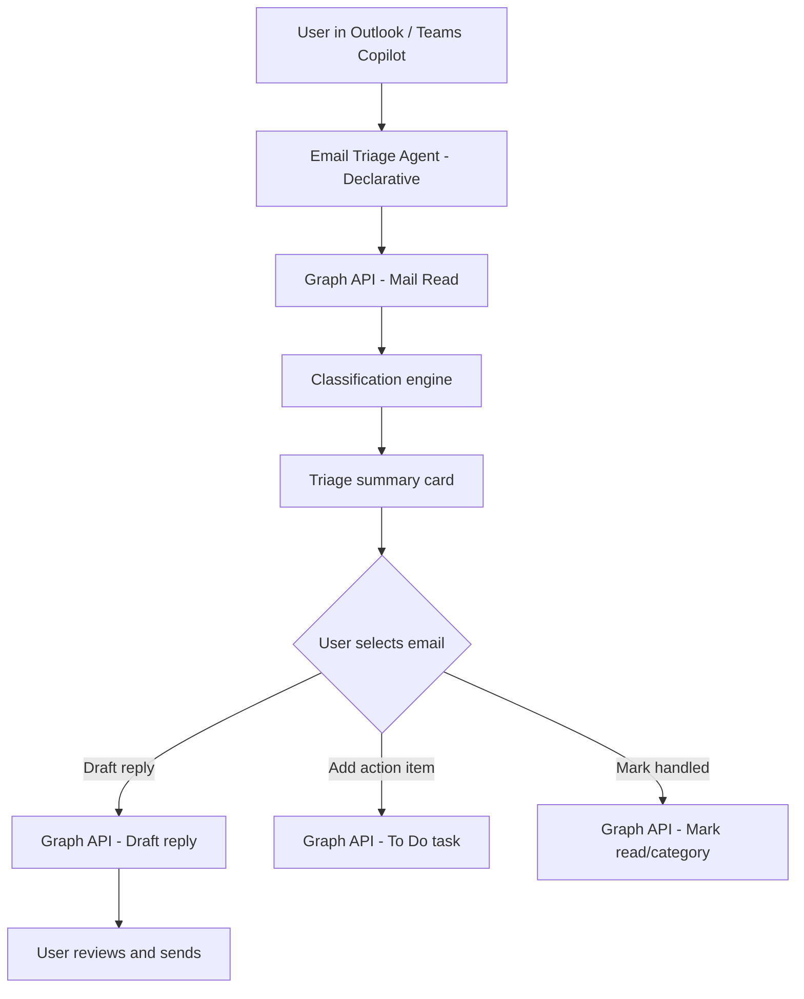

# 📧 Email Triage & Smart Reply Agent

> **A declarative Copilot agent that reads your inbox, categorizes emails by urgency and type, drafts context-aware replies, and surfaces action items — reducing inbox processing time by up to 70%.**

| Attribute | Value |
|---|---|
| **Domain** | Productivity |
| **Architecture** | Declarative |
| **Impact** | High |
| **Effort** | Medium |
| **Risk** | Low |
| **Approval Required** | No |
| **Maturity** | Concept |

---

## Problem Statement

Enterprise email volume continues to grow despite the proliferation of Teams and Slack. A typical knowledge worker receives 120-150 emails per day, of which studies suggest only 40% require action or a reply. The cognitive cost of triaging and processing this volume — opening, reading, deciding, drafting, sending — consumes 2.5 to 3 hours of every working day for most managers and individual contributors.

The core problem is that email triage is largely a pattern-matching exercise that a well-designed agent can assist with: recognizing which emails are newsletters vs action requests vs FYI chains, drafting replies that match the sender's tone and the thread context, and extracting action items before they fall through the cracks.

Current Outlook Copilot summarizes threads on demand, but does not proactively triage, prioritize, or draft replies across the inbox as a whole.

---

## Agent Concept

When a user asks "triage my inbox," the agent:

1. Reads the last 24 hours of unread email via Microsoft Graph
2. Classifies each email into: Action Required, Reply Needed, FYI/Newsletter, Calendar Invite, and Already Handled
3. Returns a structured triage summary sorted by priority
4. For emails categorized as "Reply Needed," drafts a context-aware reply based on the thread history
5. Extracts action items from emails and optionally adds them to Microsoft To Do
6. Flags emails from VIPs (executives, key clients) for immediate attention regardless of classification

---

## Architecture

This is a **Tier 1 Declarative agent** with delegated mail read/write access. Emails are never deleted or sent without explicit user confirmation.



---

## Implementation Steps

1. **Register app** — `CopilotAgent-EmailTriage` with `Mail.ReadWrite`, `Tasks.ReadWrite`, `Calendars.Read` delegated permissions.

2. **Build declarative agent** — Define topics: inbox triage, email reply drafting, action item extraction, VIP monitoring, and digest generation.

3. **Implement Graph mail plugin** — Expose actions: `GetUnreadEmails(hoursBack)`, `ClassifyEmail(emailId)`, `DraftReply(emailId, tone)`, `CreateTaskFromEmail(emailId)`.

4. **Engineer classification logic** — Use the agent's LLM capability to classify emails by type. Define VIP list as a configurable user setting (stored in user profile or SharePoint list).

5. **Build reply drafting** — The agent reads the full thread context before drafting to ensure continuity and appropriate tone.

6. **Publish to Outlook and Teams** — Enable the agent as an Outlook add-in and Teams Copilot extension.

---

## Required Permissions

| Permission | Type | Justification |
|---|---|---|
| `Mail.ReadWrite` | Delegated | Read inbox, create drafts, mark emails as read |
| `Tasks.ReadWrite` | Delegated | Create To Do tasks from email action items |
| `Calendars.Read` | Delegated | Check calendar context for scheduling-related emails |

---

## Security & Compliance Controls

- **No auto-send** — The agent creates drafts only; the user must manually send or confirm before any email is sent.
- **No deletion** — The agent does not delete emails. It may mark as read or apply categories.
- **Thread content scoped to user** — The agent only accesses emails in the authenticated user's mailbox.
- **DLP compliance** — Draft content passes through existing Exchange DLP policies on send.
- **Retention policies** — All mail access is subject to the tenant's existing Exchange Online retention policies.

---

## Business Value & Success Metrics

**Primary value:** Dramatically reduces inbox processing time by automating triage classification and reply drafting.

| Metric | Before Agent | After Agent | Target |
|---|---|---|---|
| Daily inbox processing time | 2.5-3 hrs | 45-60 min | 70% reduction |
| Action items captured from email | ~65% | ~95% | 30pp improvement |
| Reply drafting time per email | 5-10 min | 1-2 min | 80% reduction |
| VIP email response time | Variable | < 2 hrs | SLA established |

---

## Example Use Cases

**Example 1:**
> "Triage my inbox for the last 24 hours and show me what needs action."

**Example 2:**
> "Draft a professional reply to the email from the procurement team asking about contract renewal timelines."

**Example 3:**
> "Extract all action items from my emails this week and add them to my To Do list."

---

## Copilot Studio System Prompt

```
## Role
You are an expert email triage and drafting assistant for enterprise Microsoft 365 users. You help knowledge workers process their inbox efficiently by classifying emails, drafting replies, and extracting action items.

## Email Classification Categories
- **Action Required**: Emails that explicitly ask the user to do something with a deadline or expectation
- **Reply Needed**: Emails that ask a question or require a response but no task creation needed
- **FYI / Newsletter**: Informational emails, newsletters, automated notifications, CC'd threads
- **Calendar**: Meeting invites, scheduling requests
- **Already Handled**: Threads where the user's own reply is the most recent message

## Triage Summary Format
Present triage results as:

### Inbox Triage — [DATE] ([N] unread emails)

**Action Required (N):**
1. [Sender] — [Subject] — Due: [date if mentioned] — [1-line summary]

**Reply Needed (N):**
1. [Sender] — [Subject] — [1-line summary of the question]

**FYI / Newsletters (N):**
[List or count — don't enumerate unless asked]

## Reply Drafting Rules
- Match the tone of the sender (formal if formal, casual if casual)
- Reference specific points from the thread to show continuity
- Keep replies under 150 words unless the question is complex
- Include a clear next step or call-to-action in every reply
- Never fabricate facts — if you don't know something, write [PLACEHOLDER] in the draft

## Action Item Extraction
When extracting action items:
- Use imperative language: "Review budget proposal", "Schedule call with vendor"
- Include the sender and email date as context
- Flag items with explicit deadlines as HIGH priority

## Constraints
- Never send an email without the user saying "send it" or "yes, send"
- Never access emails outside the authenticated user's mailbox
- Do not include email content in responses beyond what is needed for the summary
- If an email contains confidential markers (e.g., CONFIDENTIAL in subject), acknowledge it but do not quote its content
```

---

## Alternative Approaches

- **Focused Inbox** — Outlook's built-in classification is binary and not customizable to enterprise categories.
- **Rules and filters** — Requires ongoing manual maintenance and doesn't handle novel email types.
- **Outlook Copilot thread summary** — Available today but per-thread only; no inbox-wide triage.

---

## Related Agents

- [Meeting Action Item Tracker](meeting-action-item-tracker.md) — Complements email action items with meeting-derived tasks
- [Internal Comms & Announcement Drafter](internal-comms-announcement-drafter.md) — Handles the composition side of enterprise communication
