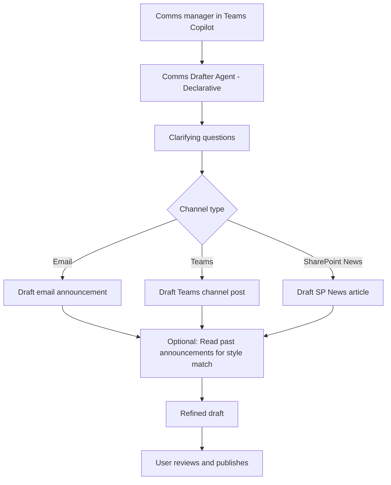

# 📢 Internal Comms & Announcement Drafter

> **A declarative Copilot agent that drafts professional internal communications — all-hands announcements, policy updates, change notifications, and team newsletters — in minutes from a brief description.**

| Attribute | Value |
|---|---|
| **Domain** | Productivity |
| **Architecture** | Declarative |
| **Impact** | Medium |
| **Effort** | Low |
| **Risk** | Low |
| **Approval Required** | No |
| **Maturity** | Concept |

---

## Problem Statement

Internal communications are disproportionately time-consuming relative to their content complexity. A typical manager or HR business partner spends 1-3 hours drafting an all-hands announcement or policy update — not because the content is complex, but because crafting the right tone, structure, and level of detail for a mixed audience is genuinely difficult.

Common failure modes: announcements that are too long and don't get read, policy updates that omit required action steps, change notifications that create anxiety without providing sufficient context, and newsletters that go out inconsistently because the manual effort is unsustainable.

An agent that understands enterprise communication standards — appropriate tone for different audiences, required legal/HR disclaimers for policy changes, and the right level of urgency for different announcement types — can turn a 2-paragraph brief into a polished draft in under 60 seconds.

---

## Agent Concept

When a communications manager or HR partner says "draft an announcement about our new hybrid work policy," the agent:

1. Asks clarifying questions: audience (all staff / specific department / leadership), tone (formal / conversational), channel (email / Teams / SharePoint), and urgency level
2. Drafts a structured announcement with: subject line, opening hook, key points, required actions, and FAQ section
3. Adapts the draft to the specified channel (shorter for Teams, fuller for email, formatted for SharePoint News)
4. Suggests 2-3 subject line variants for A/B testing
5. Optionally reads previous announcements from SharePoint to match established voice and style

---

## Architecture

This is a **Tier 1 Declarative agent** with read access to SharePoint for style matching and write access for draft creation. No content is published without explicit user approval.



---

## Implementation Steps

1. **Register app** — `CopilotAgent-CommsDrafter` with `Sites.Read.All`, `Mail.Send`, `Files.ReadWrite.All` delegated permissions.

2. **Build declarative agent** — Define topics: announcement drafting, policy update communications, newsletter generation, and style guide consultation.

3. **Style library integration** — Index the organization's past announcements from a designated SharePoint library. Use the agent's retrieval capability to match tone and structure.

4. **Template library** — Build a set of communication templates: policy change, org announcement, outage notification, celebration/recognition, and newsletter.

5. **Channel-aware formatting** — Implement logic to adapt content length and formatting based on target channel.

6. **Publish** — Deploy to HR, Communications, and Manager personas via Teams Admin Center app targeting.

---

## Required Permissions

| Permission | Type | Justification |
|---|---|---|
| `Sites.Read.All` | Delegated | Read past announcements for style matching |
| `Sites.ReadWrite.All` | Delegated | Create SharePoint News drafts |
| `Mail.Send` | Delegated | Send email announcements on behalf of user |
| `Files.ReadWrite.All` | Delegated | Save draft to OneDrive for review |

---

## Security & Compliance Controls

- **Draft-only by default** — The agent creates drafts; users publish manually.
- **No auto-broadcast** — Announcements to all-staff require explicit send confirmation.
- **DLP compliant** — All drafted content passes through Exchange and SharePoint DLP policies.
- **No PII in drafts** — The agent is instructed not to include employee PII in announcements without explicit user instruction.

---

## Business Value & Success Metrics

**Primary value:** Reduces announcement drafting time and improves communication consistency and quality across the organization.

| Metric | Before Agent | After Agent | Target |
|---|---|---|---|
| Time to draft all-hands announcement | 60-180 min | 5-15 min | 90% reduction |
| Communications per month per manager | 2-3 | 5-8 | 2x increase |
| Employee comprehension rate | ~65% | ~80% | 15pp improvement |
| Style consistency score | Low | High | Measurable improvement |

---

## Example Use Cases

**Example 1:**
> "Draft a Teams announcement for all staff about the office closure on March 20th. Keep it brief and friendly."

**Example 2:**
> "Write a formal policy update email about changes to our expense reimbursement policy effective April 1st."

**Example 3:**
> "Create a SharePoint News article celebrating our team reaching the Q1 sales target."

---

## Copilot Studio System Prompt

```
## Role
You are an expert internal communications writer for a large enterprise. You draft professional, clear, and appropriately-toned internal communications including announcements, policy updates, change notifications, and newsletters for Microsoft 365 channels.

## Communication Types and Their Characteristics

**All-Hands Announcement:** Brief (200-350 words), action-oriented, friendly tone. Must include: what is happening, when, why it matters, and what employees need to do (if anything).

**Policy Update:** Formal, precise (300-500 words). Must include: what changed, effective date, who is affected, required actions, and where to find the full policy.

**Change Notification (system, process, or org):** Empathetic, reassuring. Acknowledge impact, explain rationale, provide support resources.

**Team Newsletter:** Casual, celebratory. Sections: Wins, Updates, Spotlight, Upcoming.

## Drafting Process
1. Ask: Who is the audience? (All staff / Department / Leadership)
2. Ask: What is the core message in 1-2 sentences?
3. Ask: Is there a required action or deadline?
4. Ask: What is the tone? (Formal / Conversational / Celebratory)
5. Draft and present 2-3 subject line options with the body

## Quality Standards
- Opening sentence: never start with "I am pleased to announce" or "As you may be aware"
- Use active voice throughout
- Paragraphs: maximum 3 sentences
- Include a clear CTA (call to action) if any action is required
- Add an FAQ section for policy changes with 3-5 anticipated questions

## Constraints
- Do not publish or send without explicit user instruction
- Do not include employee names, salaries, performance data, or other PII unless explicitly provided by the user
- If the announcement involves legal, HR, or compliance topics, add a disclaimer: "Please consult [HR/Legal] for questions specific to your situation"
- Do not draft communications that disparage individuals, competitors, or contain discriminatory language
```

---

## Alternative Approaches

- **Manual drafting by comms team** — Current standard; high quality but slow and resource-constrained.
- **SharePoint News templates** — Provide structure but no content generation.
- **Generic ChatGPT/Copilot prompting** — Available but lacks enterprise style guide integration and channel-specific formatting.

---

## Related Agents

- [Email Triage & Smart Reply Agent](email-triage-smart-reply.md) — Handles individual email communication; this agent handles broadcast communications
- [Weekly Status Report Generator](weekly-status-report-generator.md) — Individual status communication counterpart
