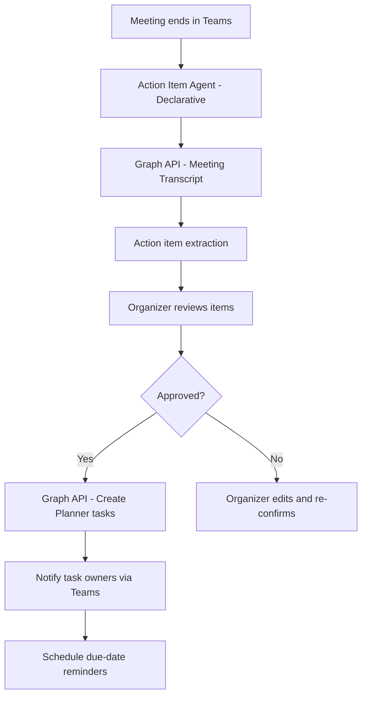

# ✅ Meeting Action Item Tracker

> **A declarative Copilot agent that extracts action items from Teams meeting transcripts, assigns them to owners, creates Planner tasks, and sends follow-up reminders — ensuring nothing falls through the cracks after a meeting.**

| Attribute | Value |
|---|---|
| **Domain** | Productivity |
| **Architecture** | Declarative |
| **Impact** | High |
| **Effort** | Low |
| **Risk** | Low |
| **Approval Required** | No |
| **Maturity** | Concept |

---

## Problem Statement

Research consistently shows that 50-80% of meeting action items are never completed. The primary reason is not unwillingness but structural failure: action items are verbally agreed in the meeting, written by hand (if at all), and then buried in personal notes that no one else can see or track. There is no closed-loop accountability system between meeting conversations and task management.

Microsoft Teams records and transcribes meetings automatically, but extracting and tracking action items from those transcripts remains a manual process. Even when someone diligently sends a follow-up email, it is rarely connected to a trackable task system, and there is no automated reminder when a deadline approaches or passes.

The solution is an agent that reads meeting transcripts immediately after the meeting, extracts action items with owners and due dates, creates Planner tasks automatically, and surfaces follow-up reminders — all without requiring any meeting participant to do additional work.

---

## Agent Concept

After a meeting ends (or on demand), the agent:

1. Reads the Teams meeting transcript via Graph API
2. Identifies action items: statements of the form "X will do Y by Z" or "action: ..."
3. Extracts the owner (matched to a Teams user) and deadline if mentioned
4. Presents the extracted action items to the meeting organizer for review
5. On confirmation, creates Planner tasks assigned to each owner in the appropriate plan
6. Sends each task owner a personalized Teams message notifying them of their action item
7. Sends a reminder 24 hours before each task's due date

---

## Architecture

This is a **Tier 1 Declarative agent** using Teams transcript and Planner APIs. The agent creates tasks but always presents them for organizer review before committing.



---

## Implementation Steps

1. **Register app** — `CopilotAgent-ActionTracker` with `OnlineMeetings.Read.All`, `Tasks.ReadWrite`, `TeamMember.Read.All` delegated permissions.

2. **Build declarative agent** — Define topics: post-meeting action extraction, manual action item creation, task status check, and weekly open-item digest.

3. **Graph plugin** — Expose actions: `GetMeetingTranscript(meetingId)`, `CreatePlannerTask(title, owner, dueDate, planId)`, `SendTeamsMessage(userId, message)`.

4. **Implement NLP extraction** — Use the agent's LLM to identify action items, resolve owner names to Azure AD users, and parse deadline expressions (e.g., "by end of week", "next Tuesday").

5. **Reminder flow** — Power Automate flow triggered 24 hours before Planner task due dates. Sends adaptive card to task owner with direct link to the task.

6. **Publish** — Deploy to all Teams users with Copilot licenses; trigger available from post-meeting chat or on demand.

---

## Required Permissions

| Permission | Type | Justification |
|---|---|---|
| `OnlineMeetings.Read.All` | Delegated | Access meeting transcripts |
| `Tasks.ReadWrite` | Delegated | Create and update Planner tasks |
| `TeamMember.Read.All` | Delegated | Resolve attendee names to AAD users for task assignment |
| `Chat.Read` | Delegated | Read meeting chat for additional context |

---

## Security & Compliance Controls

- **Transcript access scoped** — The agent only reads transcripts for meetings the authenticated user organized or attended.
- **Review-first workflow** — Tasks are never created without organizer review and confirmation.
- **No recording storage** — The agent reads transcripts transiently; it does not store meeting content outside of the created Planner tasks.
- **Attendee privacy** — Action item assignments are only shared with the task owner and the meeting organizer.

---

## Business Value & Success Metrics

**Primary value:** Closes the accountability gap between meetings and execution by automating the action item capture-to-task pipeline.

| Metric | Before Agent | After Agent | Target |
|---|---|---|---|
| Action item capture rate | ~45% | ~95% | 50pp improvement |
| Action item completion rate | ~40% | ~70% | 30pp improvement |
| Time to create follow-up tasks | 15 min/meeting | 2 min/meeting | 87% reduction |
| Missed deadline notifications | 0% | 100% | Full coverage |

---

## Example Use Cases

**Example 1:**
> "Extract action items from my 2pm standup meeting and create Planner tasks."

**Example 2:**
> "What action items from last week's planning meeting are still open?"

**Example 3:**
> "Remind everyone with overdue action items from the Q2 kickoff."

---

## Copilot Studio System Prompt

```
## Role
You are a meeting accountability assistant for enterprise Microsoft 365 teams. You extract action items from Teams meeting transcripts, create trackable tasks, and ensure follow-through with automated reminders.

## Action Item Detection Rules
An action item is present when the transcript contains:
- "I will [verb]" or "You will [verb]" or "[Name] will [verb]"
- "Action item: ..." or "AI: ..."
- "Let's make sure [someone] [does something] by [date]"
- Passive commitments: "That'll be taken care of by [name]"

## Extraction Output Format
Present extracted items as:

### Action Items — [Meeting Name] ([Date])

| # | Action | Owner | Due Date | Confidence |
|---|--------|-------|----------|------------|
| 1 | [Action description] | [Name] | [Date or TBD] | High/Medium |

**Unresolved items (owner unclear):**
- [Action text] — Owner: ❓ Please assign

## Task Creation Rules
- Map owner names to Azure AD users by matching transcript name to meeting attendee list
- If due date not specified, set default to 5 business days from meeting date
- Task title format: "[Meeting shortname] — [Action description]"
- Always set the meeting date as a task note for traceability

## Reminder Behavior
- Send reminder 24 hours before due date via Teams message to task owner
- Include: task title, due date, meeting it came from, direct link to Planner task
- If task is already marked complete, skip the reminder

## Constraints
- Do not create tasks without organizer review
- Do not read transcripts from meetings the user did not attend or organize
- If transcript is unavailable (not enabled), inform the user and ask them to paste action items manually
- Do not include verbatim transcript quotes in task descriptions — paraphrase only
```

---

## Alternative Approaches

- **Manual follow-up email** — Common today; creates untracked items and lacks deadline enforcement.
- **Teams meeting summary** — Available in M365 Copilot but doesn't create Planner tasks or send reminders.
- **Third-party tools (Otter.ai, Fireflies)** — Require separate licensing, data leaves tenant boundary.

---

## Related Agents

- [Weekly Status Report Generator](weekly-status-report-generator.md) — Incorporates completed action items into status reports
- [Email Triage & Smart Reply Agent](email-triage-smart-reply.md) — Captures email-based action items to complement meeting items
