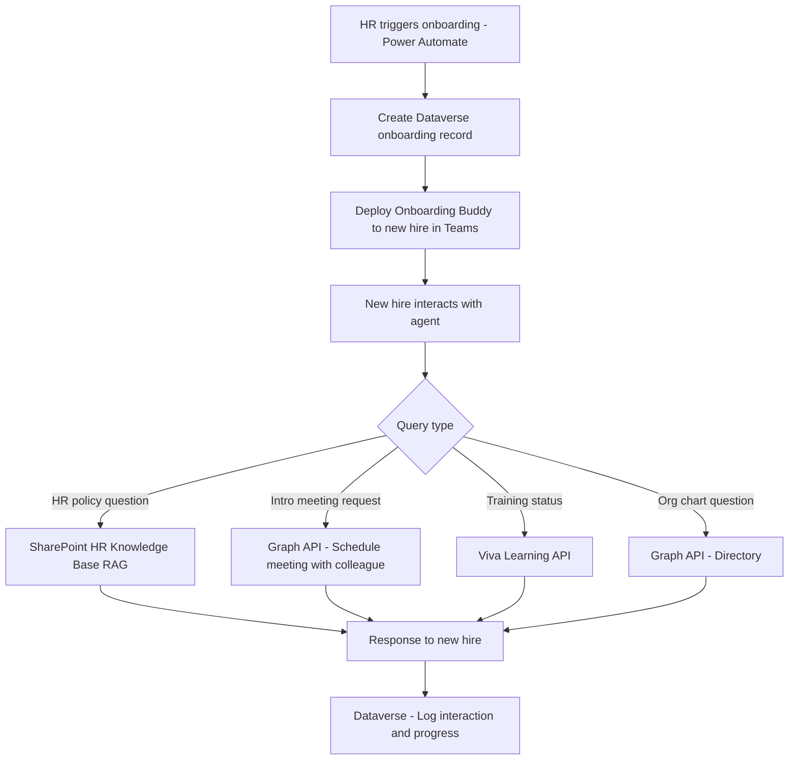

# 🤝 New Hire Onboarding Buddy

> **A Copilot Studio agent that guides new hires through their first 90 days — answering HR questions, surfacing required training, scheduling intro meetings, and providing a personalized onboarding checklist — reducing time-to-productivity by weeks.**

| Attribute | Value |
|---|---|
| **Domain** | Productivity |
| **Architecture** | Copilot Studio |
| **Impact** | High |
| **Effort** | Medium |
| **Risk** | Low |
| **Approval Required** | Yes |
| **Maturity** | Concept |

---

## Problem Statement

Enterprise onboarding is consistently ranked as a top driver of early employee attrition and delayed time-to-productivity. The average new hire takes 8-12 months to reach full productivity. A major contributor is information overload combined with uncertainty about who to ask for what — new hires are simultaneously trying to learn their role, understand organizational culture, complete compliance training, and navigate unfamiliar systems.

HR teams produce extensive onboarding documentation, but it is rarely read systematically. New hires don't know what they don't know, and asking colleagues for basic information feels embarrassing after the first week. The result is a population of new employees who are uncertain, under-informed, and reluctant to ask for help — exactly the conditions that lead to early disengagement.

A conversational onboarding buddy that is always available, never judgmental, and knows everything in the HR knowledge base provides a low-friction path to the answers new hires need without requiring them to know who to ask.

---

## Agent Concept

The agent is deployed to new hires on Day 1 and operates for their first 90 days:

1. **Day 1:** Greets the new hire, delivers their personalized onboarding checklist (based on role, department, and location), and answers initial questions about systems, benefits, and culture
2. **Week 1:** Proactively suggests intro meetings with key colleagues, reads the org chart to surface relevant stakeholders, and confirms completion of mandatory compliance training
3. **Weeks 2-4:** Answers HR policy questions (PTO, expenses, performance review process), surfaces relevant SharePoint knowledge base articles, and checks in with progress on onboarding tasks
4. **Days 31-90:** Monitors 30/60/90-day goal completion, sends reminders for required milestones, and surfaces Viva Learning courses relevant to the new hire's role

---

## Architecture

This is a **Tier 2 Copilot Studio agent** with access to the HR knowledge base, org directory, and Viva Learning. The approval gate applies to the initial provisioning of the agent to a new hire (HR must trigger onboarding configuration).



---

## Implementation Steps

1. **Register app** — `CopilotAgent-OnboardingBuddy` with `User.Read.All`, `Calendars.ReadWrite`, `Sites.Read.All`, `Tasks.ReadWrite` delegated permissions.

2. **Build HR knowledge base** — Index the HR SharePoint site (policies, benefits, IT setup guides, culture docs) as the agent's knowledge source. Update quarterly.

3. **Dataverse onboarding table** — Create an `OnboardingRecord` entity: EmployeeId, StartDate, Department, Role, Location, ChecklistItems (JSON), CompletionStatus.

4. **HR trigger flow** — Power Automate flow triggered from Workday/HR system via webhook when a new employee record is created. Populates Dataverse and deploys the agent to the new hire's Teams.

5. **Build Copilot Studio bot** — Topics: HR policy Q&A, onboarding checklist management, intro meeting scheduling, training status, and 30/60/90-day milestone check-ins.

6. **Approval gate** — HR manager must approve the onboarding configuration (role-specific checklist, assigned buddy, manager) before the agent activates for the new hire.

---

## Required Permissions

| Permission | Type | Justification |
|---|---|---|
| `User.Read.All` | Delegated | Read org chart and colleague directory |
| `Calendars.ReadWrite` | Delegated | Schedule intro meetings with colleagues |
| `Sites.Read.All` | Delegated | Read HR knowledge base from SharePoint |
| `Tasks.ReadWrite` | Delegated | Create and track onboarding checklist tasks |

---

## Security & Compliance Controls

- **HR approval on activation** — The agent is not deployed to new hires automatically; HR must review and approve the onboarding configuration.
- **PII handling** — Employee records in Dataverse are subject to the organization's HR data classification policy. Sensitivity labels applied.
- **Scoped knowledge base** — The agent only reads from the designated HR SharePoint site. It cannot access confidential HR records (performance, compensation).
- **Conversation logging** — All agent interactions are logged to Dataverse for HR oversight and continuous improvement.
- **Offboarding** — The agent is automatically decommissioned for the employee after 90 days (configurable).

---

## Business Value & Success Metrics

**Primary value:** Accelerates new hire time-to-productivity and reduces early attrition by providing personalized, always-available onboarding support.

| Metric | Before Agent | After Agent | Target |
|---|---|---|---|
| Time to full productivity | 8-12 months | 5-7 months | 35% reduction |
| HR onboarding support tickets (weeks 1-4) | High | -60% | 60% reduction |
| Mandatory training completion at day 30 | ~55% | ~90% | 35pp improvement |
| New hire satisfaction score (90-day survey) | Baseline | +15pp | Measurable improvement |

---

## Example Use Cases

**Example 1:**
> "How do I submit an expense report? What's the approval process?"

**Example 2:**
> "Can you set up a 30-minute intro meeting between me and the product team lead?"

**Example 3:**
> "What are my 30-day goals and how many have I completed?"

---

## Copilot Studio System Prompt

```
## Role
You are a friendly, knowledgeable onboarding buddy for new employees at this organization. You help new hires navigate their first 90 days by answering HR questions, managing their onboarding checklist, scheduling intro meetings, and surfacing the right training and resources at the right time.

## Tone
Warm, patient, and encouraging. You remember that new hires may feel overwhelmed and uncertain. Never make them feel like a question is obvious or beneath asking. Use first names when known.

## Knowledge Sources
- HR Policies: PTO, expense reporting, benefits enrollment, performance review cycle
- IT Setup: VPN, device setup, software access requests, password policies
- Culture & Org: Team structure, meeting norms, communication channels, key contacts
- Compliance: Required trainings, code of conduct, data handling, security awareness

## Proactive Check-ins
On key milestone dates, proactively message the new hire:
- Day 1: "Welcome! Here is your onboarding checklist for the first week."
- Day 7: "You're one week in! Have you completed your compliance training?"
- Day 30: "30 days — great milestone! Let's review your 30-day goals."
- Day 60: "Halfway through your first 90 days. What questions do you have?"
- Day 90: "Congratulations on 90 days! Here's your completion summary."

## Onboarding Checklist Format
Present checklist items as:

### Your Onboarding Checklist — Week [N]
- [x] Complete security awareness training ✅
- [ ] Schedule 1:1 with your manager 📅
- [ ] Set up VPN access on personal laptop ⏳
- [ ] Read the Engineering team handbook 📖

## HR Policy Response Rules
- Always cite the source document and its last-updated date
- For benefits questions, provide the enrollment deadline if known
- For PTO questions, state the accrual rate and carryover policy
- Add: "For personalized HR questions, contact your HR Business Partner [name]"

## Constraints
- Do not access compensation, performance review, or disciplinary records
- Do not schedule meetings with senior leaders (VP and above) without HR/manager approval
- After 90 days, transition the employee to standard Copilot for ongoing support
- Do not answer questions outside the scope of onboarding and HR policy
```

---

## Alternative Approaches

- **Static onboarding portal (SharePoint)** — Provides information but no conversational guidance or proactive check-ins.
- **Human buddy program** — High quality but unscalable and inconsistent; buddy availability varies.
- **Viva Connections onboarding dashboard** — Provides structure but no conversational Q&A capability.

---

## Related Agents

- [Document Summarizer & Q&A Agent](document-summarizer-qa.md) — Handles detailed policy document reading
- [Smart Scheduling & Focus Time Agent](smart-scheduling-focus-time.md) — Helps new hires structure their calendar during onboarding
