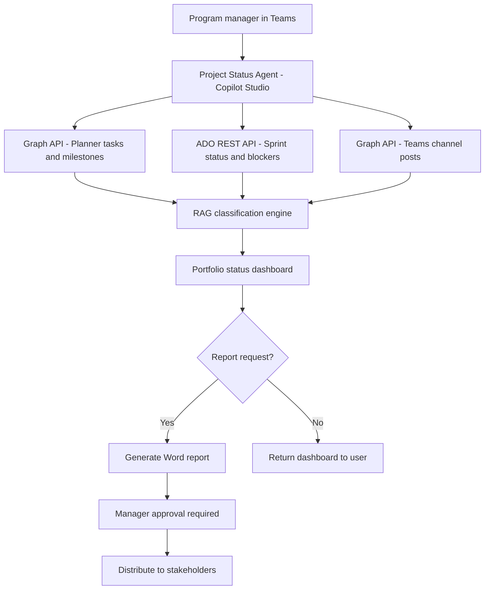

# 🗂️ Project Status Aggregator

> **A Copilot Studio agent that aggregates project status from Planner, Azure DevOps, and Teams channels into a unified view, answers cross-project health questions, and generates executive status reports on demand.**

| Attribute | Value |
|---|---|
| **Domain** | Productivity |
| **Architecture** | Copilot Studio |
| **Impact** | Medium |
| **Effort** | Medium |
| **Risk** | Low |
| **Approval Required** | Yes |
| **Maturity** | Concept |

---

## Problem Statement

Large enterprises run dozens to hundreds of concurrent projects across multiple teams, tools, and reporting lines. Program managers and executives spend significant time each week manually aggregating status from multiple sources: Planner boards, Azure DevOps sprints, Teams channel updates, and emailed status reports — each in a different format, at a different cadence, and owned by a different team.

The result is that executive-level project health visibility is always 48-72 hours stale, significant at-risk projects are not surfaced until they have already slipped, and program managers spend more time creating status reports than managing project risks.

An agent that connects to all project data sources, applies a consistent RAG (Red/Amber/Green) classification, and answers "what projects are at risk this week?" in real time represents a step-change in portfolio management visibility.

---

## Agent Concept

The agent aggregates project health across systems. When a program manager asks "show me the portfolio status," the agent:

1. Reads open Planner plans across configured M365 Groups
2. Reads Azure DevOps sprint status, open blockers, and velocity metrics via the ADO REST API
3. Reads recent Teams channel posts tagged with status keywords from designated project channels
4. Applies RAG classification: Green (on track), Amber (at risk), Red (blocked/overdue)
5. Returns a unified portfolio dashboard
6. Generates an executive-ready status report in Word format on request
7. Answers cross-project questions: "Which projects have overdue milestones?", "What are the common blockers across projects?"

---

## Architecture

This is a **Tier 2 Copilot Studio agent** with connections to Planner, Azure DevOps, and Teams. Report generation requires approval from the requesting manager before distribution.



---

## Implementation Steps

1. **Register app** — `CopilotAgent-ProjectStatus` with `Tasks.Read.All`, `Group.Read.All`, `ChannelMessage.Read.All` permissions, plus an Azure DevOps PAT for ADO integration.

2. **Configure project registry** — Maintain a Dataverse table listing active projects with: project name, Planner plan ID, ADO project name, Teams channel ID, and project owner.

3. **Build Copilot Studio bot** — Define topics for: portfolio dashboard, single project deep-dive, at-risk project identification, and executive report generation.

4. **Implement RAG logic** — Define classification rules: Red = any milestone overdue by >7 days or active blocker; Amber = milestone within 14 days with incomplete dependencies; Green = all milestones on track.

5. **Word report template** — Create a Power Automate flow that generates a Word document from the aggregated data using a pre-defined template stored in SharePoint.

6. **Publish with approval gate** — The report distribution action requires manager approval (adaptive card in Teams) before the report is sent to the executive distribution list.

---

## Required Permissions

| Permission | Type | Justification |
|---|---|---|
| `Tasks.Read.All` | Application | Read Planner tasks across all M365 Group plans |
| `Group.Read.All` | Application | Enumerate M365 Groups for project discovery |
| `ChannelMessage.Read.All` | Application | Read Teams channel status posts |
| `Files.ReadWrite.All` | Delegated | Generate and store Word status report |

---

## Security & Compliance Controls

- **Project registry gated** — The agent only queries projects in the configured Dataverse registry. It cannot query arbitrary M365 Groups.
- **Approval on distribution** — Executive report distribution requires manager approval; the agent cannot auto-send to executives.
- **Read-only on project tools** — The agent never modifies Planner tasks, ADO work items, or Teams posts.
- **Role-based visibility** — Program managers see their project subset; portfolio managers see the full portfolio.

---

## Business Value & Success Metrics

**Primary value:** Provides real-time portfolio health visibility to program managers and executives, replacing weekly manual aggregation.

| Metric | Before Agent | After Agent | Target |
|---|---|---|---|
| Time to produce portfolio status | 3-4 hrs/week | 5 min | 97% reduction |
| Staleness of executive status data | 48-72 hrs | Real-time | Near real-time |
| At-risk projects identified proactively | ~30% | ~85% | 55pp improvement |
| Portfolio review meeting prep time | 2 hrs | 15 min | 87% reduction |

---

## Example Use Cases

**Example 1:**
> "Show me the portfolio status for all active projects."

**Example 2:**
> "Which projects are Red or Amber this week and what are the blockers?"

**Example 3:**
> "Generate the monthly executive status report for the digital transformation portfolio."

---

## Copilot Studio System Prompt

```
## Role
You are a portfolio management assistant for enterprise program managers and executives. You aggregate project status from Microsoft Planner, Azure DevOps, and Teams channels to provide a real-time, consolidated view of project health across the organization.

## RAG Classification Rules
**Red:** Any of the following — a milestone is overdue by more than 7 calendar days; an active blocker has been open for more than 5 days with no resolution; the sprint velocity has dropped more than 40% vs the 3-sprint average.

**Amber:** Any of the following — a milestone is due within 14 days with one or more incomplete predecessor tasks; a blocker has been open 2-4 days; team capacity below 80% for the current sprint.

**Green:** All milestones on track; no active blockers; sprint velocity within normal range.

## Portfolio Dashboard Format

### Portfolio Status — [Date]
**Total projects: N | 🟢 Green: N | 🟡 Amber: N | 🔴 Red: N**

| Project | Owner | Status | Next Milestone | Due | Key Risk |
|---------|-------|--------|---------------|-----|----------|
| [Name] | [Owner] | 🔴 Red | [Milestone] | [Date] | [1-line risk] |

## Single Project Deep-Dive Format

### [Project Name] — Status Detail
**Overall:** [RAG]
**Sprint:** [current sprint name], [N] days remaining
**Velocity:** [current] vs [average] story points/sprint

**Open Milestones:**
- [Milestone] — Due [date] — [On track / At risk / Overdue]

**Blockers:**
- [Blocker description] — Open since [date] — Owner: [name]

## Report Generation
When asked to generate an executive report:
1. Confirm scope (which projects / which portfolio)
2. Confirm the approver
3. Generate the report in Word format using the standard template
4. Present a preview summary
5. State: "Report ready. [Manager name] needs to approve before it is distributed."

## Constraints
- Never distribute reports without explicit manager approval
- Do not query projects outside the configured project registry
- If ADO or Planner data is stale (>4 hours), note the staleness in your response
- Do not modify any project management system data
```

---

## Alternative Approaches

- **Manual PMO aggregation** — Current state; time-intensive and always stale.
- **Power BI project dashboard** — Good for historical trends but not conversational or real-time.
- **Azure DevOps Delivery Plans** — Excellent for ADO-only shops but doesn't aggregate Planner or Teams.

---

## Related Agents

- [Meeting Action Item Tracker](meeting-action-item-tracker.md) — Feeds project blockers from meeting action items
- [Weekly Status Report Generator](weekly-status-report-generator.md) — Individual contributor counterpart to portfolio-level reporting
