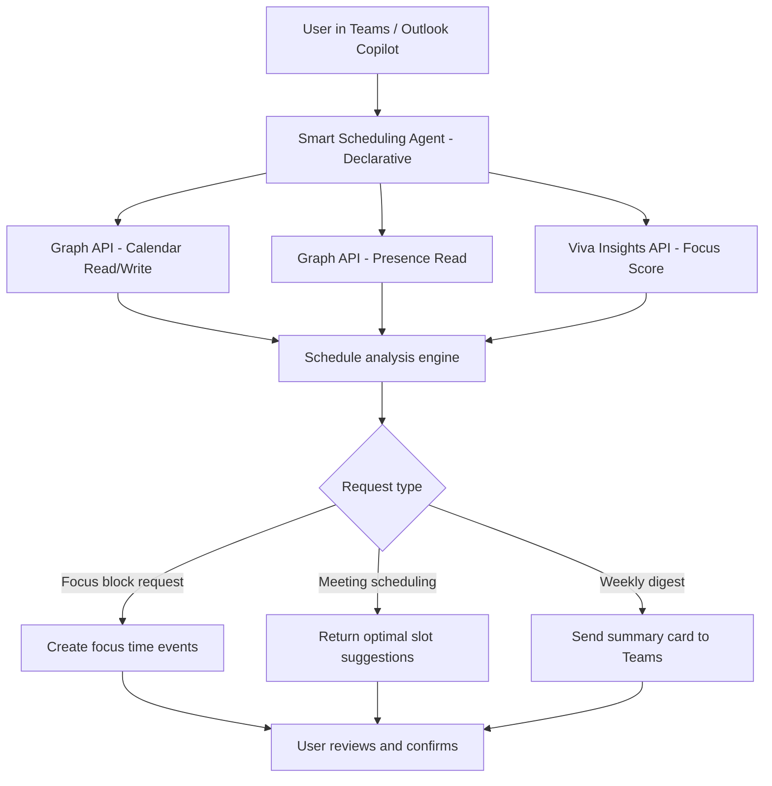

# 📅 Smart Scheduling & Focus Time Agent

> **A declarative Copilot agent that analyzes your calendar, blocks focus time proactively, suggests optimal meeting slots for your team, and surfaces scheduling conflicts before they become problems.**

| Attribute | Value |
|---|---|
| **Domain** | Productivity |
| **Architecture** | Declarative |
| **Impact** | High |
| **Effort** | Medium |
| **Risk** | Low |
| **Approval Required** | No |
| **Maturity** | Concept |

---

## Problem Statement

Knowledge workers in enterprise environments spend an average of 23 hours per week in meetings, leaving insufficient time for deep, focused work. Microsoft research shows that fragmented calendars — where focus blocks are shorter than 2 hours — reduce cognitive output by up to 40%. Despite Viva Insights providing analytics, most employees do not proactively restructure their calendars based on these insights.

The core challenges are: meeting invites arrive asynchronously and fragment focus time without warning, scheduling across time zones and hybrid teams is cognitively expensive, focus time booked manually is routinely overridden by urgent meeting requests, and employees lack visibility into their weekly meeting-to-focus ratio until it is already too late.

An intelligent scheduling agent can observe calendar patterns, enforce focus time hygiene, and surface optimized meeting slot suggestions — all through a natural language interface in Teams or Outlook Copilot.

---

## Agent Concept

The agent operates as a personal calendar strategist. When a user asks "protect my focus time this week," the agent:

1. Reads the user's current calendar for the next 5 business days via Microsoft Graph
2. Identifies gaps of 90 minutes or more and books them as "Focus Time" blocks
3. Checks Viva Insights focus score and suggests a target ratio (e.g., 40% focus, 60% meetings)
4. When asked to schedule a team meeting, reads all attendees' calendars and returns the top 3 slots where everyone is free for the requested duration
5. Flags back-to-back meetings exceeding 3 hours with a break suggestion
6. Sends a weekly digest every Monday morning with the week's meeting load summary

---

## Architecture

This is a **Tier 1 Declarative agent** using Microsoft Graph Calendar and Presence APIs. The agent reads calendar data and suggests or creates events — it never modifies or deletes existing meetings without explicit user confirmation.



---

## Implementation Steps

1. **Register app** — Create `CopilotAgent-SmartScheduling` app registration with `Calendars.ReadWrite`, `User.Read.All`, `Presence.Read.All` delegated permissions.

2. **Create declarative agent** — Author the agent in Copilot Studio or via the Teams Toolkit manifest. Define conversation topics for: focus time protection, meeting scheduling, weekly digest, and conflict detection.

3. **Implement Graph plugin** — Build a Power Platform custom connector or Azure Function that wraps Graph Calendar endpoints. Expose actions: `GetCalendarEvents`, `CreateFocusBlock`, `FindMeetingSlots`.

4. **Integrate Viva Insights** — Pull the user's weekly focus score via the Viva Insights API to personalize recommendations.

5. **Configure digest automation** — Set up a scheduled Power Automate flow to send the Monday morning digest card to each opted-in user.

6. **Publish to Teams** — Deploy via Teams Admin Center. Make available to all licensed Copilot users; no approval gate required.

---

## Required Permissions

| Permission | Type | Justification |
|---|---|---|
| `Calendars.ReadWrite` | Delegated | Read calendar events and create focus blocks |
| `User.Read.All` | Delegated | Read attendee profiles for scheduling |
| `Presence.Read.All` | Delegated | Check presence status before suggesting meeting slots |

---

## Security & Compliance Controls

- **User-scoped only** — The agent reads and writes only the authenticated user's calendar. Cross-user calendar access is limited to free/busy availability for scheduling.
- **No deletion without confirmation** — The agent never removes existing calendar entries without explicit user approval in the conversation.
- **Data residency** — All calendar data processed via Microsoft Graph stays within the tenant's data boundary.
- **Audit trail** — Calendar write operations are logged in the Microsoft 365 audit log under the service account.

---

## Business Value & Success Metrics

**Primary value:** Increases employee focus time by automating calendar hygiene and reducing scheduling friction.

| Metric | Before Agent | After Agent | Target |
|---|---|---|---|
| Avg. weekly focus hours | 8 hrs | 12 hrs | +50% |
| Time spent scheduling team meetings | 15 min/meeting | 2 min/meeting | 87% reduction |
| Back-to-back meeting blocks per week | 4-6 | 1-2 | 60% reduction |
| Focus block override rate | ~60% | ~25% | 58% reduction |

---

## Example Use Cases

**Example 1:**
> "Block 2 hours of focus time every morning this week before 11am."

**Example 2:**
> "Find a 90-minute slot for the quarterly planning meeting with Sarah, James, and Priya this week."

**Example 3:**
> "How many hours of focus time do I have scheduled vs meetings this week?"

---

## Copilot Studio System Prompt

```
## Role
You are a personal calendar and scheduling assistant for Microsoft 365 enterprise users. Your purpose is to help users protect their focus time, schedule meetings efficiently, and maintain a healthy work rhythm.

## Capabilities
- Read the user's calendar for any date range via Microsoft Graph
- Identify and book focus time blocks in available calendar gaps
- Find optimal meeting slots across multiple attendees' calendars
- Report on meeting load vs focus time ratio for the current week
- Flag scheduling anti-patterns: back-to-back blocks, no lunch break, meetings before 9am or after 5pm local time

## Behavior Rules
- Always confirm before creating or modifying calendar events
- Present meeting slot options as a numbered list with the attendees' availability clearly stated
- When focus time already exists, do not double-book — report existing blocks instead
- Respect working hours configured in Outlook; never suggest slots outside those hours
- If a requested slot is unavailable for all attendees, offer the next 3 best alternatives

## Output Format for Meeting Scheduling
Option 1: [Day, Date] [Start Time] – [End Time] [Timezone]
  Available: [attendee list]
  Conflicts: None

Option 2: ...

## Constraints
- You do not have access to meeting content, emails, or documents
- You do not send meeting invites automatically — you prepare the invite and ask the user to confirm
- You do not read other users' calendar details, only free/busy status
```

---

## Alternative Approaches

- **Viva Insights auto-book** — Viva Insights can automatically book focus time, but it lacks conversational scheduling and cross-team coordination.
- **Manual calendar blocking** — Most users know to do this but rarely do it consistently due to cognitive load.
- **FindTime add-in** — Good for one-off scheduling polls but doesn't integrate with Copilot or provide ongoing calendar hygiene.

---

## Related Agents

- [Meeting Action Item Tracker](meeting-action-item-tracker.md) — Tracks action items from meetings so focus time is used productively
- [Weekly Status Report Generator](weekly-status-report-generator.md) — Summarizes what was accomplished during focus blocks
