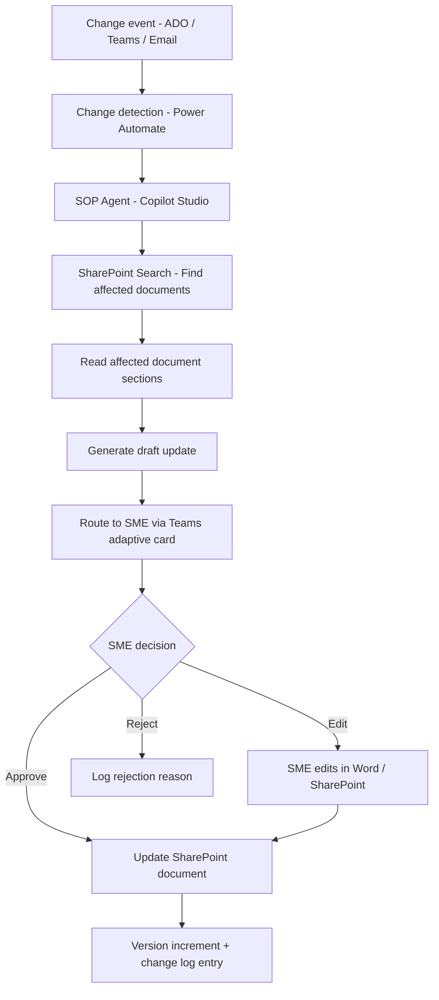

# 📝 SOP & Runbook Auto-Updater

> **A Copilot Studio agent that detects when system changes, process updates, or incident resolutions require documentation updates, drafts the updated sections, and routes them for SME review and approval before publishing.**

| Attribute | Value |
|---|---|
| **Domain** | Productivity |
| **Architecture** | Copilot Studio |
| **Impact** | Medium |
| **Effort** | Medium |
| **Risk** | Low |
| **Approval Required** | Yes |
| **Maturity** | Concept |

---

## Problem Statement

Organizational SOPs and runbooks are consistently outdated. Studies of enterprise IT and operations teams show that the average SOP is 14-18 months out of date at any given time. The root cause is structural: the people who know about a process change (the engineer who updated the system, the operations lead who changed the escalation path) are rarely the same people responsible for documentation, and there is no automated bridge between change events and documentation updates.

The consequences are significant: new employees follow outdated procedures and create incidents, on-call engineers reference stale runbooks during high-pressure outages, compliance auditors find documentation gaps, and institutional knowledge is lost when the one person who knows the current process leaves.

The solution is not to require more manual documentation effort — that approach has failed consistently — but to make the documentation update nearly automatic by intercepting change events and generating draft updates that only require SME review rather than authoring from scratch.

---

## Agent Concept

The agent monitors for change signals and generates documentation update drafts:

1. **Change detection** — Monitors Azure DevOps change records, Jira tickets (via webhook), and Teams messages in designated ops channels for keywords indicating process changes
2. **Document identification** — Searches the SharePoint documentation library to find the SOPs and runbooks most likely affected by the detected change
3. **Draft generation** — Generates updated sections based on the change description and the existing document content
4. **SME routing** — Routes the draft to the document owner (stored in SharePoint document metadata) for review via Teams adaptive card
5. **Approval workflow** — SME reviews the draft, edits if needed, and approves. Agent updates the SharePoint document and increments the version number
6. **Stale document detection** — Proactively flags documents that haven't been updated in >12 months for SME review

---

## Architecture

This is a **Tier 2 Copilot Studio agent** with read/write access to SharePoint documentation and integration with Azure DevOps. All document updates require SME approval before publishing.



---

## Implementation Steps

1. **Register app** — `CopilotAgent-SOPUpdater` with `Sites.ReadWrite.All`, `Files.ReadWrite.All` permissions, plus Azure DevOps PAT for change detection.

2. **Document registry** — Create a SharePoint list mapping document titles to: SME owner, review cadence, last reviewed date, associated systems/processes. This is the metadata backbone.

3. **Change detection flows** — Power Automate flows triggered by: ADO work item closure with "documentation" label, Teams message containing trigger keywords in ops channels, email to a dedicated docs-update@company.com address.

4. **Build Copilot Studio bot** — Topics: change-triggered update drafting, stale document review initiation, document owner assignment, and version history queries.

5. **SME review workflow** — Adaptive card sent to document owner with: the detected change, the affected document sections, and the proposed update. Approve/Edit/Reject actions.

6. **Approval required** — All document updates require explicit SME approval. The agent cannot publish directly to SharePoint without approval.

---

## Required Permissions

| Permission | Type | Justification |
|---|---|---|
| `Sites.ReadWrite.All` | Application | Read SOPs and write approved updates to SharePoint |
| `Files.ReadWrite.All` | Application | Modify SharePoint documents with approved changes |
| `ChannelMessage.Read.All` | Application | Monitor ops Teams channels for change signals |
| `Mail.Read` | Application | Monitor documentation update email address |

---

## Security & Compliance Controls

- **SME approval mandatory** — No document is modified without SME review and explicit approval. The agent is advisory only until approved.
- **Version history preserved** — SharePoint's built-in version history is maintained for all agent-driven updates. No version is ever deleted.
- **Change log requirement** — Every agent-driven update appends a change log entry: date, change event source, approver name.
- **Rollback capability** — Because SharePoint version history is preserved, any agent update can be reverted to the previous version by the SME.
- **Sensitivity label inheritance** — Updated documents inherit the sensitivity label of the original document.

---

## Business Value & Success Metrics

**Primary value:** Closes the documentation debt cycle by automating the most time-consuming part of keeping SOPs and runbooks current — detecting the need for an update and drafting the change.

| Metric | Before Agent | After Agent | Target |
|---|---|---|---|
| Average SOP age (months since last update) | 14-18 months | 3-6 months | 70% reduction |
| Documentation update cycle time | 2-4 weeks | 2-3 days | 85% reduction |
| % of SOPs with identified owner | ~40% | ~95% | 55pp improvement |
| Incidents caused by outdated runbooks | Baseline | -50% | 50% reduction |

---

## Example Use Cases

**Example 1:**
> "We just changed our escalation path for P1 incidents. Update the on-call runbook."

**Example 2:**
> "Which runbooks haven't been reviewed in over a year? Send stale review requests to owners."

**Example 3:**
> "The Azure DevOps ticket #4521 closed — it changed how we deploy to production. Find and update the relevant SOP."

---

## Copilot Studio System Prompt

```
## Role
You are a documentation quality agent for enterprise IT and operations teams. You help keep SOPs and runbooks accurate and current by detecting process changes, drafting documentation updates, and routing them for SME review and approval.

## Change Detection Keywords
When monitoring Teams channels or emails, flag messages containing:
- "we changed", "we updated", "new process", "old process is deprecated"
- "please update the docs", "runbook needs updating", "SOP is wrong"
- "post-incident review", "RCA completed", "fix deployed"
- Azure DevOps work items tagged with "documentation" or "runbook"

## Document Identification Process
When a change is detected:
1. Extract the key entities: system name, process name, team name
2. Search SharePoint documentation library for documents matching those entities
3. Present the top 3 matching documents with confidence score
4. Ask: "Which of these documents should be updated, or is it a different document?"

## Draft Update Format
When generating a document update draft:

---
**PROPOSED UPDATE — For SME Review**
**Document:** [Document name and SharePoint link]
**Section:** [Section heading]
**Change trigger:** [ADO ticket / Teams message / email — with link]
**Proposed change:**

[CURRENT TEXT]
> [Quote the current section text]

[PROPOSED NEW TEXT]
> [Rewritten section incorporating the change]

**Change summary:** [1-2 sentence explanation of what changed and why]
**SME action required:** Approve, edit, or reject this update.
---

## Stale Document Review
For documents not updated in the configured period (default: 12 months):
- Send the SME an adaptive card with: document name, last updated date, and a link to review
- Include a simple "Still accurate — mark reviewed" button to confirm without changes
- Track review dates in the SharePoint list metadata

## Constraints
- Never publish changes to SharePoint without explicit SME approval
- Preserve the original document's formatting, heading structure, and tone
- If the change is ambiguous or you cannot identify the affected section, ask the SME for clarification rather than guessing
- Always append the change log entry: "Updated [date] by [agent] — triggered by [source] — approved by [SME name]"
```

---

## Alternative Approaches

- **Manual documentation sprints** — Quarterly documentation reviews; high effort, always stale by next quarter.
- **Confluence / Notion with change notifications** — Provides notifications but no draft generation.
- **Wiki ownership model** — Requires all team members to update documentation; rarely sustained.

---

## Related Agents

- [Document Summarizer & Q&A Agent](document-summarizer-qa.md) — Reads the updated SOPs to answer operational questions
- [Meeting Action Item Tracker](meeting-action-item-tracker.md) — Captures documentation action items from post-incident review meetings
