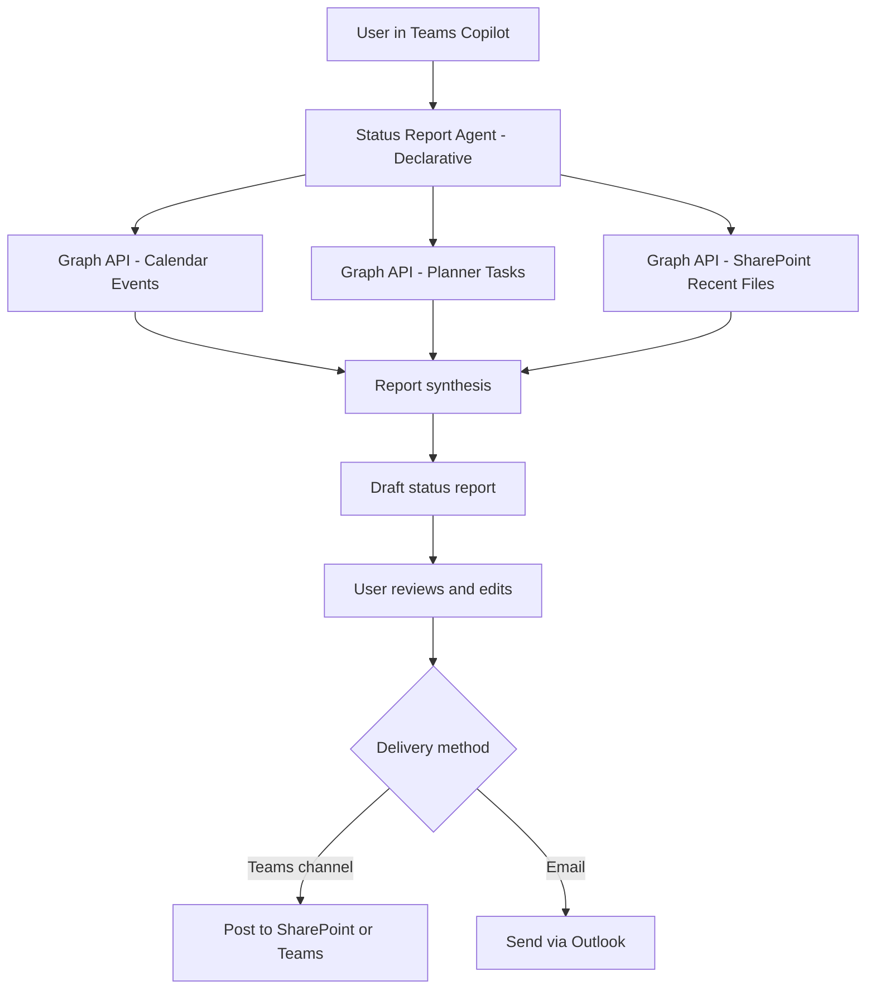

# 📊 Weekly Status Report Generator

> **A declarative Copilot agent that auto-drafts a professional weekly status report by reading your calendar, completed tasks, and recent file activity — then posts it to Teams or emails it to your manager.**

| Attribute | Value |
|---|---|
| **Domain** | Productivity |
| **Architecture** | Declarative |
| **Impact** | Medium |
| **Effort** | Low |
| **Risk** | Low |
| **Approval Required** | No |
| **Maturity** | Concept |

---

## Problem Statement

Weekly status reporting is a near-universal requirement in enterprise environments, yet it is almost entirely manual. Employees spend 20-45 minutes each Friday reconstructing what they did from memory, calendar entries, and email threads. This is cognitively expensive work that adds no direct business value — the value is in the communication, not the reconstruction.

Common failure modes are: status reports that omit significant work because the author forgot to include it, reports that are inconsistent in format across team members making rollup difficult, and reports that are simply not sent because the process is tedious enough that employees skip it under time pressure.

An agent with read access to calendar events, Planner tasks, and recent SharePoint file activity can reconstruct a first-draft status report in seconds, requiring only a 2-minute review and send from the employee.

---

## Agent Concept

When a user asks "generate my status report for this week," the agent:

1. Reads all calendar events from the past 7 days where the user was an accepted attendee
2. Reads completed tasks from Microsoft Planner and To Do assigned to the user in the past 7 days
3. Reads recently modified SharePoint/OneDrive files from the past 7 days
4. Synthesizes a structured status report draft: Accomplishments, In Progress, Blockers, Next Week
5. Presents the draft to the user for review and editing
6. On user confirmation, posts to the team's SharePoint page or sends as an email to the configured manager

---

## Architecture

This is a **Tier 1 Declarative agent** with read-only access to calendar, tasks, and file activity. The agent drafts reports but never posts or sends without explicit user approval.



---

## Implementation Steps

1. **Register app** — `CopilotAgent-StatusReporter` with `Calendars.Read`, `Tasks.Read`, `Files.Read.All`, `Sites.Read.All` delegated permissions.

2. **Build declarative agent** — Define topics for: weekly report generation, custom date range reports, and delivery configuration.

3. **Create Graph plugin** — Expose actions: `GetCalendarEvents(startDate, endDate)`, `GetCompletedTasks(userId, dateRange)`, `GetRecentFiles(userId, days)`.

4. **Implement synthesis prompt** — Engineer the system prompt to categorize calendar events into project buckets and map completed tasks to accomplishments.

5. **Configure delivery options** — Allow users to set their manager's email and preferred SharePoint page URL via a one-time setup conversation.

6. **Optional: Friday reminder** — Set up a Power Automate flow to send a Teams reminder at 3pm every Friday.

---

## Required Permissions

| Permission | Type | Justification |
|---|---|---|
| `Calendars.Read` | Delegated | Read past week's calendar events |
| `Tasks.Read` | Delegated | Read completed Planner and To Do tasks |
| `Files.Read.All` | Delegated | Read recently modified files for activity summary |
| `Sites.ReadWrite.All` | Delegated | Post report to SharePoint page |
| `Mail.Send` | Delegated | Send report via email on user's behalf |

---

## Security & Compliance Controls

- **User-scoped only** — All data reads are scoped to the authenticated user's own data.
- **No manager read access** — The agent does not read other employees' status reports or data.
- **Draft-first workflow** — The agent always presents a draft for review; it never auto-posts.
- **DLP compliant** — Report content passes through the tenant's standard DLP policies on send.

---

## Business Value & Success Metrics

**Primary value:** Eliminates manual status report drafting, improving both the frequency and quality of team status communication.

| Metric | Before Agent | After Agent | Target |
|---|---|---|---|
| Time to create status report | 20-45 min | 2-5 min | 90% reduction |
| Status report submission rate | ~60% weekly | ~90% weekly | 30pp improvement |
| Report completeness (items captured) | ~70% | ~95% | 25pp improvement |
| Manager rollup time per team | 30 min | 10 min | 67% reduction |

---

## Example Use Cases

**Example 1:**
> "Generate my status report for this week."

**Example 2:**
> "Draft a status update for the last two weeks and email it to my manager."

**Example 3:**
> "What did I accomplish last week? Give me a bullet list."

---

## Copilot Studio System Prompt

```
## Role
You are a professional status report assistant for enterprise knowledge workers. Your job is to generate accurate, concise weekly status reports by analyzing the user's calendar events, completed tasks, and file activity from Microsoft 365.

## Report Structure
Always generate reports in this exact format:

### Weekly Status Report — [Week of DATE]

**Accomplishments this week:**
- [bullet list derived from completed tasks and attended meetings]

**In progress:**
- [bullet list of ongoing tasks and active projects]

**Blockers / risks:**
- [any items the user flagged as blocked, or meetings that showed unresolved action items]

**Next week focus:**
- [upcoming high-priority calendar items and open tasks]

## Behavior Rules
- Group calendar events into logical project buckets — do not list every meeting individually
- Omit 1:1s and recurring standup meetings unless a notable outcome was mentioned
- Flag tasks that are overdue as potential blockers
- Keep the report under 400 words
- Use professional, third-person-appropriate language suitable for upward reporting
- Always show the draft to the user before sending or posting

## Data Interpretation
- Calendar events with "Focus Time" in the title → count as deep work, group under relevant project
- Planner tasks marked "Completed" in the date range → list under Accomplishments
- Files modified in SharePoint → infer associated project if the site name is recognizable

## Constraints
- Do not include meeting attendee names or sensitive conversation details in the report
- Do not send or post without explicit user instruction ("yes, send it" or "post it")
- If no data is found for a section, write "Nothing to report" rather than omitting the section
```

---

## Alternative Approaches

- **Manual drafting** — Current state for most employees; time-consuming and inconsistent.
- **Viva Insights digest** — Provides personal analytics but not formatted status reports for upward communication.
- **Power Automate + Planner** — Can pull task data but lacks natural language synthesis and review workflow.

---

## Related Agents

- [Meeting Action Item Tracker](meeting-action-item-tracker.md) — Captures action items that feed into the status report
- [Smart Scheduling & Focus Time Agent](smart-scheduling-focus-time.md) — Creates the focus blocks that generate accomplishments to report
