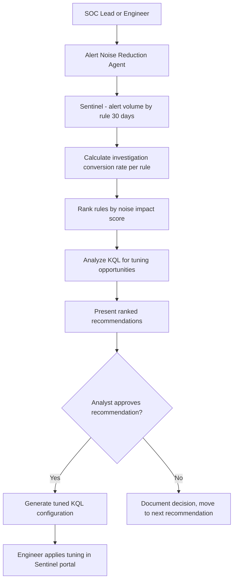

# 🔕 Alert Noise Reduction Advisor

> **A Copilot Studio agent that analyzes Sentinel alert volume by rule, identifies high-volume low-fidelity rules generating analyst fatigue, and recommends tuning changes — routing each recommendation through analyst approval before producing the tuning configuration.**

| Attribute | Value |
|---|---|
| **Domain** | SecOps |
| **Architecture** | Copilot Studio |
| **Impact** | High |
| **Effort** | Medium |
| **Risk** | Medium |
| **Approval Required** | Yes |
| **Maturity** | Concept |

---

## Problem Statement

Alert fatigue is one of the most serious operational problems facing enterprise SOC teams. When analysts receive 500+ alerts per day and know from experience that 80%+ are false positives, they develop coping mechanisms: they triage faster (missing true positives), they close alerts with minimal investigation, or they simply stop engaging with certain alert categories entirely. This creates exactly the blind spots that threat actors exploit.

The problem is not that detection rules are bad — it is that rules written for generic environments need tuning for specific ones. A "Rare process executed via WMI" rule will fire constantly in an environment where a legitimate automation tool uses WMI. A "Login from unusual location" rule will generate constant noise for a team with legitimate global operations. Without systematic analysis of alert volume versus investigation outcome, noise-generating rules are never identified and never tuned.

---

## Agent Concept

The agent queries Sentinel for alert analytics over a configurable period (default: 30 days). It identifies alert rules ranked by volume and calculates the "investigation conversion rate" — what percentage of alerts from each rule resulted in a non-closed (i.e., acted-upon) incident. Rules with high volume and low conversion rate are candidates for tuning.

For each identified rule, the agent retrieves the current KQL query, analyzes it for common noise-generating patterns (overly broad entity filters, missing exception lists, threshold too low), and recommends specific tuning adjustments. Each recommendation is presented with justification and risk assessment: "Raising the threshold from 5 to 10 failed logins would reduce alert volume by ~60% while maintaining detection of brute-force attacks above the threshold."

Tuning changes are routed through approval before the agent generates the updated KQL configuration.

---

## Architecture

A **Tier 3 Copilot Studio agent** with Sentinel read access. Tuning recommendations require analyst and SOC lead approval before the agent produces configuration changes.

---

## Implementation Steps

1. **Create app registration** — `copilot-alert-tuning` with `SecurityEvents.Read.All`, `SecurityIncident.Read.All`, `ThreatHunting.Read.All`.

2. **Build alert volume analysis flow** — KQL query against Sentinel SecurityAlert table: aggregate by AlertName over 30 days, join with SecurityIncident to calculate conversion rate.

3. **Build tuning analysis** — For each high-noise rule, retrieve the current rule KQL, identify tunable parameters: thresholds, entity filters, exception lists, aggregation windows.

4. **Build recommendation engine** in agent instructions — Define tuning patterns: add exception list for known-good entities, raise threshold, narrow entity filter, add lookback window comparison.

5. **Build approval flow** — Each tuning recommendation requires approval from both the analyst who investigated the false positives and the SOC lead. Rejected recommendations are logged with reason.

6. **Generate tuned KQL** — On approval, produce the modified KQL with tracked changes highlighted.

---

## Required Permissions

| Permission | Type | Justification |
|---|---|---|
| `SecurityEvents.Read.All` | Application | Read alert history and volume data |
| `SecurityIncident.Read.All` | Application | Calculate investigation conversion rates |

---

## Security & Compliance Controls

- **No automated rule modification** — All tuning changes are recommendations requiring approval + manual application.
- **Dual approval for significant changes** — Changes that reduce detection scope by >30% require both analyst and SOC lead approval.
- **Rollback documentation** — Before-tuning KQL is captured and stored alongside each approved change.
- **Coverage impact assessment** — Each recommendation includes a statement of what attack patterns would still be detected after the tuning change.

---

## Business Value & Success Metrics

**Primary value:** Reduces alert volume by 30-50% while maintaining detection effectiveness, dramatically reducing analyst fatigue.

| Metric | Before Agent | After Agent | Target |
|---|---|---|---|
| Daily alert volume | 500-1000 typical | 250-500 | 50% reduction |
| Alert investigation conversion rate | 15-25% | 40-60% | 2x improvement |
| Time to identify noise-generating rules | Days of manual analysis | 30 minutes | 95% reduction |
| Analyst satisfaction (alert quality) | Low | High | Qualitative improvement |

---

## Example Use Cases

**Example 1:**
> "Which of our Sentinel rules are generating the most false positive alerts this month?"

**Example 2:**
> "Analyze our 'Brute Force Login' rule and recommend tuning to reduce noise."

**Example 3:**
> "Show me the 10 noisiest rules ranked by volume-to-investigation-conversion ratio."

---

## Alternative Approaches

- **Manual KQL analysis** — Requires deep Sentinel expertise; inconsistently done.
- **Sentinel SOAR playbooks** — Can auto-close alerts but doesn't address root cause (noisy rule).
- **Microsoft Defender tuning recommendations** — Available for some Defender-native rules; this agent extends coverage to custom Sentinel analytics rules.

---

## Related Agents

- [SOC Triage Summarizer](soc-triage-summarizer.md) — Triage speed is directly correlated with alert quality
- [Sentinel Workbook Builder](sentinel-workbook-builder.md) — Build dashboards to monitor alert quality trends over time
- [Incident Postmortem Generator](incident-postmortem-generator.md) — Postmortems surface false positive patterns that drive tuning needs
