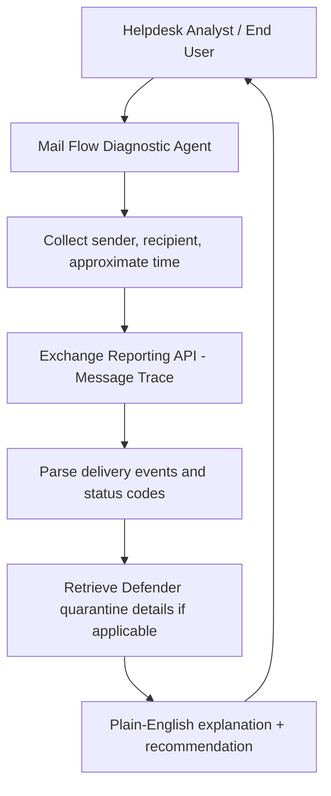

# ✉️ Exchange Mail Flow Diagnostic

> **A Copilot Studio agent that diagnoses Exchange Online mail flow issues and Defender for Office 365 delivery decisions through conversational troubleshooting, eliminating multi-step Message Trace portal navigation.**

| Attribute | Value |
|---|---|
| **Domain** | SecOps |
| **Architecture** | Copilot Studio |
| **Impact** | Medium |
| **Effort** | Medium |
| **Risk** | Low |
| **Approval Required** | No |
| **Maturity** | Concept |

---

## Problem Statement

"Why didn't I receive the email from [external sender]?" is one of the most common helpdesk queries involving email. The answer almost always requires running a Message Trace in the Exchange Admin Center — a tool that is powerful but requires knowledge of the right filters, the ability to interpret delivery status codes, and the patience to navigate through multiple portal layers. Tier-1 helpdesk staff typically cannot run Message Traces confidently, so these tickets escalate to Exchange administrators who spend 5-15 minutes on each one.

In a large organization, email delivery queries can account for 50-100 helpdesk tickets per week. Escalation to Exchange admins costs significant specialist time on low-complexity work. Additionally, some delivery issues are security-relevant — emails quarantined by Defender for Office 365 policies, emails blocked due to anti-spam rules, or legitimate emails incorrectly flagged as phishing — and these require coordination between the helpdesk and the security team.

---

## Agent Concept

A helpdesk analyst or end user describes their email issue in natural language: "John Smith sent me an invoice from vendor@external.com at 2pm today and I never received it." The agent runs a Message Trace via the Exchange Online Reporting API, retrieves the delivery events for that message, and explains in plain English what happened: "The email was received by Exchange Online at 2:04pm and was quarantined by a Defender for Office 365 anti-phishing policy because the sender's domain was registered less than 30 days ago."

The agent provides the specific reason for the delivery event and the recommended resolution path — release from quarantine (if appropriate), create a sender allow list entry, or escalate to security if the quarantine reason suggests a genuine threat.

---

## Architecture

A **Tier 3 Copilot Studio agent** with Exchange Reporting API access. Read-only for diagnosis; any action (quarantine release, allow list) is presented as a recommendation for the administrator to execute.

---

## Implementation Steps

1. **Create app registration** — `copilot-mailflow-diag` with `Mail.Read` (for specific message lookup), `Reports.Read.All` (for Message Trace data).

2. **Build Copilot Studio topics** — "Diagnose email delivery issue", "Check quarantine status", "Explain mail flow rule".

3. **Build Message Trace action** — Power Automate flow calling `GET /reports/getEmailActivityUserDetail` and `POST /admin/serviceAnnouncement/messages` via the Reporting API.

4. **Build quarantine lookup action** — Query `GET /security/threatAssessmentRequests` and Defender quarantine API for quarantined messages.

5. **Add knowledge source** — SharePoint document with common delivery status codes explained, organizational mail flow rules documented, allow/block list management procedures.

---

## Required Permissions

| Permission | Type | Justification |
|---|---|---|
| `Reports.Read.All` | Application | Read Message Trace and mail flow reports |
| `Mail.Read` | Application | Look up specific message details |

---

## Business Value & Success Metrics

**Primary value:** Resolves email delivery queries at tier-1 without Exchange admin escalation, reducing specialist time on low-complexity tickets.

| Metric | Before Agent | After Agent | Target |
|---|---|---|---|
| Email delivery ticket escalation rate | 70-80% to Exchange admins | 20-25% | 70% reduction |
| Mean time to resolve email delivery query | 20-30 min | 5-8 min | 75% reduction |
| Exchange admin time on tier-1 email tickets | 4-6 hours/week | 1-2 hours/week | 70% reduction |

---

## Example Use Cases

**Example 1:**
> "A user says they didn't receive an expected email from vendor@supplier.com that was sent at 3pm today."

**Example 2:**
> "Why are emails from our partner company being quarantined?"

**Example 3:**
> "An email I sent to an external recipient shows as delivered on our end but they say they never received it. What do I check?"

---

## Alternative Approaches

- **Exchange Admin Center Message Trace** — Available but requires admin access and portal expertise. Not suitable for tier-1 helpdesk.
- **Defender portal quarantine review** — Available but not integrated with Message Trace context.
- **PowerShell Get-MessageTrace** — Powerful but requires Exchange Online PowerShell module and expertise.

---

## Related Agents

- [Phishing Response](phishing-response.md) — When email delivery investigation reveals a phishing campaign
- [Alert Noise Reduction](alert-noise-reduction.md) — Tune Defender policies that are generating false positive quarantine events
- [DLP Policy Tuning](../compliance/dlp-policy-tuning.md) — DLP policies can block email delivery; this agent helps diagnose DLP-related delivery failures
