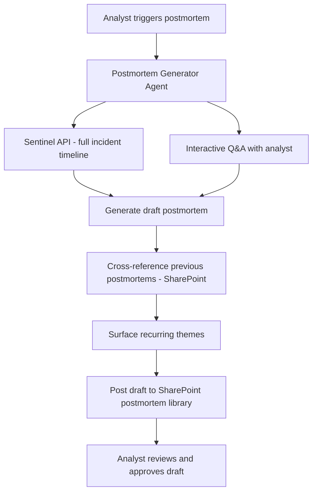

# 📝 Incident Postmortem Generator

> **A Copilot Studio agent that generates a structured incident postmortem report by ingesting Sentinel incident data, analyst conversation notes, and remediation actions taken — turning a multi-hour writing task into a 15-minute review process.**

| Attribute | Value |
|---|---|
| **Domain** | SecOps |
| **Architecture** | Copilot Studio |
| **Impact** | Medium |
| **Effort** | Medium |
| **Risk** | Low |
| **Approval Required** | No |
| **Maturity** | Concept |

---

## Problem Statement

Incident postmortems are universally acknowledged as valuable — they drive process improvement, satisfy audit requirements, and build institutional knowledge. They are also universally neglected in practice. In a high-volume SOC, the time between an incident being closed and a team having capacity to write a thorough postmortem can be days or weeks. By then, the mental context has faded, the timeline must be reconstructed from logs, and the "lessons learned" section devolves into generic platitudes.

The result is either no postmortem at all, or a perfunctory document that satisfies compliance checkers but provides no operational value. Organizations that do invest in quality postmortems typically spend 3-6 hours per incident — time that is hard to justify when the next incident is already in the queue.

---

## Agent Concept

When an incident is closed in Sentinel, an analyst triggers the postmortem agent with the incident ID. The agent retrieves the full incident timeline from Sentinel (all alerts, entities, analyst comments, and actions taken), and begins an interactive postmortem session. It asks the analyst a structured set of questions: "What was the initial detection vector?" "How long between first indicator and containment?" "What worked well in the response?" "What would you do differently?" The agent synthesizes the Sentinel data and the analyst's answers into a complete postmortem document in the organization's standard template.

The draft is posted to a SharePoint postmortem library for review and approval. The agent cross-references previous postmortems to identify recurring themes: "This is the third incident involving compromised contractor accounts in 6 months. Previous recommendations on this theme were: [X, Y, Z]."

---

## Architecture

A **Tier 3 Copilot Studio agent** with Sentinel read access and SharePoint write access (for saving the draft). The conversational Q&A drives the qualitative sections; the Sentinel API drives the timeline and technical sections.

---

## Implementation Steps

1. **Create app registration** — `copilot-postmortem` with `SecurityIncident.Read.All`, `Sites.ReadWrite.All`.

2. **Design postmortem template** — Standard sections: Incident Summary, Timeline, Root Cause Analysis, Impact Assessment, Response Actions Taken, What Went Well, Areas for Improvement, Action Items with Owners and Due Dates.

3. **Build Copilot Studio flow** — Topic: "Generate postmortem". Collect incident ID, retrieve Sentinel data, ask structured Q&A questions, generate draft.

4. **Build SharePoint postmortem library** — Create a SharePoint document library with metadata: incident date, incident type, severity, status (draft/approved), analyst author.

5. **Build recurring theme detection** — When generating a new postmortem, query the SharePoint library for previous postmortems with similar incident types. Surface any action items from previous postmortems that appear unresolved.

6. **Publish to SOC team in Teams.**

---

## Required Permissions

| Permission | Type | Justification |
|---|---|---|
| `SecurityIncident.Read.All` | Application | Read incident details and timeline from Sentinel |
| `Sites.ReadWrite.All` | Delegated | Save postmortem drafts to SharePoint library |

---

## Business Value & Success Metrics

**Primary value:** Increases postmortem completion rate and quality while reducing the time investment from 3-6 hours to 30-60 minutes.

| Metric | Before Agent | After Agent | Target |
|---|---|---|---|
| Postmortem completion rate | 20-30% of incidents | 90%+ | 3x improvement |
| Time to write postmortem | 3-6 hours | 30-60 minutes | 80% reduction |
| Action item follow-through rate | 30-40% | 70%+ | 2x improvement |
| Recurring theme identification | Ad hoc / never | Every postmortem | Systematic |

---

## Example Use Cases

**Example 1:**
> "Generate a postmortem for Sentinel incident INC-2026-0342 that was closed yesterday."

**Example 2:**
> "Are there any recurring themes across our last 10 postmortems that we haven't addressed?"

**Example 3:**
> "What action items from Q4 postmortems are still open?"

---

## Alternative Approaches

- **Manual postmortem writing** — Time-intensive, low completion rate, inconsistent quality.
- **Confluence/SharePoint templates** — Structured format but no automation; still requires manual timeline reconstruction.
- **Sentinel workbooks** — Good for analytics dashboards but not narrative postmortem generation.

---

## Related Agents

- [SOC Triage Summarizer](soc-triage-summarizer.md) — The triage summary feeds the incident timeline section of the postmortem
- [Sentinel Workbook Builder](sentinel-workbook-builder.md) — Uses postmortem findings to design better detection workbooks
- [Alert Noise Reduction](alert-noise-reduction.md) — Postmortem findings often surface false positive alerts that should be tuned
