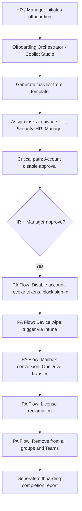

# 🚪 Offboarding Orchestrator

> **A hybrid agent that orchestrates the complete employee offboarding process — from account disablement through mailbox conversion, device wipe, and license reclamation — with a structured approval gate and full audit trail.**

| Attribute | Value |
|---|---|
| **Domain** | SecOps |
| **Architecture** | Hybrid |
| **Impact** | High |
| **Effort** | High |
| **Risk** | High |
| **Approval Required** | Yes |
| **Maturity** | Concept |

---

## Problem Statement

Employee offboarding is a security-critical process that organizations consistently execute poorly. A 2023 study found that 29% of organizations had experienced unauthorized access by a former employee — almost always because offboarding was incomplete or delayed. The consequences range from data exfiltration in the window between resignation and account disablement, to former employees accessing systems months after departure through overlooked access paths.

The core problem is that offboarding touches 8-12 different systems and requires coordination across HR, IT, Security, and the departing employee's manager. Each team has their own checklist, their own cadence, and their own definition of "done." When these are not orchestrated, steps are missed. The most commonly missed items: revoking OAuth tokens (not just disabling the account), removing from distribution groups and Teams channels (which persist after account disable), reclaiming assigned licenses, wiping or recovering the device, transferring OneDrive data ownership, and updating shared credentials the employee had access to.

---

## Agent Concept

HR or a manager initiates offboarding by notifying the agent with the employee's details and last working day. The agent generates a complete offboarding task list, assigns each task to the responsible team, and tracks completion. For security-critical tasks (account disable, token revocation, device wipe), the agent executes them via Power Automate flows after obtaining approval from the HR business partner and the employee's manager.

The agent provides a real-time status view: "Offboarding for Jane Smith: 7 of 12 tasks complete. Pending: device recovery, shared mailbox conversion." Tasks that are overdue relative to the last working day are escalated.

---

## Architecture

A **Tier 4 Hybrid agent** combining Copilot Studio (conversational interface and status tracking), Power Automate (task orchestration and write operations), and a SharePoint list (offboarding task registry and audit log).

---

## Implementation Steps

1. **Create app registration** — `copilot-offboarding` with: `User.ReadWrite.All` (account disable), `DeviceManagementManagedDevices.ReadWrite.All` (device wipe), `MailboxSettings.ReadWrite` (mailbox conversion), `Sites.ReadWrite.All` (OneDrive transfer), `Group.ReadWrite.All` (group removal).

2. **Build task template** — SharePoint list with standard offboarding tasks: account disable, sign-in revocation, MFA method removal, device wipe/recovery, mailbox conversion, OneDrive data transfer, license reclamation, group/Teams removal, shared credentials rotation, access badge deactivation (manual task flagged).

3. **Build approval gate flow** — Dual approval (HR + manager) required before account disable. Approval card includes: employee name, last working day, all tasks that will be automated, and confirmation that manager has been briefed.

4. **Build execution flows** — One Power Automate flow per automation task:
   - Account disable: `PATCH /users/{id}` with `accountEnabled: false`
   - Token revocation: `POST /users/{id}/revokeSignInSessions`
   - Device wipe: `POST /deviceManagement/managedDevices/{id}/wipe`
   - License reclamation: `DELETE /users/{id}/licenseDetails/{licenseId}`

5. **Build tracking and escalation** — Daily flow checks incomplete tasks past the last working day. Escalates to department head if critical tasks remain incomplete 24 hours after last working day.

---

## Required Permissions

| Permission | Type | Justification |
|---|---|---|
| `User.ReadWrite.All` | Application | Disable account, update properties |
| `DeviceManagementManagedDevices.ReadWrite.All` | Application | Trigger device wipe |
| `Group.ReadWrite.All` | Application | Remove from all groups and Teams |
| `MailboxSettings.ReadWrite` | Application | Convert mailbox to shared |

> **High-risk permissions.** These are scoped to a dedicated offboarding service principal with monitoring alerts on all write operations.

---

## Security & Compliance Controls

- **Dual approval** — Account disable requires approval from both HR and the direct manager.
- **Irreversible action warnings** — Device wipe requires a separate confirmation step with an explicit warning that the action cannot be undone.
- **Complete audit trail** — Every action, approver, and timestamp is logged to an immutable SharePoint list.
- **Separation of duties** — The offboarding agent cannot initiate its own offboarding; the service principal is excluded from the process.
- **Monitoring alert** — An Azure Monitor alert fires if the offboarding service principal is used outside of approved workflow run contexts.

---

## Business Value & Success Metrics

**Primary value:** Eliminates security gaps in the offboarding process, reducing the risk of unauthorized post-employment access.

| Metric | Before Agent | After Agent | Target |
|---|---|---|---|
| Offboarding task completion rate | 60-70% | 98%+ | Near-complete |
| Time from last day to full access revocation | Hours to days | <2 hours | Same-day revocation |
| Post-employment unauthorized access incidents | 2-4/year | 0 | Elimination |
| License reclamation per departure | Ad hoc | 100% | Full reclamation |

---

## Example Use Cases

**Example 1:**
> "Initiate offboarding for John Smith, last working day is March 31st."

**Example 2:**
> "What's the current status of Sarah Chen's offboarding? Are all tasks complete?"

**Example 3:**
> "Which offboardings from this quarter have incomplete device recovery tasks?"

---

## Alternative Approaches

- **Entra ID Lifecycle Workflows** — Automates some user lifecycle tasks but limited write capabilities and no multi-system orchestration.
- **Manual HR/IT process** — Current state: error-prone, incomplete, undocumented.
- **ITSM offboarding ticket** — Better than email but no automation and no enforcement.

---

## Related Agents

- [Privileged Access Review](../identity/privileged-access-review.md) — Regular reviews reduce the privileged access that needs to be revoked during offboarding
- [Stale Device Cleanup Planner](../endpoint/stale-device-cleanup-planner.md) — Devices from departed employees become stale if offboarding is incomplete
- [Phishing Response](phishing-response.md) — When offboarding is triggered by a security incident rather than voluntary departure
