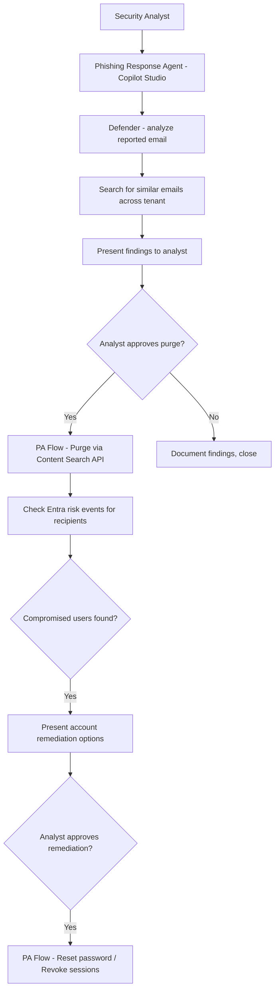

# 🎣 Phishing Response Orchestrator

> **A Copilot Studio agent that guides security analysts through phishing incident response — from initial user report through email purge, sender block, and affected user remediation — with human approval gates at every write operation.**

| Attribute | Value |
|---|---|
| **Domain** | SecOps |
| **Architecture** | Copilot Studio |
| **Impact** | High |
| **Effort** | Medium |
| **Risk** | High |
| **Approval Required** | Yes |
| **Maturity** | Concept |

---

## Problem Statement

Phishing attacks are the most common initial access vector for enterprise breaches, and response speed is directly correlated with blast radius. The difference between a phishing email that is contained in 15 minutes versus 2 hours can determine whether 1 user is affected or 50. Yet most organizations' phishing response playbooks are manual, multi-step processes distributed across Microsoft 365 Defender, Exchange Admin Center, and Entra ID — requiring the analyst to context-switch between portals while actively triaging the threat.

A typical phishing response involves: analyzing the reported email, searching for other recipients who received the same message, purging copies from all mailboxes, blocking the sender domain, checking whether any recipients clicked the link, checking whether any accounts that clicked show signs of compromise (risk events, anomalous sign-ins), and documenting the incident. Each step has multiple sub-tasks. Doing this under time pressure while managing a user calling in panicked creates conditions for errors and missed steps.

---

## Agent Concept

A security analyst reports a phishing email by pasting the message ID or forwarding details to the agent in Teams. The agent automatically: retrieves the email headers and body analysis from Defender, searches Exchange Online for other recipients using the same subject/sender/URL fingerprint, presents findings to the analyst, and — after analyst approval — executes the purge across all affected mailboxes and blocks the sender.

In parallel, the agent checks Entra ID Protection for risk events on users who received the email, surfaces any who clicked through or show post-delivery compromise indicators, and recommends account remediation steps. Each write action (purge, block, account disable) requires explicit analyst approval via an Adaptive Card before execution.

---

## Architecture

A **Tier 3 Copilot Studio agent** with Power Automate flows for each response action. The agent is the orchestration layer; all write operations are gated by approval.

---

## Implementation Steps

1. **Create app registration** — `copilot-phishing-response` with: `Mail.ReadWrite` (for purge via Content Search), `ThreatAssessment.ReadWrite.All`, `IdentityRiskyUser.ReadWrite.All`, `SecurityEvents.Read.All`.

2. **Build Copilot Studio topics** — Topic: "Report phishing email" (primary flow). Topic: "Check phishing campaign status". Topic: "Review affected users".

3. **Build purge flow** — Power Automate flow using the Security & Compliance Center Content Search API to find and soft-delete matching emails. Requires `eDiscovery.ReadWrite.All` or Purge role.

4. **Build Defender query flow** — Query `GET /security/alerts` and Threat Explorer API for similar email fingerprints.

5. **Build account remediation flow** — On analyst approval: revoke user sessions via `POST /users/{id}/revokeSignInSessions`, set user risk to `dismissed`, optionally trigger password reset.

6. **Add approval gates** — Every write action (purge, block, remediate) is presented as an Adaptive Card approval before execution. Analyst must provide a justification string.

---

## Required Permissions

| Permission | Type | Justification |
|---|---|---|
| `ThreatAssessment.ReadWrite.All` | Application | Analyze email threats |
| `Mail.ReadWrite` | Application | Purge phishing emails from mailboxes |
| `IdentityRiskyUser.ReadWrite.All` | Application | Remediate compromised user accounts |
| `SecurityEvents.Read.All` | Application | Read Defender security alerts |

---

## Security & Compliance Controls

- **Human-in-the-loop for ALL write operations** — No email is purged, no user is remediated without explicit analyst approval.
- **Approval audit trail** — Every approval decision with analyst identity, timestamp, and justification is logged.
- **Scope limiting** — Purge operations are scoped to the specific email fingerprint; no bulk tenant-wide purge without explicit analyst confirmation of scope.
- **Dual approval for account disable** — Account disablement requires approval from both the analyst and the SOC team lead.

---

## Business Value & Success Metrics

**Primary value:** Reduces phishing response time from 60-120 minutes to 15-20 minutes, dramatically reducing blast radius for successful phishing campaigns.

| Metric | Before Agent | After Agent | Target |
|---|---|---|---|
| Mean time to contain phishing campaign | 60-120 min | 15-20 min | 80% reduction |
| Steps missed during response | 2-3 avg | Near-zero | Process completeness |
| Analyst cognitive load during incident | Very high | Structured guidance | Qualitative improvement |
| Incident documentation completeness | 60% | 100% | Auto-generated |

---

## Example Use Cases

**Example 1:**
> "I have a reported phishing email. Message ID is AAMkAD... Can you analyze it and check if others received it?"

**Example 2:**
> "Purge all copies of the phishing email with subject 'Your invoice is ready' from sender invoices@fakecorp.com."

**Example 3:**
> "Did any users who received today's phishing campaign show signs of account compromise?"

---

## Alternative Approaches

- **Microsoft Defender portal manual response** — Available but requires navigating multiple portals and lacks conversational orchestration.
- **Attack Simulation & Training** — Preventive tool, not response.
- **Sentinel Playbooks** — Can automate some steps but not conversational; requires pre-built Logic App for each scenario.

---

## Related Agents

- [SOC Triage Summarizer](soc-triage-summarizer.md) — Provides broader incident context during phishing response
- [Offboarding Orchestrator](offboarding-orchestrator.md) — Handles full account remediation if phishing leads to confirmed compromise
- [Incident Postmortem Generator](incident-postmortem-generator.md) — Generates the post-incident report after response is complete
