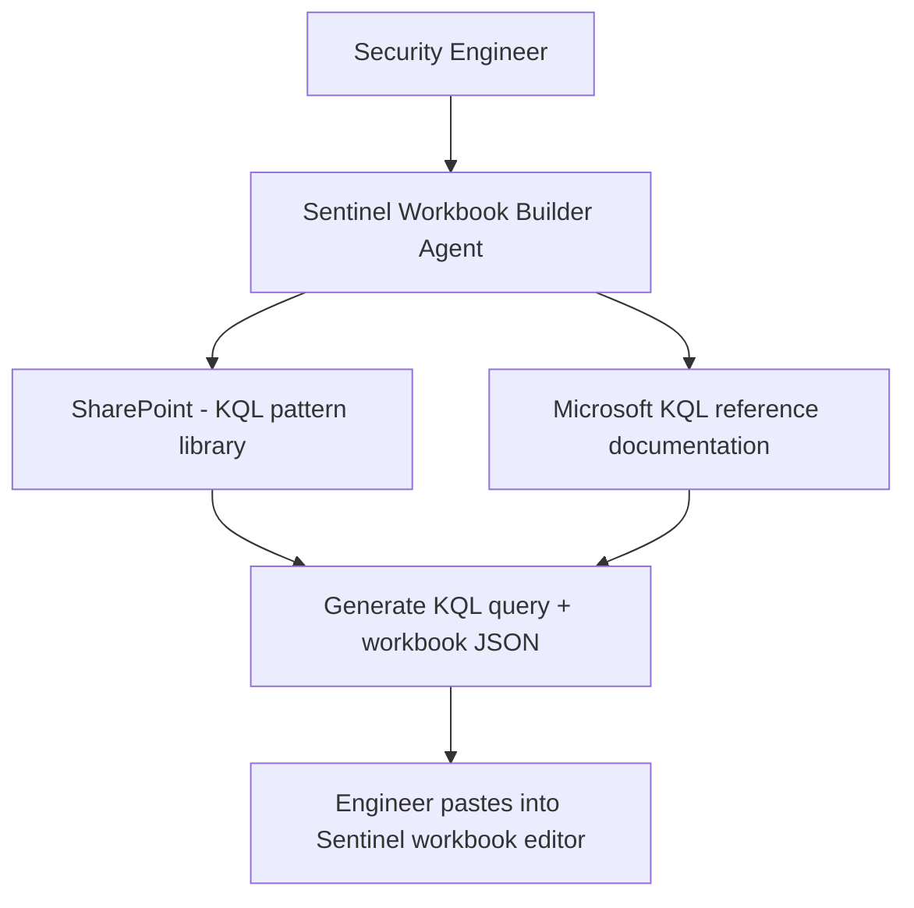

# 📊 Sentinel Workbook Builder

> **A declarative agent grounded in Sentinel workbook patterns and KQL reference documentation, helping security engineers design and troubleshoot Azure Monitor workbooks without deep KQL expertise.**

| Attribute | Value |
|---|---|
| **Domain** | SecOps |
| **Architecture** | Declarative |
| **Impact** | Medium |
| **Effort** | Medium |
| **Risk** | Low |
| **Approval Required** | No |
| **Maturity** | Concept |

---

## Problem Statement

Microsoft Sentinel workbooks are a powerful visualization and investigation tool, but authoring them requires proficiency in both KQL (Kusto Query Language) and the Azure Monitor workbook JSON schema — a combination that many security analysts lack. The result: most Sentinel deployments use only the built-in workbooks, which are generic and not tuned to the organization's environment, data, or specific detection needs.

Security engineers who want to create custom workbooks for specific use cases — a dashboard showing daily phishing report volumes, a geographic sign-in risk heatmap, a device compliance trend — spend hours fighting KQL syntax and workbook JSON rather than focusing on the analytical logic. The learning curve creates a bottleneck where all custom workbook development flows through one or two KQL-proficient engineers.

---

## Agent Concept

A security analyst or engineer describes what they want to visualize — "I want a chart showing the number of high-severity alerts per day for the last 30 days, broken down by alert type" — and the agent generates the KQL query, explains the query step by step, and provides the Azure Monitor workbook JSON template they can paste directly into the Sentinel workbook editor.

The agent also helps troubleshoot existing KQL queries: "My query is returning an empty result set, here's the KQL..." and provides diagnostic guidance. It is grounded in Microsoft's KQL reference documentation and a SharePoint library of the organization's custom KQL patterns.

---

## Architecture

A **Tier 1 Declarative Agent** grounded in SharePoint KQL pattern library and Microsoft KQL documentation. No write access required — the agent generates content that the engineer pastes into the Sentinel portal.

---

## Implementation Steps

1. **Build KQL pattern library in SharePoint** — Document common query patterns: time series charts, entity frequency tables, geographic maps, top N tables. Include the organization's custom table names and schemas.

2. **Create declarative agent manifest** — Reference the SharePoint KQL library. Author instructions that guide the agent to always: explain the query step by step, note any performance considerations (time range limits, `summarize` vs `count`), and provide the workbook JSON template alongside the query.

3. **Add Microsoft documentation reference** — Point the knowledge source at the KQL quick reference and Azure Monitor workbook documentation.

4. **Deploy to SOC and security engineering Teams channels.**

---

## Required Permissions

No Graph API permissions required. This is a knowledge-grounded agent only.

---

## Business Value & Success Metrics

**Primary value:** Democratizes Sentinel workbook creation, enabling analysts without deep KQL expertise to build custom visualizations.

| Metric | Before Agent | After Agent | Target |
|---|---|---|---|
| Custom workbook creation time | 4-8 hours | 1-2 hours | 75% reduction |
| Analysts who can create workbooks | 2-3 (KQL experts) | All team members | 5x increase |
| Custom workbooks per quarter | 2-3 | 10-15 | 5x increase |

---

## Example Use Cases

**Example 1:**
> "Write a KQL query to show the top 20 users with failed sign-in attempts in the last 7 days."

**Example 2:**
> "My KQL query works in Log Analytics but returns no results in Sentinel. Here it is: [query]"

**Example 3:**
> "Create a Sentinel workbook that shows a time chart of SecurityAlert events by AlertSeverity over the last 30 days."

---

## Related Agents

- [SOC Triage Summarizer](soc-triage-summarizer.md) — Uses Sentinel data; workbooks provide the dashboard layer
- [Alert Noise Reduction](alert-noise-reduction.md) — Workbooks help visualize alert volume and identify tuning opportunities
- [Incident Postmortem Generator](incident-postmortem-generator.md) — Postmortem findings drive new workbook requirements
