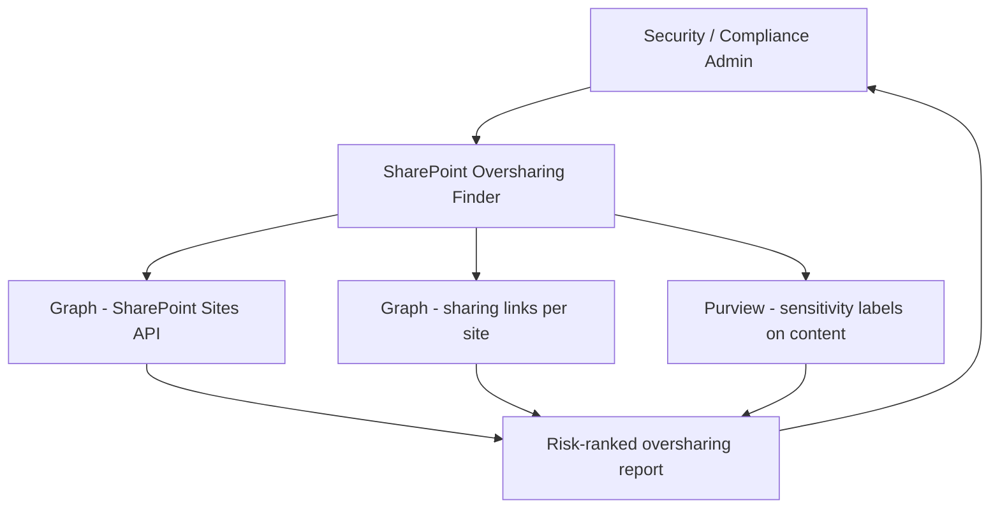

# 🔓 SharePoint Oversharing Finder

> **A declarative agent that identifies SharePoint sites and files shared broadly with "Everyone," "Everyone except external users," or anonymous links — surfacing the highest-risk sharing configurations in conversational queries.**

| Attribute | Value |
|---|---|
| **Domain** | SecOps |
| **Architecture** | Declarative |
| **Impact** | High |
| **Effort** | Medium |
| **Risk** | Low |
| **Approval Required** | No |
| **Maturity** | Concept |

---

## Problem Statement

SharePoint oversharing is one of the most prevalent data governance problems in enterprise Microsoft 365 tenants. The platform makes sharing easy — and that is a feature, not a bug — but the cumulative effect of years of sharing without governance is a sprawl of broadly accessible content that neither users nor administrators have visibility into.

The most common high-risk patterns: entire SharePoint sites shared with "Everyone except external users" (meaning all authenticated users in the tenant can see them), anonymous sharing links created for external access that were never revoked, sensitive document libraries accessible by entire departments when they should be scoped to a team, and "Anyone" links that allow unauthenticated access that were enabled for a one-time external collaboration and never disabled.

This matters enormously in the context of Microsoft 365 Copilot deployment. Copilot respects existing SharePoint permissions — meaning it can surface content from overshared sites in responses to any authenticated user. Organizations deploying Copilot without first remediating oversharing risk Copilot becoming an inadvertent data exfiltration vector: sensitive information from broadly accessible sites appearing in Copilot responses to users who were never intended to have access.

---

## Agent Concept

A security or compliance administrator asks "show me the SharePoint sites with the broadest sharing configurations" and receives a ranked list of sites ordered by risk: sites with "Everyone" sharing at the root level, sites with active anonymous links, sites with external sharing enabled beyond policy, and sites containing content classified as sensitive that have broad internal sharing.

The agent can drill down: "Show me the anonymous sharing links created in the Finance department sites in the last 90 days." It surfaces the content, who created the link, when it was created, when it was last accessed, and whether the link has an expiry date set.

---

## Architecture

A **Tier 1 Declarative Agent** with Graph and SharePoint API access. Read-only — the agent surfaces findings; remediation is executed by the administrator in the SharePoint Admin Center or via PowerShell.

---

## Implementation Steps

1. **Create app registration** — `copilot-oversharing` with `Sites.Read.All`, `Files.Read.All`, `InformationProtectionPolicy.Read`.

2. **Build Graph API plugin** — Wrap: `GET /sites/{siteId}/permissions`, `GET /drives/{driveId}/items/{itemId}/permissions`, `GET /sites?$select=id,displayName,sharingAllowedDomainList`.

3. **Build risk scoring logic** in agent instructions:
   - Critical: "Everyone" sharing at site level
   - High: Anonymous/Anyone links without expiry
   - Medium: "Everyone except external users" on sites with sensitive labels
   - Low: External sharing enabled without policy restrictions

4. **Add SharePoint knowledge source** — Organization's sharing policy document, so the agent can compare actual configurations against policy.

5. **Deploy to compliance and security teams.**

---

## Required Permissions

| Permission | Type | Justification |
|---|---|---|
| `Sites.Read.All` | Application | Read site sharing configurations |
| `Files.Read.All` | Application | Read sharing links on files |
| `InformationProtectionPolicy.Read` | Application | Check sensitivity labels on content |

---

## Business Value & Success Metrics

**Primary value:** Identifies and prioritizes oversharing risks before Copilot deployment and on an ongoing basis, reducing data exposure surface.

| Metric | Before Agent | After Agent | Target |
|---|---|---|---|
| Oversharing risk visibility | Blind spot | Full visibility | Complete |
| Time to identify top-risk sharing configs | Days of manual audit | 10 minutes | 95% reduction |
| Anonymous links with no expiry | Unknown / many | Tracked and remediated | <5% |
| Copilot data exposure pre-deployment | Unquantified | Quantified and addressed | Managed risk |

---

## Example Use Cases

**Example 1:**
> "Show me the top 20 SharePoint sites with the broadest sharing configurations."

**Example 2:**
> "How many anonymous sharing links have no expiry date set across our tenant?"

**Example 3:**
> "Are any sites with confidential sensitivity labels shared with Everyone except external users?"

---

## Alternative Approaches

- **SharePoint Admin Center** — Reports available but not conversational; no risk ranking.
- **Microsoft Purview Data Governance** — Provides some visibility but requires separate licensing and complex configuration.
- **PowerShell PnP module** — Scriptable but requires expertise and custom reporting.

---

## Related Agents

- [Copilot Readiness & Governance](../compliance/copilot-readiness-governance.md) — Oversharing remediation is a prerequisite for safe Copilot deployment
- [External Sharing Exception Workflow](../compliance/external-sharing-exception-workflow.md) — Manages the approval process for new external sharing requests
- [Data Classification Assistant](../compliance/data-classification-assistant.md) — Labels sensitive content so oversharing finder can prioritize high-risk sites
