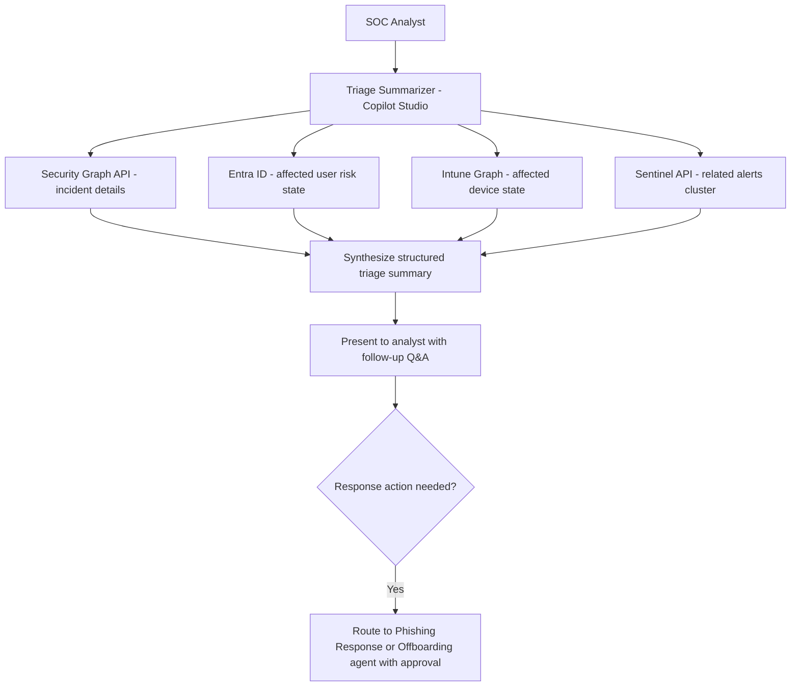

# 🛡️ SOC Triage Summarizer

> **A Copilot Studio agent that ingests a Microsoft Sentinel incident or Defender alert and produces a structured triage summary — timeline, affected entities, MITRE ATT&CK mapping, and recommended next steps — in under 2 minutes.**

| Attribute | Value |
|---|---|
| **Domain** | SecOps |
| **Architecture** | Copilot Studio |
| **Impact** | High |
| **Effort** | Medium |
| **Risk** | Medium |
| **Approval Required** | Yes |
| **Maturity** | Concept |

---

## Problem Statement

SOC analysts face a constant tension between thoroughness and speed. Every incident requires gathering context from multiple sources — alert details, affected user history, device state, network connections, related alerts — before a triage decision can be made. For a high-volume SOC, this context-gathering phase consumes 30-40% of total analyst time per incident, and it is almost entirely mechanical: copy incident ID, search in Sentinel, cross-reference in Defender, look up the user in Entra, check device compliance in Intune.

This mechanical aggregation work is exactly what an AI agent should handle. The analyst's expertise should be applied to the decision — is this a true positive? what is the correct response? — not to the data retrieval.

Additionally, the quality and completeness of triage documentation varies significantly between analysts and shifts. Incidents triaged at 3am by a junior analyst may have one line of notes; incidents handled by a senior analyst during business hours may have a full narrative. Inconsistent documentation makes post-incident analysis and trend identification difficult.

---

## Agent Concept

An analyst pastes a Sentinel incident ID or Defender alert ID into the Teams channel. The agent retrieves the full incident details from the Security Graph API, enriches them with: affected user's Entra risk state and recent sign-ins, affected device's Intune compliance state, related alerts across the same entity cluster, MITRE ATT&CK tactic and technique mapping (from Sentinel's alert enrichment), and any open incidents involving the same entities in the last 30 days.

The agent returns a structured 1-page triage summary with: executive summary (2-3 sentences), affected entities, timeline of events, MITRE mapping, severity assessment with justification, and recommended next steps (sorted by priority). The analyst can ask follow-up questions: "Has this user been involved in other incidents?" "What is the device's compliance status?" "When did the last successful sign-in occur?"

---

## Architecture

A **Tier 3 Copilot Studio agent** with read-only Graph API and Sentinel API actions. Approval is required before any response actions are initiated from the triage summary.

---

## Implementation Steps

1. **Create app registration** — `copilot-soc-triage` with `SecurityEvents.Read.All`, `SecurityIncident.Read.All`, `IdentityRiskyUser.Read.All`, `DeviceManagementManagedDevices.Read.All`, `AuditLog.Read.All`.

2. **Build Copilot Studio topics** — "Triage incident" (primary), "Entity lookup" (follow-up queries on user/device/IP), "MITRE explain" (explain ATT&CK technique in plain language).

3. **Build Graph API actions** — Power Automate flows: (a) get incident by ID from Security Graph, (b) get user risk profile from Entra, (c) get device compliance state from Intune, (d) get related alerts for the same entity.

4. **Build MITRE ATT&CK knowledge source** — Add a SharePoint document with MITRE technique descriptions and typical investigation steps for each technique. The agent uses this to explain the MITRE mapping in context.

5. **Build triage summary template** — Define output structure in agent instructions: Executive Summary | Affected Entities | Timeline | MITRE Mapping | Severity Assessment | Recommended Next Steps.

6. **Add escalation routing** — If the analyst indicates a response action is needed, the agent presents options and routes to the appropriate response agent (Phishing Response, Offboarding Orchestrator) with approval.

---

## Required Permissions

| Permission | Type | Justification |
|---|---|---|
| `SecurityEvents.Read.All` | Application | Read Defender and Sentinel incidents |
| `SecurityIncident.Read.All` | Application | Read full incident details and timeline |
| `IdentityRiskyUser.Read.All` | Application | Enrich with affected user risk state |
| `DeviceManagementManagedDevices.Read.All` | Application | Enrich with affected device compliance state |
| `AuditLog.Read.All` | Application | Read recent sign-in activity for affected users |

---

## Security & Compliance Controls

- **Read-only triage** — The agent reads and synthesizes; it does not take any response actions.
- **Response action approval** — When the analyst wants to act, they are routed to a response agent (Phishing Response, Offboarding) that has its own approval gates.
- **Sensitive entity masking** — In shared SOC channels, user personal details are masked to initials in the triage summary. Full details available only in direct message to the analyst.

---

## Business Value & Success Metrics

**Primary value:** Reduces the mechanical context-gathering phase of incident triage from 20-40 minutes to 2 minutes, increasing analyst throughput and improving documentation consistency.

| Metric | Before Agent | After Agent | Target |
|---|---|---|---|
| Mean time to triage (MTTT) | 25-40 min | 5-8 min | 80% reduction |
| Triage documentation completeness | 50-70% | 100% | Consistent quality |
| Analyst incidents handled per shift | 8-12 | 20-30 | 2x throughput |
| MITRE mapping coverage | 40% of incidents | 95%+ | Near-complete |

---

## Example Use Cases

**Example 1:**
> "Summarize Sentinel incident INC-2026-0342."

**Example 2:**
> "What other incidents involve the same user as INC-2026-0342 in the last 30 days?"

**Example 3:**
> "Explain what MITRE technique T1078 means and what I should look for in the logs."

---

## Alternative Approaches

- **Microsoft Copilot for Security** — Provides similar capability and should be considered if the organization has Copilot for Security licensing. This agent provides similar value for organizations using M365 Copilot without Copilot for Security.
- **Sentinel analytics workbooks** — Good for dashboards but not conversational per-incident analysis.
- **Manual investigation** — Current state; described in the problem statement.

---

## Related Agents

- [Phishing Response](phishing-response.md) — The primary response agent when triage identifies a phishing campaign
- [Alert Noise Reduction](alert-noise-reduction.md) — Reduces the volume of incidents that need triage
- [Incident Postmortem Generator](incident-postmortem-generator.md) — Uses the triage summary as input for the postmortem
